## Affirmative approval and continuous execution repair (2026-10-04)

User evidence: the new five-view house conversation repeatedly responded to "confirm", "start" and "continue" by preparing parameter cards/scripts and claiming geometry tools unavailable.

- Confirmed workflow defect: bare Chinese affirmations were absent from both frontend and backend approval routing. In planned state they remained planning turns with modeling tools withheld. Added recognition in planned state only; negations, questions and parameter edits still do not approve geometry.
- Approved execution now automatically attempts the existing session connection, serializes submission, retains pending execution after a connection error, and sends the entire approved scope as one continuous request. Skill/context explicitly treat passes as internal work order, never new user approval gates. Original approval of scope remains; do not stop for another confirmation between geometry/detail/QA passes.
- Found a second connection blocker during real browser testing: a new conversation had no model path while SketchUp remained on a different project's saved disposable model. Previous code rejected this and misleadingly suggested a new project. The host now prepares the requested project copy, verifies active GUID/path/edit context, preserves current content at a unique recovery path without overwriting the original, opens the requested copy, and verifies the resulting path before tools are enabled. Reuses existing connector/lifecycle; no new geometry generator.
- Real test: sending only "confirm" through the hot-updated frontend reached automatic SketchUp startup, proving it no longer routes to discussion. The running frozen backend still uses the previous connection code and rejected the foreign model. A source-level lifecycle probe successfully wrote a recovery SKP using save_copy but encountered SketchUp's save-changes modal. Revised preservation to save to a new recovery path (clears modified status); a subsequent probe was obstructed by the still-open modal and is not a successful runtime acceptance result.
- Automatic review rejected clicks on the native save dialog because target identification/loss risk was considered insufficient, including the refreshed Cancel attempt. Stopped dialog interaction and asked the user to click Cancel. Real geometry/full-scope/QA remains pending; no paid model call or model quality success was recorded this turn. Do not describe script files as built geometry.
- Checks: scripts/check.ps1 167 passed, two existing dependency warnings; git diff whitespace check passed. Desktop packaging succeeded and installed packaged provider import diagnosis returned ok=true. Installed updated E-drive version and existing desktop shortcut for the next launch. The current older process remains running to preserve its memory-only provider credential; only its static frontend is hot-updated. Full backend repair requires launching the new version, and its memory-only Key must then be supplied through the local password form. Credentials, screenshots, SKP files and project data remain ignored runtime assets.
## Chat-first UI and explicit execution repair (2026-10-03)

User report: five-view DeepSeek plan was generated, repeated approval attempts did not produce geometry, and fixed status/plan/composer blocks obscured conversation.

Evidence: the failed execute run wrote persistent house_full.rb, then the provider request failed with a disconnected response. No geometry execution was recorded in that run. Previous connection-refused errors also existed. This is not evidence of damaged SketchUp geometry or of poor model reconstruction quality.

Changes:
- Chat takes the main viewport. Connection checklist and parameter card are closed by default and expand as overlays; state, plan and approval controls share one compact row. Execution no longer automatically opens the reference sidebar.
- Explicit execute instructs the same agent to use approved assumptions and execute persistent Ruby, inspect and revise, without asking for approval again. If connection is required, successful connection resumes the pending approved execution for that same project.
- Network failures show retained-project/retry guidance rather than model recovery advice. Official DeepSeek requests use an HTTP client with trust_env=False, avoiding inherited local proxy settings; no silent retries and no global proxy change.

Validation: scripts/check.ps1: 160 passed (two dependency warnings); real installed LiteLLM serialization tests preserve images, reasoning/tool history and wire model deepseek-flash. Mock contract asserts official DeepSeek client ignores environment proxies. Approval instruction regression assertions added. Desktop rebuilt and installed as version 20261003-chat-execution, desktop shortcut updated. Mouse inspection in the installed app confirmed compact controls, preserved five-view project, expanded parameter-card overlay and correct network error guidance.

Pending live verification: the old desktop was already closed, so its memory-only API key was unavailable. The new desktop is open at the original project with the DeepSeek configuration dialog prepared; user must enter the key locally. No model substitution or paid request was performed. Read-only connector probe currently returns ECONNREFUSED at the configured local bridge; SketchUp/plugin must be started/reconnected before execution. Do not claim real reconstruction success from these code/UI checks.

# Handoff — AI Architecture Studio

## Desktop DeepSeek request repair and follow-up diagnosis (2026-10-03)

- User reported generic HTTP 500 before provider usage. Reproduced the installed, windowed executable's provider import without any credential: LiteLLM raised `ValueError: Unknown encoding cl100k_base`, with no discovered tiktoken plugins. Source-environment tests had missed this packaging defect.
- Packaging now explicitly includes `tiktoken_ext.openai_public` and preloaded cl100k/o200k vocabularies; the frozen desktop sets its bundled cache path. Added a credential-free `--diagnose-provider` check. The rebuilt and installed executable passes that check. Provider dependency exceptions now become actionable, credential-redacted errors rather than an unhandled 500.
- The custom API form now normalizes the official DeepSeek model ID on the exact official API host to LiteLLM's internal provider-prefixed ID. Wire tests confirm the actual HTTP body uses `deepseek-flash`, not the prefix or retired aliases. Same-connection effort changes still reuse the memory-only credential.
- Updated the installed desktop version and existing desktop shortcut, retaining the shared local profile and project history. Restart cleared the old memory-only credential; the user subsequently configured DeepSeek and retried. No credential was read, returned or persisted by this repair.
- A later user screenshot reports WinError 10061, separate from the fixed packaging problem. Historical provider events confirm connection refusal without a provider reply. The machine uses a loopback HTTP proxy on port2080. At diagnosis time both environment-proxied and direct unauthenticated requests reached the official models endpoint (HTTP401, expected without a Key). This demonstrates current reachability, not proof of which endpoint refused the earlier request or credential validity.
- The user's latest actual retry completed planning with DeepSeek (session state planned, empty error; 37,849 input / 11,712 output tokens reported). Their next execute turn was already active during inspection; it was not restarted or interrupted. No modeling-quality success is claimed and no alternative model was called.
- Validation: `scripts/check.ps1` 160 passed, two existing dependency warnings; whitespace checks passed. Installed frozen import check passed. Runtime logs, tokenizer cache, reference images and model outputs remain ignored. Real building output from the active user turn is not an acceptance result for this repair.

## Desktop MCP connection repair (2026-10-03)

User requested repair of the two connection buttons. Pulled latest main (already up to date), started with a clean tree, and scoped this turn to connectivity. Modeling remains paused; no model API requests were sent.

- Reproduced both buttons in the installed desktop application. The application process stayed alive. MCP health and model context were reachable, but automatic connection closed its dialog before session binding failed against the active unsaved Untitled model. Transient console subprocess windows were also possible because MCP and launcher subprocesses had no Windows no-console flag.
- Added Windows CREATE_NO_WINDOW for MCP/PowerShell child processes; serialized the connection buttons; kept the dialog open until session binding succeeds and retained concrete errors on failure. Automatic connection now attempts the existing launcher when the bridge is unreachable instead of stopping after a failed health check.
- Reused the existing template launcher with a prepare-only option, then a host-owned lifecycle action for an unsaved model: recheck GUID, unsaved path and inactive edit context; save the current work to a unique local recovery SKP; open the prepared project copy; verify path/GUID before enabling modeling tools. Saved foreign documents remain protected by the existing project boundary. No new generic MCP or geometry engine was introduced.
- Real SketchUp 2024.0.484 revealed that save_copy fails on an unsaved model (`Model must be saved before copying`). Corrected this to save the unsaved document to a new recovery file before opening the blank project copy. Timer errors are captured in local status files and reported rather than silently timing out. The original Untitled content was preserved locally, then the expected disposable model opened successfully. The website button subsequently bound the user's test session and displayed its connection-success toast.
- Added regression coverage for unsaved session binding, edit-context rejection, hidden subprocess creation and recovery-before-open/error reporting. scripts/check.ps1: 158 passed, two existing dependency warnings. Runtime SKP/recovery/status files remain ignored. This is a connection/lifecycle validation, not an architectural quality benchmark or fresh-computer installation acceptance.
- Rebuilt and installed a separate updated desktop version, updated the existing desktop shortcut with its original data-directory arguments, and reopened it with the user's existing 16 conversations. Clicked both connection buttons in the installed application: MCP check returned connected; automatic connection verified the same disposable path/GUID and returned a successful connection toast. Installed EXE hash matches the build. Reopening resets memory-only API credentials; no inference was performed. JavaScript syntax and git diff --check passed.


## Reconstruction reliability follow-up / independent implementation (2026-10-02)

User authorized improvements informed by readable competitor implementation after pausing modeling. Up-to-date main was pulled; eight files already contained the prior paused engineering repairs, so a clean starting tree is not claimed. No proprietary Skill/bridge code was imported, no provider substitution, paid inference or SketchUp modification occurred.

- Added original concise reconstruction guidance addressing actual GLM failures: explicit metric conversion/representative-section readback, face-normal/extrusion/thin-roof checks, a source-defining opening in the first recognizable form, timeout readback before retry, building-focused camera framing and corrections persisted to source. The full Skill is 9,849 characters within its existing 10,000 cap; safety/continuity guidance remains present. No claim these instructions alone fix model quality.
- Completed the pending engineering repairs: zero SDK/LiteLLM retries with the existing ZAI parameter override; narrowed negative-approval recognition so approved requests with unrelated 'do not' clauses can execute; specific unsaved-model binding/API-timeout errors. These changes do not implement automatic blank-model save/binding or guarantee uninterrupted modeling.
- Installed-library HTTP mock regression verifies one actual domestic-GLM wire request on a 503, instead of silent SDK retries. This is transport evidence, not a paid provider test. Approval negatives and complete Skill retention have regressions.
- scripts/check.ps1:155 passed,2 dependency warnings. Node syntax and git diff --check passed. Reconstruction quality remains FAIL/incomplete at the paused GLM checkpoint; no real acceptance run was performed for these changes. The known developed Sol six-view model remains the baseline.
- Desktop package rebuilt successfully; the desktop shortcut now targets a separate updated version, preserving the running installation. Installed EXE hash matches the build; PYZ inspection confirms the new geometry guidance is included. Updated-package runtime startup remains pending; running instances retain their previously loaded code until restart. Memory-only API credentials require re-entry after restart. No auth/payment/cloud work or new generic MCP/geometry engine.

## Local desktop installation / modeling paused (2026-10-02)

User paused the poor GLM single-image modeling run, then requested an E-drive desktop installation. No new inference, modeling, model replacement or quality acceptance was performed for installation.

- Rebuilt the existing PyInstaller/pywebview desktop package successfully with current local source; installed the application outside the repository and created a normal Windows desktop shortcut directly targeting the EXE.
- Shortcut launches a local application profile whose runtime directory links to the existing ignored project runtime. Existing conversations/assets/models remain in place. Explicit local bridge configuration was copied only into the private installation profile; no credentials/config contents entered Git.
- Launched the desktop shortcut and visually verified the K Studio chat UI, historical conversations and model selector. This proves local startup on this computer, not fresh-machine installation or successful reconstruction. No model request was submitted.
- An optional PowerShell launcher creation was rejected by automatic approval review (`blocked by policy`, no specific reason returned). Used a direct EXE shortcut instead; automatic attach-to-port behavior was not installed.
- API keys remain process-memory only and must be re-entered after restarting the application. No API key was copied from the existing server.
- Previous GLM retry/approval/unsaved-model error repairs remain uncommitted local changes while that modeling task is paused. The installed candidate includes them; this installation handoff does not claim their live reconstruction acceptance or GitHub delivery. The latest single-image GLM quality result remains FAIL / incomplete.

## Latest product reliability repair / no-spend research (2026-10-02)

Started from clean, up-to-date `02f86cdc5d17713b246c0f7ce73cea4451f6b01d`. Latest user explicitly requested broader novice-product/competitor work, then selected **no new API spending**. No model inference, Astra rescue, original SKP/DWG edits, proprietary code reuse or new modeling engine in this turn.

- Fixed frontend auto approval being overwritten as `plan`. Backends retain affirmative approval checks and no SU writes before approved plans. Text-only input already reached backend; Skill and UI now describe proposed text design without inventing image evidence. Added 0/1/6-image clarify → plan → approval-wait contract tests, all with explicit fixtures, not real quality results.
- Each native `localImage` and API `image_url` now has an adjacent filename label. Skill requires visible landmark/source-view mapping before geometry and view-matched QA; filename direction is not blindly trusted. Increased Skill context cap to10000 so its finite-turn/safety ending is not silently cut off by added guidance.
- Context explicitly marks `single_image`, `multi_view` or `text_description` from actual reference inputs; text mode uses approved design assumptions and does not claim photo reconstruction. It keeps the same coding tool profile and approval lifecycle, without introducing a new generator.
- API requests retain six most recent generated readback images, all reference images, tool exchanges and reasoning. Full on-disk history is untouched. Offline replay of actual six-view history:218messages/43images →12images,31obsolete screenshots removed;84tool results preserved. No measured latency/cost/quality improvement claimed. General text/reasoning compaction remains unresolved; inspected LiteLLM trim implementation rather than blindly slicing function-call history.
- SketchUp setup is independent of credential availability. Added a lock so session/model switching cannot race a modeling turn. UI automatic connection checks the installed bridge first and explains a missing plugin response; it does not pretend to install/redistribute Kongxing on a fresh machine. Removed Codex-specific branding from API connection success text.
- Official Sol documentation exposes an actual API compatibility gap: tool calling requires Responses. Model settings/runtime reject the currently unsupported Sol/Astra API tool route before inference rather than claiming a working Chat Completions preset. Native development route remains. Reuse LiteLLM Responses in a future scoped implementation; this turn has not implemented/accepted that integration.
- [Research/product review](PRODUCT_RELIABILITY_AND_LAUNCH_REVIEW_2026-10-02.md) records real GLM failures, three/five-input acceptance matrix, advisory agreement/disagreement, pinned MIT SAIE/Supex implementation paths, LiteLLM SDK versus enterprise licensing, commercial primary sources, cost accounting and proposed beta/marketing gates. No fabricated model ranking, competitor trial, domestic GLM pricing or conversion metrics. Inspected source caches/private logs remain ignored.
- `scripts/check.ps1`:149 passed,2 dependency warnings; Node JS syntax and `git diff --check` pass. New tests cover screenshot filtering/history preservation, source label pairing, full Skill ending, free connection without provider, session busy lock and rejection of Responses-only API models.
- Real browser reload/clicks verified connection dialog accessible without Key and automatic missing-bridge failure. Live Kongxing currently does **not** respond, so real SU smoke is pending; no new building or geometry quality acceptance. Local UI screenshot retained under ignored `runtime/reviews/product-research/connection-guidance.png`.
- Automatic approval review rejected terminating/restarting the existing port8000 server (`blocked by policy`, no more specific reason supplied). Did not bypass that rejection. Static UI is served from updated files and was checked; current port8000 Python process still runs pre-turn backend imports. Backend changes are tested on fixture app instances; live reloading remains pending. Existing desktop process/package untouched; a candidate package build result is recorded below. Existing GLM memory Key remains unavailable; no new Key requested.

Remaining product release gates: fresh GLM quality run after budget approval; genuine Sol API Responses integration; fair single/multiple/text model tests; legal bridge packaging and clean Windows installation; reliable independent image/model QA; measured unit cost and invited novice acceptance. Historical GLM quality stays FAIL/partial. This turn is repairs/research, not a commercially ready release.

- Desktop candidate rebuilt successfully after correcting local packaging command paths and rebuilding after the final context changes. Fresh PYZ inspected to verify the `input_mode` change is included; copied the full folder into ignored `runtime/desktop-candidate-fresh/` (entry `KStudio.exe`). Existing running desktop package was not overwritten. Packaging success does not prove fresh-machine startup/plugin installation; those remain pending. `build/`, `dist/`, runtime evidence/package folders confirmed ignored; no private source assets or credentials added to Git.

## Latest user-session recovery — real GLM High / six views (2026-10-02)

Started from clean, up-to-date main `5747d12e9095a2019d7870b29c4b336e6501b645`. User re-entered the memory-only domestic BigModel Key and authorized continuation. No Astra/native Codex building fallback, proprietary code copying or new geometry engine.

- Reviewed the actual user conversation: positive start stayed in `clarifying`; host intentionally withheld SketchUp execution/view tools, while the model called this unavailable tooling. API chat and Ruby file writes were real, but geometry was absent. Fixed answer → plan and affirmative natural-language approval → execute; questions, negative/conditional approval and parameter changes do not approve. Clarification context now explicitly describes the gate and prohibits promising tool recovery/building. Script writes alone fail the geometry completion gate.
- Sent reference images now belong to the sending user message, leave the composer, remain project evidence, and do not reattach to every message. Legacy conversation migration uses file timestamp; sent images retain recoverable corner × removal. Exact duplicate vision payloads are removed from real provider history while preserving the first image and later new images.
- Added factual progress checklist: actual API response, current stage, workspace write, geometry commit and screenshot readback. Static configuration/available screenshot are explicitly distinct from connectivity/quality acceptance. Fixed the workspace tool name to match `workspace_write`.
- GLM domestic preset defaults to High (middle of Low/High/Max, no fabricated Medium). Same provider/model/base effort changes reuse the memory-only credential, without returning or persisting it. Actual API calls in this run report High. Installed serializer tests also verify High/Max on domestic endpoint; these mocked tests are not live quality evidence.
- Real browser approval of the original six-view user project generated 8 revisions in the same owned root37843: 540.078s, 33 tool calls, 2 failures, 1,859,915 input / 29,350 output tokens summed across provider requests. Geometry and screenshots are real. Manual QA rejects quality acceptance: initial roof is excessively pyramidal, floor/window composition differs substantially from the source, glazing and materials are simplified; complete interior has not been visually verified. Agent self-reported QA is not acceptance. Ordinary browser feedback requests a same-model correction; final evidence follows below.
- `scripts/check.ps1`: 142 passed, two dependency warnings; JS syntax and whitespace checks passed. Final desktop package rebuild succeeded, including interruption usage reporting. Private images/models/generated Ruby/logs remain ignored; original thesis files untouched. This is a UX/execution recovery test, not a controlled one-view versus six-view model comparison (effort and input differ).


- Same-model correction ended at the real 48-call cap after approximately 742 seconds: 48 tools, 1 failure, provider-summed 6,185,576 input / 27,824 output tokens, root37843 retained through r16. Model and viewport checkpoint saved despite interruption. Final manual QA remains **FAIL / partial**: large pitched roof, blank side wall, misplaced/floating window pieces, missing source facade composition; no accepted interior views. Source-card street/pool view correspondence is wrong and self-QA incorrectly claims consistency. Do not market this run as faithful reconstruction.
- A real bug surfaced at interruption: LiteLLM omitted partial-result usage, leaving the session UI's previous-turn metrics. Added partial-result checkpoint/usage on provider failure, repeated execution failure and tool-budget exhaustion; two new regressions pass. The historical trial's correct metrics above come from its event file; this fix was not retroactively presented as a live rerun.
- Real browser downloaded the final checkpoint SKP; download/artifact SHA256 both `789230b92caa1b9308c8c4a4601bba6fcf55d065bbd5f4c867c8a8352362d1e3`. Sent-image corner removal controls and recovered conversation were visually verified after reload. Screenshots are private local evidence, not public source packages.
- Background terminal-host service ended after the completed/interrupted run; restarted latest source as a hidden independent process. Key was memory-only and is no longer configured after restart; no additional provider inference was issued. Preserved all project/geometry state. EXE rebuilt and opened; native screenshot verification encountered the Windows lock screen, so final native UI verification is `pending_external`; browser UI/output checks succeeded. Bridge packaging/clean-machine delivery remain unresolved.


## Latest local API integration — domestic GLM / novice UI (2026-10-02)

Started from clean, up-to-date main `79f34149d32e1aaaa8f7da4ce7f51be53bdb2cd1`. User extended the image-reconstruction work to independent API delivery and selected domestic BigModel GLM-5.3-Flash. No Astra/Codex building fallback, proprietary competitor code, new provider framework or geometry engine.

- Replaced prominent delete labels with thumbnail corner × and project right-click menu; reversible trash/restore remains. Improved narrow composer/result-panel behavior after a real send obstruction.
- Domestic GLM preset, Low effort and image/tool/thinking continuity use existing LiteLLM. Installed serializer contract tests cover domestic GLM/international GLM/DeepSeek; distinguish mocked transport from live calls. Standalone desktop API profile uses only explicit bridge configuration and rejects Codex/Premium. EXE rebuild succeeded; second-machine installation and bridge packaging remain pending.
- Real website → domestic GLM Low → disposable SU single-view run: build819.032s/36calls/12failures; revision468.547s/33calls/1failure. Provider-summed usage build1,931,784input/41,383output; revision3,632,547input/15,011output. Initial floor count needed correction. Building root37853 retained through r8 after earlier empty probe. Six exterior views were actually read back, side walls repaired, final model downloaded with matching SHA256 `d718935189358438e8fe1527a7693564e806cf80f06e48ee7c07f97828279a86`.
- **Quality FAIL / partial:** opaque-looking right glazing, incorrect heavy/white frames, dangling panels and weak material detail persist. Agent's QA optimism is not acceptance. Single-view rear/interior inference is schematic. Six-view comparison is pending; do not report this product as commercially ready.
- Derived fixes: explicit injected root/Ruby scope contract, recursive empty-container rejection, Skill once in system context, tool-history checkpointing and three-failed-execution stop. Rebuilt service now runs API-only with these changes. New live building validation requires Key re-entry after restart (Key remains memory-only), not an outer permission probe.
- `scripts/check.ps1`: 125 passed with two dependency warnings; final rerun recorded below if different. Private images/models/generated Ruby/logs/screenshots remain ignored; no original model edited. See [API review](API_STANDALONE_RECONSTRUCTION_REVIEW.md) for measurements and release gaps.


## Latest user-requested fix — image/project deletion (2026-10-02)

Started from clean, up-to-date main `174082d`. Added visible 删除 labels to pasted/uploaded reference thumbnails and each left-hand project/history row. Deletion moves generated project data or registered reference input into ignored local runtime/trash; a 回收站 dialog provides restoration, including after restart. No permanent purge UI, no original assets or SketchUp geometry edits.

Reference delete/restore resets the visual thread and invalidates approval (clarifying), preserving existing model/root/revisions; user must regenerate and approve a plan against current inputs. Active modeling lock rejects delete/restore while a turn runs. Paths are confined to registered project reference inputs; arbitrary output/source paths are rejected. Deleting current project selects another, or creates a fresh blank conversation if none remain; GET no longer recreates the old demo ID after deletion, preserving restoration.

Real browser clicks verified: fresh test project → actual Ctrl+V test PNG → delete image → recover image → delete project → recover project. No model inference or new SketchUp benchmark requested or performed. `scripts/check.ps1`: 116 passed; JS syntax and git whitespace checks passed. Regression coverage includes plan/thread invalidation, unchanged saved model bytes, busy guard, traversal rejection, last-project removal and restoration. Desktop package rebuilt successfully with scripts/build_desktop.ps1; updated EXE remains under ignored runtime/desktop-dist.


## Latest local execution — novice chat, real reconstruction and desktop shell (2026-10-01)

Pulled clean/up-to-date main `0f06f485a1a7f000508fd737fb4ed899016839b9`. Latest user requested a simpler real first-user path, paste/document/site/URL input, connection lesson, explicit approval, actual progress and final SKP download; also asked which delivery form fits MCP. User-directed scope extension and recommendation are recorded in DECISIONS. Existing Skill/persistent Ruby/Kongxing architecture retained; no new CAD engine, generic MCP, Astra or competitor proprietary source.

- Actual UI novice test: new project `architecture-project-d478d`, real Ctrl+V image paste, one synthetic task TXT plus 30×30m DXF, simple Chinese conversation, explicit plan, connection lesson, fresh generated SketchUp file and approval. Clarification145.344s / second chat164.875s / plan206.875s; none edited SU. First build476.735s,19 dynamic calls,1 failure; developed geometry and r1–r3. Ordinary follow-up299.969s,22 calls,0 failures; front/rear/left/right/roof inspection, r4, same root37843 retained.
- Final model384,022bytes. Actual browser download and artifact SHA-256 both `2c239348d52c01b300f15fb735855559e8684cb4ba74a48d2f41f1759f850952`. Inspected all five final exterior views. Balcony/glazing/frames/slats/garage/stair/roof rail/site present; inferred sides, simplified materials/environment and generic window rhythm remain. Not exact source fidelity, professional compliance or a quality parity benchmark. Four-total-floor user input intentionally superseded apparent extra source floors.
- Product fixes: continuous clarification; explicit plan button; unified paste/drag/upload and image normalization; real uploaded document/site/URL context; clear DWG/scanned-PDF limitations; MIT markdown-it safe tables/lists; connection teaching and approval; actual sanitized stage/tool/failure/commit/screenshot progress; blank output hidden; narrow result panel obstruction repaired; model API settings memory-only via existing LiteLLM; no incompatible provider/model thread reuse; loopback/Host/same-origin boundary.
- Read-only competitor UI observation: AI建模 → SU自动建模, attachment/model/Skills/tutorial entries, tutorial leading to Feishu. No competitor inference performed. Updated COMPETITOR_DESKTOP_ARCHITECTURE_OBSERVATION.
- Recommend Windows local workbench first. Adopted BSD pywebview6.2.1 / PyInstaller6.22.3, retained license. Actual EXE built and launched; own fresh per-user runtime, blank starter session, model dialog and native-mouse/keyboard creation of a second session work. Fixed build data paths and missing legacy seed failure encountered during actual packaging test. Standalone existing MCP command config supported; no Kongxing/SketchUp/Codex credential/private data bundled. Build outputs remain ignored.
- `scripts/check.ps1`: **114 passed**. Native browser real build/revision/download, desktop build/start/UI, JS `node --check` and `git diff --check` passed. New regressions cover repeated text-first chat, real document/DXF evidence, URL ingestion, image validation, current progress, in-memory BYOK configuration, local boundary, standalone MCP and packaged missing-example startup.

See [novice acceptance report](NOVICE_FIRST_RUN_ACCEPTANCE.md) and [user guide](USER_GUIDE.md). Private source/model/Ruby/chat/screenshot files are local only.

### Commercial readiness is not claimed

Configured-machine modeling flow works. A licensed distributable bridge/plugin installer, clean-machine first-run validation, independent live BYOK inference/quality, shorter measured latency, unattended recovery and full dependency release review remain gates. No spare customer API credential was supplied, so BYOK configuration/contracts are tested but live API modeling success is not invented. Current preset still relies on local Codex credentials. No payment/account/cloud deployment was added.


## Latest local execution — six-view villa through real website UI (2026-10-01)

User requested a real first-user flow, six reference views, a new disposable SketchUp model, inferred interiors and environment, with fixes during usage. Started from clean, up-to-date main `ed4e9c8`. Browser clicks/file chooser/text input performed the product actions; website GPT-6.1 Sol Low authored and executed the modeling Ruby through existing Kongxing. Outer integration agent fixed infrastructure/UX and inspected screenshots, without supplying building geometry. No Astra or provider substitution.

- Six real localImage inputs confirmed on native turns. Initial image-only clarification and parameter card were completed without SU editing; approved four-storey baseline resolves inconsistent three/four-storey source views via explicitly inferred rear terrain.
- Fixed multi-select upload, eight-image cap/batch feedback, all-source previews, optimistic chat, locked composer, approval text preservation, persistent failure guidance, output-view gallery and malformed sanitized local links.
- First execute timed out after revision 4. Next website execute reached revision 7 with six-angle QA and a saved SKP. Interior follow-up exposed an actual replacement/incremental mismatch: default Ruby cleared the root, inspection/patch source could leave it empty, and Undo eventually removed the generated model. Do not interpret these failed turns as accepted continuity.
- Added replace/edit mode to the existing workspace-Ruby tool rather than a new geometry/MCP engine. Full replacement remains the default; edit preserves the existing script root. Skill explicitly distinguishes modes, preserves the full baseline source and bounds correction passes. Patched the existing MIT helper to reject empty roots before commit, capture PID before commit and avoid needless make_unique; SketchUp 2024 Entities length compatibility was checked through real retries. License retained; local changes noted in THIRD_PARTY_NOTICES.
- Native interruptions retain execution-thread ID/latency/tool metrics, attempt a guarded checkpoint and report incomplete work. Checkpoints refuse missing/empty owned roots and false save_copy returns, preserving prior output. Pre-turn recovery snapshots now include the corresponding Ruby revision state. Recovery uses a host-owned website action and existing connector, confined to generated project copies; preview/download/readback are synchronized after restore. Native save-dialog interference and an introduced identity NameError were encountered, repaired and recorded, with additional regressions.
- Full archived baseline successfully restored via website, creating owned root 111487 / revision 1 (307.844 s, 3 tools, 0 failures). Subsequent real edit retained root 111487 and committed revision 2 (639.875 s, 8 tools, 0 failures), correcting stair support, excess top flight, landing/partition collisions, doors and bathroom openings; exterior and full source archive retained. The original root 37845 was lost in the failed follow-up; uninterrupted identity across that failure is not claimed.
- Added a process-local lock preventing overlapping native turns/recovery. This is not a queue or background-worker system. All model inference remains in a generated workspace with workspace-write and network disabled. Region and token usage remain unavailable through the current native result; null is recorded rather than fabricated prices.
- `scripts/check.ps1`: **103 passed**; JS syntax and `git diff --check` passed. Added actual adapter-source regressions, multimodal six-input check, interrupted-state/checkpoint test, root-preserving transport check, generated-only recovery/revision synchronization and overlap rejection.

See [six-view usage report](VILLA_SIX_VIEW_UX_TEST.md) and updated [user guide](USER_GUIDE.md). This test proves developed editable geometry and exposes/fixes product failures; it does not establish an exact replica, photo-realistic rendering, measured interior correctness, construction compliance, commercial unattended readiness or formal Direct-Codex parity. Private image packages, generated models, transcripts and screenshots remain ignored locally.

### Final UI/readback and recovery verification

- Website screenshot-only turn completed in 454.844 s, 15 dynamic calls, zero failures. Six final views were inspected: front, rear, left, right, top and oblique. No Ruby execution/Undo occurred in this turn. Materials, planting, facade seams, garage proportions and the raised rear terrain still differ from the source; interiors are inferred.
- Clicked the recovery control through the real browser. A SketchUp save dialog still delayed native opening despite the pre-save, causing an explicit timeout. Handled the generated-file dialog with native mouse input, then clicked the recovery control again. The pending-copy rebind succeeded, preserved the developed building, and synchronized root 111487 / revision 2, model path, readback, preview and downloadable artifact. Added specific Chinese guidance for this timeout. Native-dialog handling remains a manual step, not an unattended PASS.
- Downloaded the restored SKP through the website link: 836,594 bytes. Download and project artifact SHA-256 both equal `3e033535e0ef16383cf6660b247f3fe8521f1d0de2837da3c7b8b60cbe151281`. Final browser screenshot stays local under ignored runtime. All six images and generated SKP remain excluded from Git.

## Latest local execution — chat-first AI modeling UI (2026-10-01)

User rejected the previous form-heavy page and requested the layout of the already open Building-Xuezhang desktop, restyled as our product and focused only on AI modeling. Pulled clean, up-to-date main at `7506b8a`. Used computer-use for live desktop observation and frontend-design for implementation.

- Observed AI task-assistant / SU automatic-modeling pages: left capability/history sidebar, spacious central chat, bottom composer with attachments/model/Skill/send. Inspected a conversation without submitting messages or invoking tools. Updated sanitized competitor observations; proprietary UI source/assets and private conversation contents are not committed.
- Replaced the landing workspace with K Studio: soft gray/forest-green palette, left modeling-session history, central chat, fixed bottom image/input/model/send toolbar and an optional model/files drawer. No drawing/render/PPT/provider-console/legacy-rule controls appear in normal UI. Existing backend compatibility paths remain intact with hidden controls; image reconstruction remains the sole visible mode.
- New-session optional goal is placed in the message composer for the first reconstruction turn, rather than being lost in the excluded taskbook context. The create dialog resets on opening; project creation still cannot trigger inference or model editing by itself.
- Kept explicit parameter approval, plan-only parameter revision, same-project workspace/model continuity and guarded bridge execution. Model-provider state no longer claims live SketchUp connectivity merely because a model path was saved. Connection details are in the result drawer; actual connection still requires the existing session/probe.
- Added empty-state prompt chips, collapsed per-turn diagnostic records, safe escaped bold/inline-code display, help dialog, keyboard drawer dismissal and a narrow-screen session menu. Default visible route remains GPT-6.1 Sol Low. No inference/Astra call, SU geometry mutation or new quality benchmark occurred.
- Browser checks against the restarted real local website: new session creation, empty state, history switching, reload memory, source thumbnails, parameter-card read, result drawer open/close and existing SKP download link. Uploaded one existing reference into a generated UI-trial session: send enabled, first-execution approval hidden. No model request was submitted. Screenshots remain ignored under runtime/reviews/chat-ui. Narrow-screen CSS/menu added; real mobile device validation remains pending.
- Fixed a boot regression from moving the runtime indicator (old sibling lookup became null), verified in browser after cache-version refresh. Updated the obsolete page-copy regression to the new single-composer/approval/result contract. `scripts/check.ps1`: **95 passed**; JS syntax and `git diff --check` passed. No claim of new architectural-quality acceptance.
- Updated Chinese USER_GUIDE to exact new controls. Streaming tools, background recovery and direct-Codex quality parity remain unresolved from the previous handoff.

## Latest local execution — self-service reconstruction UX (2026-10-01)

User requested a usable manual website workflow and asked to adopt the observed Building-Xuezhang interaction logic. Started from an up-to-date clean `main` at `5298762`. Applied the frontend-design skill within the existing reconstruction milestone; no proprietary competitor code was copied.

- Added functional project selection and remembered last selection, five-step guidance, persistent reference thumbnails, readable saved reconstruction card, direct SKP download and clear next-step prompts. Reconstruction hides unrelated legacy drawings/render/presentation stages.
- Explicit approval remains the backend execution gate. Parameter revision now focuses the message field and sends `plan`, including from an existing model, rather than silently doing nothing or accidentally sending an execution request. Replanning requires renewed approval afterward.
- Added elapsed waiting feedback and locked project/input controls during requests, prevented duplicate project creation, fixed cancel accidentally submitting the project form, and enforced `[hidden]` against button styling. Elapsed seconds are not tool events or a progress percentage.
- Normal Codex runtime default timeout increased from 300 to 900 seconds, based on the previous real 600-second plan and 353-second execution. Explicit caller overrides remain honored; added regression coverage. Existing sandbox/model/approval boundaries remain in place.
- Browser validation at the already running local website: Jinshan project survives reload, both source thumbnails persist, actual card text loads, parameter revision changes submit label, cancel closes the dialog with project count unchanged (14), and output SKP remains linked. Latest model is displayed, not recreated. No extra model inference or SketchUp geometry mutation occurred this UX turn; previous real-model evidence remains below.
- `scripts/check.ps1`: **95 passed**, compilation checks passed. `node --check app/static/studio.js` passed. Browser console had no captured errors during verification. `git diff --check` passed.
- Added Chinese `docs/USER_GUIDE.md` with exact clicks, current instance vs standard dev port, input examples and honest limitations. Current UI is a usable local prototype, not arbitrary-provider self-service or production delivery. Tool streaming, background recovery and multi-project modeling queues remain pending; Direct-Codex visual parity remains unaccepted.

Private reference images, generated screenshots, models and runtime data remain ignored and are excluded from this handoff commit.

## Latest local execution — website / Jinshan / Sol Low (2026-10-01)

**Real reconstruction executed; formal Direct-Codex parity remains unaccepted.** The user explicitly requested the Jinshan case in a new SketchUp model through the website, using `gpt-6.1-sol` / `low`. No Astra inference or model/effort substitution was used. Started this work after an up-to-date fast-forward pull at `c865469`; continued interrupted local changes on the next user request.

### Runtime fixes

- Verified the installed App Server JSON schema: `thread/start` accepts `dynamicTools`; `thread/resume` does not. Removed the ignored resume field. Persist tool fingerprints and start a tool-equipped native execution thread at the planning/execution boundary; later execution turns resume that thread. Project conversation, approved card, Ruby workspace and disposable model remain continuous. Earlier claims of identical native thread identity across stages are superseded by this finding.
- Reject execution with zero tool calls instead of marking a text-only reply as building. This is a prerequisite guard, not visual-quality acceptance; readback-only turns can still be recorded as building and must not be interpreted as completed geometry.
- Seed generated-workspace `AGENTS.md` and clarify that repository maintenance belongs to the outer integration agent. The modeling agent previously wasted time trying repository pull/HANDOFF operations outside its writable workspace. Existing project instructions/notes are preserved.
- Persist committed Ruby root/revision metadata atomically immediately after the guarded transaction, before screenshots/readback or further inference. Reload metadata for the same disposable path on subsequent executions. Revision/root ownership checks remain enforced by the existing upstream helper.
- Local diagnostic events now retain bounded tool failure text, never image bytes or credentials.

### Evidence and failures

The real FastAPI website conversation endpoint was exercised over localhost; it invoked Codex App Server, the generated Ruby workspace and the existing Kongxing bridge in SketchUp 2024. No architecture geometry was authored by the outer integration agent. All case images, generated Ruby, screenshots, model files and raw events remain ignored under runtime.

- Uploaded two actual local Jinshan reference images (aerial appearance and auxiliary floor plan). App Server events show `text, localImage, localImage`, reference-only scope, `gpt-6.1-sol` / `low`, workspace-write and modeling network disabled.
- Clarification completed in 103,328 ms; already supplied scope, unknown scale and unseen-geometry permission were recognized. Parameter planning completed in 600,562 ms and wrote KNOWN/ESTIMATED/ASSUMED values, including estimated 150 × 48 × 34 m cluster. User had explicitly authorized direct modeling; approval was carried into execution.
- First execution returned a tool-free refusal in 591,156 ms. The old endpoint wrongly saved an empty checkpoint. This failure led to the real protocol fix above; it is not a successful building turn.
- Registered execution then authored persistent `scripts/jinshan.rb`, built curved tapered peaks, glazed podiums, terraces/rails, recessed openings, fine ribs, planting instances, a road/water strip and a waterfront bridge/pavilion. Transaction reports show revisions 1 and 2 on root 718383, with actual screenshot results delivered back as `inputImage`. Initial rendering-option errors were corrected by the modeling agent. It compared screenshots and revised mesh visibility, bridge extent and planting.
- That request was interrupted before endpoint completion/checkpoint; SketchUp was no longer running on continuation. Opened the same generated project file and accepted its available automatic recovery. This restored revision 1, not the later revision 2 recorded in previous transient reports.
- Recovery turn: HTTP 200, 170,688 ms endpoint / 166,640 ms native, 10 calls / 3 failures. Agent authored additional platform/opening/rib changes, but ownership guard rejected creation because the root already existed; it correctly reported that revisions had not reached the model. Checkpoint preserved the recovered model (~7.2 MB).
- Next continuation: HTTP 200, 111,906 ms endpoint / 109,390 ms native, 7 calls / 2 failures. Restoring revision 2 from the latest committed report was insufficient: actual automatic recovery was older and the existing helper rejected `Revision mismatch`. A read-only inspection through the installed bridge verified the exact disposable path, top-level root, project identity and actual revision 1 with 2,217 root entities. Host metadata was aligned to that inspected state; no guard was weakened and no replacement root was created.
- Native tokens and billing cost remain unavailable/null; region is Codex-managed and not exposed. Dynamic-tool counts exclude native shell/file authoring. Failed calls are retained rather than hidden; no Premium rescue ran.
- Final corrected continuation completed: HTTP 200, **356,313 ms** endpoint / **353,500 ms** native, **13 dynamic calls / 1 failed call** (unsupported color name, corrected using RGB). Resumed the same registered execution thread and committed revisions **2 → 3 → 4 on the same root 718383**. Verified triangulated smooth white shells, deeper/third-tier openings, connected platforms, lighter rail rhythm, entrance steps and repeated glazed ground-floor bays on both sides. Agent independently identified the solid podium mismatch from its screenshots and replaced that treatment. Final aerial/back images and mismatch notes are in `runtime/projects/sol-low/runtime/agent_workspace/qa/`; screenshot evidence also remains in outputs/renders. The website saved `outputs/model/fast-assembly-agent.skp`, **9,015,919 bytes**, and reported no checkpoint error. This is developed editable reconstruction with actual same-model correction, not a blank fixture.
- The UI's `premium_rescue_pending` flag remains true after historical failures; every subsequent request explicitly selected Economy and no Premium model was invoked. It is a stale/over-sensitive rescue suggestion, not evidence that Astra was called.
- Saved the active generated disposable document through SketchUp's normal Save UI as well (**9,015,793 bytes**), preserving the website's original model path for later reopening. Only this runtime-generated file was replaced; original/private files were not involved. The independent website checkpoint remains available. Existing optional InstantRoad/TT_Lib extension warnings were observed; Kongxing and this reconstruction worked without installing/changing those unrelated extensions.

### Acceptance limits

This user-selected Jinshan run is not a completed controlled A/B benchmark: no independently verified Direct Codex + GPT-6.1 Sol Low result on identical evidence was established. Final visual review confirms recognizable peaks/bridge, developed curved ribs and recesses, connected terraces, repeated glazing, inferred backsides and steps. Peaks/windows are still too regular, platform levels too simplified, and waterfront pavilion/shoreline geometry coarse compared to the source. Do not claim architectural parity or commercial readiness based on the endpoint status or test suite. Remaining acceptance work is a verified same-model/effort Direct Codex comparison and better source-fidelity review, rather than more tool-count/connectivity work.

Private originals and competitor proprietary implementation were not edited or committed. Source images and SKP remain excluded by `.gitignore`. The working website is localhost-only.

### Checks

`scripts/check.ps1`: **94 passed**, compilation/checks passed. Regression checks cover tool-registration transition, zero-call refusal, workspace instruction preservation and committed metadata surviving an interrupted screenshot. Final diff/push verification is recorded by the completion commit.

## Latest integration — own Agent / competitor observation (2026-10-01)

**PARTIAL: lifecycle integration and real image/parameter persistence verified; architectural parity NOT accepted.** The user resumed implementation after a read-only competitor review. Pulled latest remote `main` at `cda4f0f`, preserving the interrupted local work in a stash before merging. The current clarification-first task and GPT-6.1 Sol Low baseline supersede historical Luna/old-probe gates below.

### Delivered

- Connected `reconstruction_runtime` to the conversation endpoint: reference required, compact reconstruction context, clarify/plan/execute stages, clarification count and action/state/profile metadata.
- Clarification/planning do not access SketchUp through the application adapter, even when a session is ready. Geometry/readback/save/capture are reserved for approved execution.
- Fixed a remote approval ambiguity: `planned + auto` updates the plan; only explicit `execute` crosses the first approval gate. `building + auto` continues modifications. Explicit execute without a planned state or ready disposable model returns 409.
- A text-only plan without a completed parameter-card file returns 422 instead of falsely marking success. Same thread/workspace is retained across stages.
- Both runtimes receive typed workflow/profile and reference-only image scope. Native start/resume explicitly supplies an empty dynamic-tool list during clarification/planning; dispatch still checks the active allowlist.
- LiteLLM now has bounded notes/qa Markdown and scripts Ruby file tools confined to the generated workspace, persisted actual provider/tool conversation history, reference-image and tool-result evidence, and summed usage across tool-loop requests.
- API model, credential environment-variable name and optional endpoint are configurable through LiteLLM. This is an implemented configuration path with mocked checks, not a claim that every provider/model has passed real modeling.
- UI shows waiting for information, waiting for approval and building/editing; includes explicit approval and parameter-revision controls. Fixed absent-DesignIR access in agent-only projects. Native/session/UI defaults aligned with GPT-6.1 Sol Low.
- Fixed isolated Codex configuration discarding the user's supported `[windows].sandbox` selection. Preserve only supported elevated/unelevated values while retaining workspace-write, generated writable root and disabled modeling network. No unrestricted sandbox or alternate write bypass was used.
- Added sanitized `COMPETITOR_DESKTOP_ARCHITECTURE_OBSERVATION.md` and `OWN_AGENT_IMPLEMENTATION_PLAN.md`. Proprietary sources, histories, screenshots, generated thesis scripts and assets were not copied into Git.

### Checks

- `scripts/check.ps1`: **91 passed**, Python compilation passed.
- `node --check app/static/studio.js`: passed.
- `git diff --check`: passed before handoff.
- Tests cover explicit approval, clarify/plan/build continuation, same thread/workspace, missing reference/card rejection, no SU calls during prebuild stages, LiteLLM source scope/file tools/history, provider configuration and Windows sandbox setting preservation. Existing architecture-design checks remain passing.

### Real runtime evidence

All evidence and the user reference remain under ignored runtime folders. The current user/competitor optimization model was not touched, switched or disconnected.

| Check | Observed result |
| --- | --- |
| Website upload and clarification | HTTP 200 through real FastAPI conversation path with GPT-6.1 Sol Low. Event evidence includes `[text, localImage]`, reference-only category and no dynamic SketchUp tools. Reply identifies upper glazed balconies, side walls, dark frame, rooftop slats and front wall/gate, then asks four material reconstruction questions. 53,188 ms endpoint elapsed; native latency 53,047 ms. |
| First parameter turn | HTTP 422 after 268,015 ms: parameter card remained unfilled. This failure was retained as evidence. |
| Supported Windows config fix | New GPT-6.1 Sol Low standalone workspace probe passed: exact inside file written, outside write denied/absent. The user waived the original ordinary-external-PowerShell requirement; this was run through the available shell, not claimed to be user-started external validation. |
| Same-thread parameter retry | HTTP 200 after 211,875 ms; native latency 211,735 ms. Same native thread; actual populated parameter card with KNOWN/ESTIMATED/ASSUMED, dimensions, facade depth, component plan and source/oblique correction plan. State is planned; no SU geometry executed. |
| Token/cost measurement | Native collector did not provide input/output tokens for these turns: null, not zero. Region is not exposed. Dynamic/MCP call count is zero for these prebuild turns; this does not count native shell authoring. No monetary estimate fabricated. |
| Reconstruction and parity | **Pending, not PASS.** No website building turn, final SKP, source-matched model capture, oblique model capture or visual correction was produced in this integration. The user's SU is occupied by competitor modeling on a private experiment copy; no independent generated session was commandeered. |

### Remaining work for acceptance

1. On an independent generated SketchUp session, approve this parameter plan and execute via persistent Ruby using GPT-6.1 Sol Low.
2. Verify the actual live profile, same-root revision, source-matched and oblique captures, concrete mismatch feedback and at least one correction.
3. Compare to a verified Direct Codex reference with the exact same model/effort/image. Do not relabel earlier results with unverified model identity as this baseline.
4. Validate additional API providers with real credentials only when available. The current configurable-provider and LiteLLM persistence checks are synthetic; no paid third-party API test is claimed.
5. Provider history currently grows with successful turns and has no production context compaction or concurrent-session queue. Deployment, authentication, billing and additional software connectors remain later milestones.

No Astra inference was called. A successful parameter card and 91 passing tests establish integration prerequisites, not developed-building quality or commercial readiness.

## Latest attempt — Image → SketchUp v1 / Luna Max (2026-09-30)

**PARTIAL / BLOCKED; architectural reconstruction is not accepted.** Started from clean `main` at `93105f2ce692705994cf57b2fe3e5ab347fe8aa2`; `git pull --ff-only` reported up to date. The user's latest instruction explicitly overrides the milestone's Sol Low benchmark selection: use **gpt-6-luna / max**, with no Astra modeling call or automatic upgrade. The coding host is separate from the tested runtime; no claim is made that this integration work was performed by Sol. Two small live Luna Max turns were run: workspace-write probe and image inspection. No building generation turn was run after the prerequisite failed.

### Implementation and tests

- Restored the accidentally removed `EditPlan` compatibility schema. Baseline `scripts/check.ps1` could not even collect tests because imports failed; after the fix and integration, **73 tests pass**.
- Wired the existing repo-owned `workflow_context` helpers into the conversation endpoint: reconstruction Skill, reconstruction instructions, source fidelity, and workflow metadata in user/assistant records and API output. Architecture-design remains the default for API clients omitting the field; the website selector defaults to image reconstruction.
- Added the workflow selector and reference-image-first help text. Reconstruction does not extract taskbook files or require brief/site inputs. Existing persistent thread/model handling remains in place; regression tests exercise two reconstruction messages with the same thread and the architecture-design fallback.
- App Server now explicitly receives the requested `effort` on `turn/start`, including resumed turns. Added local ignored event evidence with model/effort, ordered source filenames, actual input types, tool names, tool-result image types and completion status. Image bytes and credentials are not logged by this diagnostic.
- Reused existing Skill, App Server, Kongxing, SAIE composition and guarded workspace Ruby; no geometry engine or MCP was added. The preceding local architecture review already inspected the Stultus Apache-2.0 and Supex MIT patterns; no new upstream source was copied in this attempt.

### Live evidence

| Gate | Result |
| --- | --- |
| Actual uploaded source | **PASS**. Website upload endpoint stored the user's image in ignored `runtime/projects/image-luna-max-v1-20260930/inputs/reference/`. App Server evidence records `input_types: [text, localImage]` and exactly one source filename; outputs are excluded by the existing discovery tests. |
| Luna image comprehension | **PASS for basic image inspection only**. HTTP 200 from the real conversation endpoint using `image_reconstruction`, Economy, `gpt-6-luna`, `max`. Luna described three glazed upper levels, possible ground/base level, roughly four glazing divisions, shallow glass-railed balconies, dark rooftop pergola, garage grille and stone wall. Hidden depth and total floor count were explicitly uncertain. |
| Image probe metrics | 100,969 ms; zero dynamic tool calls, zero dynamic tool failures. Region: Codex-managed, not exposed. Input/output tokens were not reported by the current collector and remain null; monetary cost is unavailable. This is not reconstruction latency or a model-quality benchmark. |
| Workspace-write prerequisite | **FAIL / BLOCKED**. Existing `scripts/workspace_write_probe.py --model gpt-6-luna --effort max` was attempted from this host. `inside_write_succeeded=false`, `outside_write_absent=true`; Luna reported both shell write attempts were rejected before execution. A missing outside file alone does not establish sandbox isolation. This is a nested-host failure, not the separately required ordinary-PowerShell acceptance. No permission escalation, alternate write mechanism or unrestricted modeling runtime was used. |
| SketchUp connectivity | **PASS, read-only**. Existing Kongxing ping reports SketchUp `24.0.484`, bridge `0.1.0`, connected. Identity still matches the existing five-building comparison document; no geometry, camera, save, or model switch was performed this attempt. |
| Reconstruction card | Seeded at `runtime/projects/image-luna-max-v1-20260930/runtime/agent_workspace/notes/reconstruction_card.md`; remains unfilled because the live call was explicitly image inspection only. Operational card writing is **not accepted**. |
| Actual building / three passes / same-script visual correction | **NOT RUN** after workspace-write failed. No new SKP or building screenshot exists. No screenshot-based self-correction is claimed. |

Private local evidence: `runtime/reviews/image-luna-v1/vision-result.json`, the project's `runtime/agent_events/*.jsonl`, and `runtime/projects/workspace-write-probe/runtime/workspace-write-result.json`. None is committed. Source images, transcripts, original models and generated files remain ignored.

Quality gates are all **NOT EVALUATED**, not PASS: modeled floor count; bay rhythm; silhouette/proportions; balcony/recess depth; repeated editable window systems; roof/pergola; facade depth layers; material zoning; named editable geometry; source-matched screenshots; visual correction. Vision description does not prove those geometry gates.

### Resume prerequisite

From a normal PowerShell outside this Codex host, run `.\.venv\Scripts\python.exe scripts\workspace_write_probe.py --model gpt-6-luna --effort max`. It must prove inside-write success and outside-write denial. If that also fails, diagnose the supported Codex sandbox setup; do not bypass it or author the model on Luna's behalf. Then continue this same milestone with the same uploaded image, Economy configured via `ARCH_STUDIO_ECONOMY_MODEL=gpt-6-luna` and `ARCH_STUDIO_ECONOMY_REASONING_EFFORT=max`, a new verified disposable model, and the three-pass reconstruction workflow. Existing global defaults have not been silently switched. Stop after this milestone; no thesis/design benchmark.

Repository checks: `scripts/check.ps1` **73 passed**; JavaScript syntax and `git diff --check` checked before handoff. This commit hands off partial integration and the blocker, not a completed Image → SketchUp milestone.

---

## Latest task — SAIE 2024 compatibility and Codex Parity v1 (2026-09-29)

Started with `git pull --ff-only` to `1aada8e` and a clean `main`. This run used Sol only for code and local integration. No Astra call, architecture-quality benchmark, thesis asset, source SKP/DWG, or production API key was used. Every live geometry test used a new `blank-disposable-*.skp` copy under ignored `runtime/projects/`.

| Gate | Result and evidence |
| --- | --- |
| Baseline and regression checks | Initial `scripts/check.ps1`: **65 passed, 1 failed** because the newly assembled Architecture Skill context ran out of space before the transaction/QA sections. Reordered existing excerpts; final `scripts/check.ps1`: **66 passed**. |
| SAIE opening diagnosis | **PASS** on SketchUp 2024.0.484. Reversing the boolean call alone produced a cutter-shaped group, not a wall. Restoring upstream `cutter.subtract(wall_group)` and correcting the cutter's vertical face orientation plus right-handed wall frame produced a real 1,000 × 2,200 mm door void. Diagnostic wall volume fell from 3,600,000,000 to 3,160,000,000 mm³; the wall remained a native solid group with 10 faces/24 edges, and the disposable-model screenshot showed the opening. |
| SAIE metadata and verify | **PASS**. SketchUp attributes do not persist nested Ruby Hash/Array specs as written upstream. The small patch writes wall/opening specs as JSON strings and safely parses them on read, tolerating missing/malformed legacy values. Wall create/rebuild, opening record/find/modify/delete, `inspect_entity`, `deep_scan`, `export_model_json`, and `verify_model` were updated. Live wall/opening readback contained structured specs; verify returned `clean` before and after edits. A live opening width modification to 1,100 mm and subsequent opening deletion also returned clean verification. |
| Full deterministic SAIE smoke | **PASS** twice, using fresh blank models. Final run: `runtime/saie-compat/smoke-20260929T033932Z/result.json`. All 19 scripted steps completed: four stable-ID walls, door void, slab, 25° gable roof, metadata inspection, initial/final clean verify, east-wall edit, north-wall delete/recreate, and separate before/after screenshots (`12-view_snapshot-1.jpg`, `19-view_snapshot-1.jpg`). This is execution compatibility evidence, not an architecture-quality judgment. |
| Reproducible SAIE installation | **PASS**. `patches/saie/saie-2024-compat.patch` targets MIT SAIE revision `eff6f41ff866bef6b4f2b90be2faa6fe2cc4347f`; `scripts/apply_saie_2024_patch.ps1` enforces the SHA and is idempotent. It applied to a clean local clone and succeeded again without duplication. `scripts/prepare_saie_2024.ps1 -Version 2024 -InstallPlugin` installed the patched wheel with `mcp==1.30.0` and copied the plugin, avoiding the upstream PowerShell installer syntax defect. A new SketchUp process then returned `PONG plugin_v1.0.0`. Post-install `deep_scan` and `export_model_json` returned parsed wall specs, and `deep_scan` returned the opening spec. |
| Persistent agent workspace | **PASS**. `runtime/projects/codex-parity-smoke/runtime/agent_workspace/` contains `README.md`, `scripts/`, `notes/`, `qa/`, and the manifest. A local note survived reseeding; automated path/retention tests passed. Architecture Skill context is 12,114/12,500 characters and includes the Supex file-based workflow, transaction helper, and evidence-iteration guidance. |
| Real same-file SketchUp revision | **PASS**. `scripts/codex_parity_smoke.py` ran `scripts/parity_geometry.rb` as revision **1 → 2** on the same disposable model GUID and owned root persistent ID **37843**. Both transactions returned success. Evidence: `runtime/projects/codex-parity-smoke/runtime/codex-parity-smoke/20260929T033726Z/result.json`; iso/top/south/east screenshots were generated and visually inspected. The script now rejects unsuccessful revisions rather than reporting a false pass. This deterministic fixture is not a design-quality benchmark. |
| Composed tools and boundaries | **PASS for discovery**. On the live model with both optional backends enabled, the agent surface exposed 80 tools: 15 Kongxing, 59 namespaced SAIE, four ArchFlow, and two guarded Ruby tools including `sketchup_run_workspace_ruby`. Raw `sketchup_eval_project_file` and unsafe SAIE whole-document/raw-execution names were absent. ArchFlow tool discovery was verified; no new ArchFlow run was requested. |
| App Server `workspace-write` | **BLOCKED PENDING USER POWERSHELL RUN**. The prior Codex host policy prevented the required in-workspace write. Per the runbook, this must be checked from ordinary PowerShell outside Codex via `scripts/workspace_write_probe.py`; no nested-host proof or bypass is claimed. |
| Repository hygiene | **PASS**. `git diff --check` passed. `.gitignore` still excludes `runtime/`, `.local/`, `.env*`, `*.skp`, and `*.dwg`; generated models, source clone, patch verification clone, screenshots, and logs remain local. |

The four Parity screenshots and the two final SAIE screenshots remain in ignored runtime paths above. SAIE 2024 is accepted for the specifically tested wall/opening/slab/roof/query/edit path; this does not establish compatibility for every upstream tool or certify architectural design quality. Workspace-write remains the sole pending external acceptance gate.

---

## Latest task — SAIE 1.0.0 real SketchUp 2024 execution (2026-09-28 continuation)

The continuation started from clean `main` at `e6ba979cd2b90892bffb088e11caeaefca7312ff`. The pinned upstream SAIE checkout remains clean at `eff6f41ff866bef6b4f2b90be2faa6fe2cc4347f`. No SAIE Ruby or Python source was edited.

| Gate | Result and direct evidence |
| --- | --- |
| SketchUp and disposable document | **PASS** — Kongxing health reported SketchUp `24.0.484`, bridge `0.1.0`, and `connected: true`. The active model identity matched the new ignored `runtime/projects/saie-2024-smoke/outputs/model/blank-disposable-20260928-224541.skp` before any save. |
| SAIE 2024 installation | **PASS with installer workaround** — the prescribed `prepare_saie_2024.ps1 -InstallPlugin` first failed in upstream `install_plugin.ps1` line 90 (details in the initial-attempt record below). The exact pinned `ruby_plugin/su_mcp_bridge` tree and loader were then copied to SketchUp 2024's empty plugin destination, and the upstream default user config was seeded without replacing an existing config. The installed loader SHA-256 matched the source. This was file installation only, not a source patch or plugin fork. |
| Python package / MCP SDK | **PASS after local dependency correction** — the editable install's `.pth` did not expose the upstream modules from this Unicode workspace, so `saie.exe ping` initially failed with `ModuleNotFoundError: No module named 'su_mcp_bridge'`. A normal wheel was built from the same pinned checkout and installed into the ignored project venv. Upstream SAIE imports `mcp.server.fastmcp`, so MCP SDK `2.2.0` failed to start its server; installing compatible `mcp 1.30.0` resolved that local dependency mismatch. No dependency is vendored into Git. |
| Plugin load / connectivity | **PASS for live bridge** — SketchUp owned the localhost listener on port `9876`. On the new disposable model, `saie.exe ping` returned `PONG  plugin_v1.0.0 (latency: 111.65ms)`. The Extensions menu and Ruby Console were not directly inspected, so this result rests on the live port, process ownership, and ping. |
| Live SAIE tools | **PASS for discovery** — the real FastMCP server listed 59 tools. All ten runbook names were present: `create_wall`, `modify_wall`, `delete_wall`, `cut_opening`, `create_slab`, `create_roof`, `scene_summary`, `inspect_entity`, `verify_model`, and `view_snapshot`. List evidence is ignored at `runtime/saie-compat/live-tools.json`. |
| Deterministic no-LLM geometry smoke | **FAIL** — the prescribed `scripts/saie_2024_smoke.py` ran against the new disposable document. Ping, initial scene summary, four `create_wall` calls, `cut_opening`, `create_slab` and `create_roof` returned without upstream errors. The first `verify_model` returned error code `-32603` and `undefined method '[]' for nil:NilClass`. The script stopped there; its planned modify/delete/repair sequence was not run. |
| Post-failure readback and view | **PARTIAL** — `scene_summary` reported 3 wall entities, 2 groups, 1 roof and 7 raw entities. `inspect_entity` found SketchUp GUIDs for `W_SOUTH`, `SLAB_GF` and `ROOF_MAIN`, but `DOOR_SOUTH_01` was not found; `W_SOUTH` reported `wall_spec: null` and `openings_spec: [null]`. SAIE `view_snapshot` produced the screenshots below. The south elevation shows no visible door opening. The opening and model verification are therefore not accepted despite the earlier `cut_opening` call returning success. |
| Editable model preservation | **PASS for native entity/save evidence; edit cycle unverified** — SAIE entity inspection returned SketchUp GUIDs for groups and the roof; Kongxing verified the disposable active path. Its existing `save_copy` path saved an ignored 112,259-byte partial checkpoint at `runtime/saie-compat/smoke-20260928T144611Z/partial-after-verify-failure.skp`. No same-model modification was claimed. |
| Website-composed tool surface | **PASS** — live `AgentToolSurface.dynamic_tools()` exposed 74 names: 15 existing Kongxing `sketchup_...` tools beside 59 `saie__...` tools; all ten required SAIE names were present with the namespace. No architecture model was invoked. |
| Standalone workspace-write | **BLOCKED PENDING USER POWERSHELL RUN** — this must be launched from ordinary PowerShell outside the Codex host, per `docs/LOCAL_EXECUTION_RUNBOOK_V1.md`. No nested-host result is claimed; expected ignored result is `runtime/projects/workspace-write-probe/runtime/workspace-write-result.json`. |
| Repository checks and scope | **PASS** — `scripts/check.ps1` passed 62 tests after the local SAIE/MCP installations. No Astra call, architecture-quality benchmark, source SKP/DWG, taskbook, or private model was used. |

The prescribed smoke evidence is under ignored `runtime/saie-compat/smoke-20260928T144611Z/`. These two curated images are from that synthetic disposable SketchUp document; they show partial geometry and the missing visible door, not an architectural quality result:

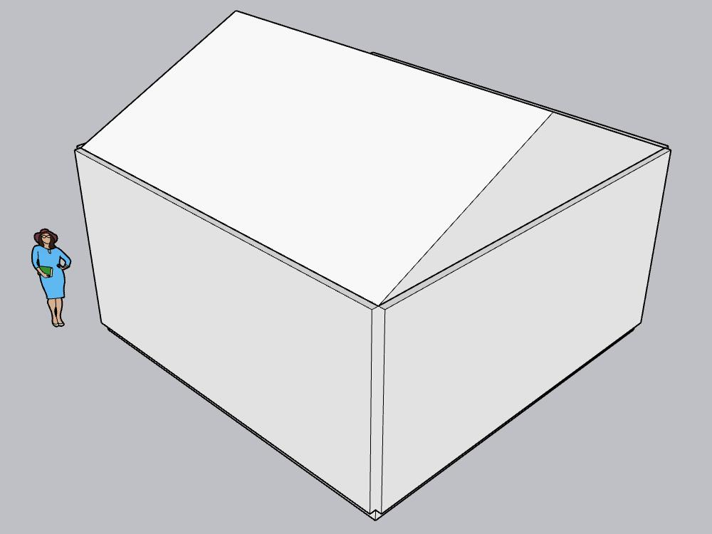

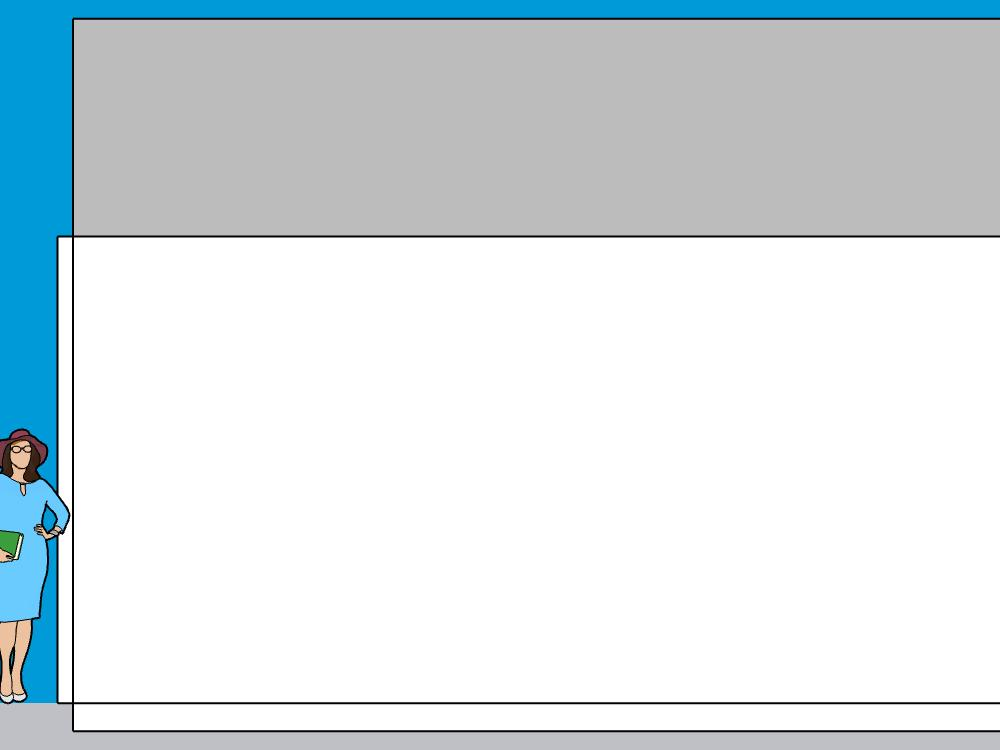

**Acceptance remains incomplete.** SAIE 1.0.0 loads and connects on SketchUp 2024.0.484, but the opening/verification defect stopped the required full tool cycle. The upstream installer syntax, editable-install path handling, broad MCP dependency range, and standalone workspace-write proof remain follow-up items. Do not infer full SketchUp 2024 compatibility from ping or tool discovery.

---

## Previous attempt — SAIE 1.0.0 / SketchUp 2024 compatibility and standalone workspace acceptance (2026-09-28)

### Local execution evidence

| Gate | Result |
| --- | --- |
| Starting repository state | **PASS** — `git pull --ff-only` fast-forwarded to `a5affff8c065c79d4dea5d9ddcfdf602c1b050ca`; `main` and `origin/main` matched and the worktree was clean before execution. |
| Baseline `scripts/check.ps1` | **PASS** — 62 tests passed; one existing Starlette/httpx deprecation warning. |
| SAIE package and source | **PASS** — upstream `iamahsanmehmood/saie` revision `eff6f41ff866bef6b4f2b90be2faa6fe2cc4347f` was checked out detached and installed editable as `saie 1.0.0` in the ignored project venv. Metadata is under ignored `runtime/saie-compat/source.json`. |
| Upstream SketchUp 2024 plugin install | **BLOCKED before file copy** — `scripts/prepare_saie_2024.ps1 -InstallPlugin` prepared the exact source and invoked upstream `scripts/install_plugin.ps1 -Version 2024 -Force`, which exited at line 90 with `A parameter cannot be found that matches parameter name 'or'.` The failing expression is `if (Test-Path $dstDir -or Test-Path $dstLdr) {`. Both the destination plugin directory and loader were confirmed absent afterward; no existing SAIE installation was overwritten. |
| SketchUp 2024.0.484 plugin load / Ruby Console | **NOT TESTED** — the installer stopped before copying the plugin. SketchUp was running with a disposable blank model, and no thesis/source model was opened. No Ruby load error can be reported because the extension was not installed. |
| `saie.exe ping` and live tool list | **NOT RUN** — the runbook connectivity gate requires a successfully loaded plugin. Tool count and required tool names are therefore unavailable. |
| SAIE deterministic wall/opening/slab/roof/edit/delete smoke | **N/A after installer blocker** — no custom geometry code or substitute tool was used. |
| Website `saie__...` discovery | **N/A after installer blocker** — the backend list was not treated as live without a successful plugin connection. |
| Temporary installer correction attempt | **BLOCKED by the active execution host policy** before execution. The pinned SAIE checkout and original upstream installer remained unchanged; no temporary correction file was left behind. The host policy was not bypassed. |
| Standalone workspace-write probe | **BLOCKED PENDING USER POWERSHELL RUN** — it was not run inside Codex because the runbook requires a normal Windows PowerShell session outside this host. Expected result: `runtime/projects/workspace-write-probe/runtime/workspace-write-result.json`. From ordinary PowerShell, run `cd <repo-root>`, then run `.\.venv\Scripts\python.exe scripts\workspace_write_probe.py`; do not use `danger-full-access`. |
| Astra / architecture-quality benchmark | **NOT RUN**, as required. |

The remaining SAIE blocker is the upstream installer’s PowerShell syntax error. The plugin itself has not been classified as compatible or incompatible with SketchUp 2024.0.484. The workspace-write gate also remains pending external PowerShell evidence. This handoff records tool-installation evidence only; no private thesis asset or original model was used or changed.

---

## Latest task — OSS Takeover v1 (2026-09-28)

### Delivered

- Kept the existing Kongxing SketchUp MCP. The live SketchUp 2024.0.484 plugin reported bridge 0.1.0, `connected: true`, and listened on localhost port 45678. A disposable copy of SketchUp's shipped Simple template was opened under ignored `runtime/`; its active model path and GUID matched that copy. Read-only model context and a PNG viewport capture succeeded. No original SKP/DWG or thesis input was opened.
- The existing Kongxing server exposes 19 tools. The product composes 15 Kongxing modeling/readback tools with four namespaced ArchFlow tools (`archflow__doctor`, `archflow__check_project`, `archflow__plan_run`, `archflow__run`). SAIE was not enabled.
- Installed upstream ArchFlow Studio editable from the ignored `.local/oss/archflow-studio` checkout at commit `6438b9a4117b614cb6b22332dfb97a259d6824a3`. `ARCHFLOW_CORE_SKILL` was set to the upstream bundled skill and `archflow doctor --json` returned `ready` for Python, the core skill, and bundled CAD/SketchUp bridge capabilities.
- Ran ArchFlow's namespaced validation, build-plan, and build tools on a generated one-storey, 6 m × 6 m synthetic room inside the ignored project `runtime/agent_workspace`. The manifest has `execute_sketchup: false` and `render_provider: none`; the completed upstream run reports `succeeded`, `executes_sketchup: false`, and no SKP output. Its artifacts include `semantic_plans.dxf`, `build_model.rb`, `metrics.json`, `validation_report.json`, `review_report.md`, `parsed_requirements.yaml`, render-view prompts, and an immutable `run.json`. The validation result is `WARNING` with five review issues; calculated site area is 100 m², footprint/gross floor area 36 m², coverage/FAR 36%, and modeled height 3,000 mm. The result is a pipeline integration fixture, not an approved design.
- Reviewed [SAIE](https://github.com/iamahsanmehmood/saie), [Supex](https://github.com/darwin/supex), [ArchFlow](https://github.com/bingxijun/archflow-studio), and [PlanFloor](https://github.com/zhixiangggggggg/sketchup-planfloor-ai-agent) upstream docs/licenses. SAIE documents SketchUp 2025 as its plugin target, while this machine has 2024.0.484, so its package/plugin was not installed into an unsupported version. Supex is MIT-licensed but describes an experimental macOS / SketchUp 2026 workflow, so only its project-script/inspect/revise pattern was retained. PlanFloor's current README targets SketchUp 2025 and the repository root has no compatible top-level license file, so no code was copied. ArchFlow's source is Apache-2.0; its brand/media exclusions remain respected by keeping the checkout local.
- Fixed a test-discovery issue so `scripts/check.ps1` runs only repository-owned tests, not third-party tests from Codex's generated runtime plugin cache. Made the local backend CLI emit ASCII-safe JSON and forced UTF-8 on ArchFlow child processes; this fixed Windows GBK/Unicode path failures during `plan_run` and build. Preserved the precedent-fidelity phrase that the existing regression test expects. Added tests for nested App Server context isolation and Unicode child output.

### Workspace-write acceptance blocker

- The App Server was configured for Luna Max coding work with `workspace-write`, a single writable root at the generated `runtime/agent_workspace`, and network access disabled. A tiny filesystem-only App Server turn attempted one write inside the workspace and one write to a synthetic sibling input sentinel. The host's `codex-run` execution layer rejected even the in-workspace write with `blocked by policy`; the outside write was not created. A separate `codex exec --sandbox workspace-write` probe reported its effective sandbox as `read-only` and likewise created no file.
- Therefore, the required real `workspace-write` proof is **BLOCKED by the current desktop execution policy**. The code passes the configured policy to App Server, but this host session cannot demonstrate a write inside its writable root. Do not treat the sandbox acceptance gate as passed. No private inputs were used or changed.

### Acceptance and verification

| Gate | Result |
| --- | --- |
| Existing Kongxing MCP to real SketchUp | **PASS** for live health, disposable-model identity, read-only context, and screenshot. |
| SAIE live semantic modeling cycle | **BLOCKED**; the installed SketchUp is 2024.0.484 and upstream targets 2025. Do not force-install it or claim the wall/opening/slab/roof/modify/delete/repair cycle. |
| ArchFlow upstream install, doctor, and namespaced tools | **PASS**. |
| ArchFlow semantic DXF / model metrics / Ruby / review artifact run | **PASS** with SketchUp execution disabled; artifacts remain under ignored runtime. |
| App Server workspace-write and input immutability proof | **BLOCKED** by the host's read-only command policy; no outside file was created. |
| Supex / PlanFloor reuse decision | **PASS** for license/platform inspection; no source copied. |
| `scripts/check.ps1` | **PASS**, 62 tests; one existing Starlette/httpx deprecation warning. |
| Private inputs and runtime hygiene | **PASS**; ArchFlow checkout, Codex sandbox fixtures, model copy, logs, and screenshot remain under ignored `.local/` or `runtime/`. |

This milestone stops here. Do not start a model-quality benchmark or another milestone until the SketchUp 2025 compatibility and host workspace-write blockers are resolved and reviewed.

## Latest task — Thesis Parity v1: reference-rich local benchmark

### Multimodal delivery and input parity

- Fixed the Codex App Server image wire type to `localImage` (the earlier `local_image` spelling was rejected), typed uploaded `Reference` objects correctly, retained DOCX table text when extracting the real taskbook, and selected/normalized the DWG-derived redline in a unitless survey-coordinate DXF. These fixes have focused regression tests.
- A no-tool smoke turn sent two different Jinshan images to `gpt-6-astra` Low and `gpt-6-luna` Max. Both correctly distinguished the mountain-like aerial rendering from the annotated plan. Captured `turn/start` payloads contained `text` plus two `localImage` items; neither turn accessed SketchUp. Generated `outputs/` images were excluded, and user-facing replies were checked for absolute-path leaks.
- The formal A/B package contains the same private taskbook, DWG-derived site material, ECADI URL, user intent, and eight images in this order: `reference-01.png` through `reference-06.png`, `site-image-01.png`, `site-plan.png`. Their SHA-256 values, in order, are `6303706ddb71f3fca81e7ba942b4f9cf180a6c54a640ebe4973253ce147a5356`, `27e261107d098ed7eba952ee76a521087ed0fede1e8d728ad4e110c567f0882e`, `2e097d26dc0222613125a6d1b060ad77d696c1ec2ea5f622a45362fd100d88a8`, `77187c01284eeeb0d66b7801da46babf396f09a1f391a03cb66264bd43fcb965`, `4d3c743d776e0e5c65c3b22959c3b53d7282906f34adb526a939186e91642b49`, `b542107d07b4e83094de5c63d01bcc07535905405b316c48614c6a63d17d195f`, `cfb1f6aad1283c897fec5aec60a64d6e131ff22480de4f018f45496bde33cb85`, and `ebd7371ab6ebecc755407402effed385000f9d704d58ceedba69a8af625b0bcc`. The image set and names match across both isolated projects. The same five reconstructed historical prompts, Architecture Skill revision `8be9ec80359cd90a7cfc5d9b03d2b0cf86188772`, guarded project Ruby, and Kongxing tool surface were used.
- The original successful thesis SKP/CAD and screenshots were used only for read-only quality comparison. The benchmark used separate blank/disposable SketchUp copies. Private assets, runtime screenshots, transcripts, and models remain in ignored local `runtime/` or their original private locations; no private source package is committed.

### Observed modeling quality and constraints

- Astra Low completed all five turns on its own disposable model: 3,465,579 ms across completed turns, 50 SketchUp tool calls, four failed calls. Native App Server API token counts and service region were unavailable. One interrupted fifth turn was resumed from its last completed disposable checkpoint with the same prompt, and this recovery is recorded in the local result.
- The model has a six-volume cluster, ground public lanes, a long-side entry, linked upper platforms/bridges, stairs, glazing and a claimed 20,900 m² above-grade program. Its reported maximum height is 23.75 m and six main footprints total 5,225 m². This is an editable schematic, but the matched exterior and plan screenshots show regular flat-topped box volumes, repetitive glass bands, limited landscape/context and weaker spatial/silhouette detail than the historical thesis's varied rising white envelopes, integrated bridges, layered platforms and surrounding roads/water/greenery. The agent explicitly chose not to reproduce the mountain-like roof form. Interior room planning, fire/structure/accessibility, and an agentic CAD drawing were not demonstrated. This is **below the historical thesis quality bar** despite completing tool calls.
- Taskbook site area is 11,490.510 m²; this DWG-derived redline is 10,970.033 m², and an older DXF was 9,640.041 m². The model preserved the present redline and disclosed the conflict. The reported 20,900 m² counted above-grade area implies FAR approximately 1.905 on that redline, exceeding 1.82. Green ratio 20% was not met or independently verified. The taskbook also contains conflicting 6,500/7,500 m² underground-area statements; no basement geometry was built. Reported program/height values are agent readback, not a permit-grade compliance audit.
- The historical direct workflow documented nine varied volumes, 42 floor slabs and a separate 13,511-primitive CAD preview in [the public case study](THESIS_MODELING_CASE_STUDY.md), after several focused shape, skin, bridge, entry and road revisions. Its own reported FAR/site-area discrepancy also remained unresolved; visual quality is separate from full compliance. This five-turn website reproduction preserved broad prompts and evidence classes but not every original interaction or modeling operation. The benchmark prompt also said not to copy the precedent's concrete form; that may have encouraged the flat-roof abstraction. These differences limit attribution of the visual gap to model capability alone.

### Acceptance and limits at experiment end

| Gate | Outcome |
| --- | --- |
| Real multimodal image delivery to Astra Low and Luna Max | **PASS**; both distinguished an aerial rendering from a plan, and formal turns used the eight-image wire payload. |
| Astra Low full five-turn run | **PASS for execution, FAIL for historical thesis visual quality**; six flat-topped schematic volumes lack the original varied white envelopes and scene depth. |
| Luna Max full five-turn run | **FAIL / incomplete**; one site turn completed, then road refinement exceeded 30 minutes and a recovery was stopped after more than 55 minutes. |
| Sol Medium follow-up | **PARTIAL**; two site turns completed faster than Luna, third building turn ended at the user's request. Its building quality remains unknown. |
| Same-model revisions | **Astra: PASS for execution, with visual gaps. Sol: site revision only. Luna: no completed second turn.** |
| Taskbook/site conflicts | **PASS for disclosure**; FAR and green ratio remain open as described above. |
| CAD continuity from the agentic model | **UNVERIFIED**; do not treat the legacy DesignIR DXF as equivalent. |
| Source asset isolation | **PASS**; no original thesis SKP/DWG, taskbook, reference image package, transcript, runtime data or credential is staged for Git. |

The user ended the experiment after inspecting the early results. Sol Medium is the selected provisional standard-tier route because Luna Max was not operationally usable here, but this run does **not** prove Sol can deliver a good building. No extra Astra modeling was run after the quota instruction.

### Verification and local evidence

- `scripts/check.ps1`: **50 passed**, one existing Starlette/httpx deprecation warning.
- Formal screenshots are captured under each ignored run's `projects/<project-id>/outputs/renders/` as `matched-plan.png`, `matched-exterior.png`, and `matched-entry.png`; these are private local review artifacts. The historical thesis screenshots were inspected read-only at corresponding overall/entry views. No private images were copied into Git.
- The website's legacy rectangle DesignIR/CAD exporter was not used to replace agentic geometry. A corresponding CAD/drawing from the generated rich model remains an unverified capability gap.

### Luna Max status and latency diagnosis

Luna uses `gpt-6-luna` / Codex App Server / Max / Economy, with no Astra rescue. Its first, site-only turn completed in 1,022,641 ms (19 tool calls, zero failed). The second prompt is also site/road-only, so no building is expected until the third prompt. The second turn exceeded an initial 30-minute App Server wait. A recovery reopened a copy of the last completed disposable checkpoint and resent the identical second prompt on the same Luna thread. The App Server log recorded multiple WebSocket disconnections and an HTTP fallback. The recovered attempt spent about ten minutes in model reasoning before its first SketchUp tool call. One local rollout sample reported 167,200 input tokens (141,184 cached) and 9,146 output tokens for a sampling step; these are diagnostic usage values, not an API cost or a per-turn total. The eight source PNGs total about 7.1 MB and are reattached on each turn, enlarging context/processing load with Max effort. This identifies severe Max-effort/context latency with some transport retries. At the user request, the recovery was stopped after more than 55 minutes without a completed second turn to conserve quota and compare Sol Medium instead. Luna therefore has one completed site turn and no building output; its architectural quality cannot be scored from this run. No further Astra modeling calls were made.

### Standard-tier route decision

- Per the user's follow-up, the prototype Economy default is now `gpt-6-sol` at **medium** effort. `gpt-6-astra` at **low** remains the explicit Premium route. The Sol comparison uses the same private package, historical prompt sequence and tools from a new blank SketchUp copy. Luna Max remains a benchmark override, not the product default.
- An Economy request now always stays on Economy, even after repeated tool failures. The product can suggest Premium, but only a user-selected Premium turn calls Astra. This also prevents an unattended Sol benchmark from consuming Astra quota through rescue.
- Sol Medium completed two site-only turns on its own blank SketchUp copy: **534,187 ms / 7 calls** for the initial redline and roads, then **521,281 ms / 2 calls** for revised entry/road layout; all 9 calls succeeded and both turns verified the same eight `localImage` inputs. Luna Max's same first turn took 1,022,641 ms / 19 calls. Sol reached the third, architecture-building prompt, but the user ended this experiment before that turn returned; no completed Sol building or final matched architectural views exist. The local Sol result is marked `interrupted_by_user` after two completed turns, not `complete`. The site screenshots show a five-point redline, adjacent roads and three schematic access stubs; they do not establish architectural quality. One Sol reply contained an invalid placeholder screenshot link, also recorded as a presentation defect.

---

## Latest task — Cost / Quality Router v1

### Delivered

- Added a deterministic **Economy / Premium** selector. Economy is the default and routes to GPT-6 Luna at low reasoning through the local Codex App Server. A user-selected Premium turn routes to Astra Low and then returns the selector to Economy. An Economy turn never resolves to an Astra route. After two failed Economy SketchUp calls or a detected loop stall, the next Economy request may use one visible Premium rescue turn.
- Extracted one shared project-scoped agent-tool surface for the Architecture Skill, guarded project Ruby, configured Kongxing SketchUp tools, model readback, and screenshots. The Codex and LiteLLM runtimes use the same schemas, dispatch, and project context; no new MCP server, SketchUp connector, Ruby modeling system, or architecture skill was created.
- Added an optional LiteLLM adapter for Qwen3-VL Flash via DashScope Model Studio, controlled by local environment settings. The dependency is optional and the adapter does not activate without `DASHSCOPE_API_KEY`. No Qwen/GLM key was present, so no Chinese-provider result is claimed. LiteLLM source is not vendored; see [the component map](OPEN_SOURCE_COMPONENT_MAP.md) for the license and upstream references.
- Made the tier labels and send availability follow the runtime's configured routes. If a configured Economy provider lacks its key or optional package, the UI marks that route unavailable and does not silently send to Astra; an available Premium route remains an explicit user selection.
- Persisted route, provider, region, model, reasoning, available token usage, elapsed time, tool calls, tool failures, rescue state, and benchmark findings in session / benchmark metadata. The local Codex App Server does not expose token counts, per-model cost, or a service region; those values are stored as unavailable rather than estimated.
- Added an optional-provider setup command and the reproducible benchmark runner. The public benchmark input is synthetic; source project assets and all SketchUp/Ruby runtime files remain under ignored `runtime/`.

### Controlled real SketchUp benchmark

Both models ran the same synthetic **60 × 48 m waterfront community learning center** input and follow-up request through the same local SketchUp 2024 / Kongxing connector, Architecture Skill revision `8be9ec80359cd90a7cfc5d9b03d2b0cf86188772`, project Ruby layer, and tool schemas. Each used its own blank disposable SketchUp document. The original brief hash is `58603e178062c85398a4ff0208c06c377c5673f6235feb52e1d30762f4b84c60`; the public JSON bytes hash is `89f2454e6ef8a93ce0ec312b9e140585ce063df38187235a1d56a95c94eecdd9`.

| Tier | Model / provider / region | Reasoning | Wall time | Tool calls / failures | Tokens | Follow-up and visual result |
| --- | --- | --- | ---: | ---: | --- | --- |
| Economy | `gpt-6-luna` / Codex App Server / `codex-managed (not exposed)` | low | 156,937 ms (129,234 + 27,703) | 17 (10 + 7) / 0 | input/output unavailable | Claimed a 4.0 m → 4.5 m path edit, but the final matched views show only an isolated narrow slab/path and a small scale figure; complete building massing is not visible. **Architecture-quality fail**, despite zero tool errors. |
| Premium reference | `gpt-6-astra` / Codex App Server / `codex-managed (not exposed)` | low | 306,423 ms (274,360 + 32,063) | 13 (8 + 5) / 0 | input/output unavailable | Clear two-wing massing, south public entry/path, east service lane, openings, and courtyard connector. Roofs obscure the plan, some labels overlap. The agent declined the requested 0.5 m path edit because it could not safely target nested geometry, and changed only the view. |

Token totals, retry count beyond observed tool failures, per-model price, and region are **not exposed** by this native runtime. No cost estimate is inferred. `complete` in the run records means that the benchmark procedure finished; it does not mean the model passed the quality gate. Luna's architecture result is a recorded failure. Astra is a useful exterior/massing reference, not a code-compliance or interior-plan pass. Same-model follow-up context was retained for both; neither successfully met the follow-up's geometry-preservation requirement.

The curated images use the same site-origin plan and exterior camera directions. They were manually inspected and the findings above are saved in each runtime benchmark record.

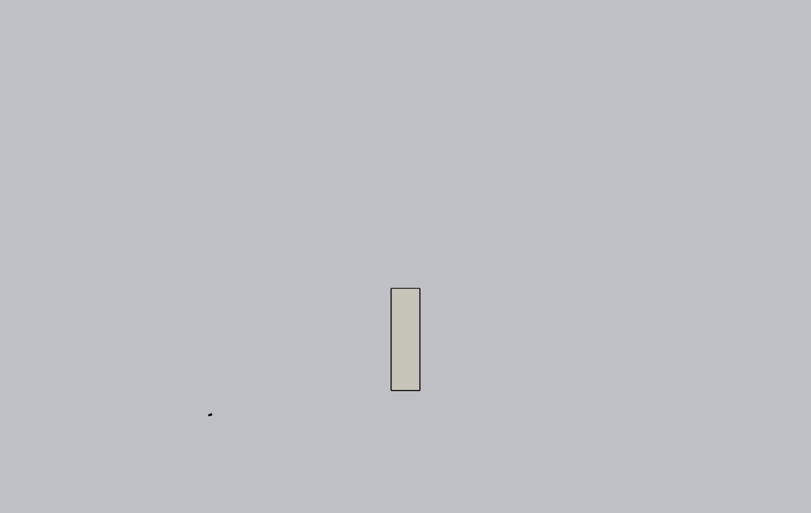

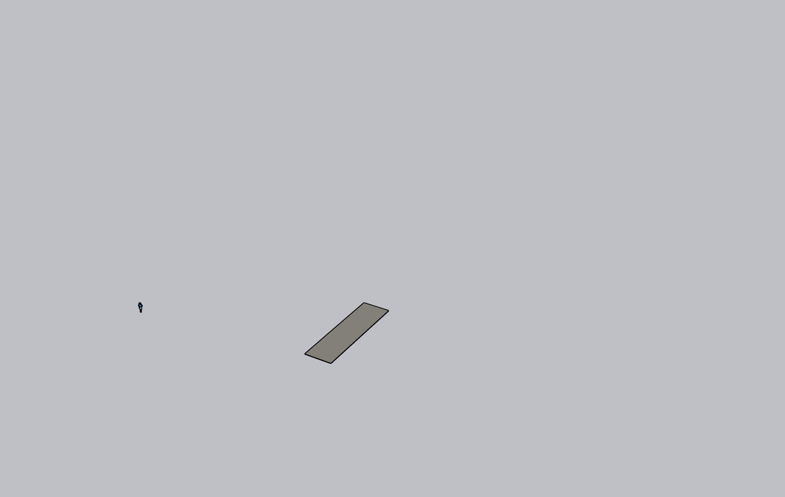

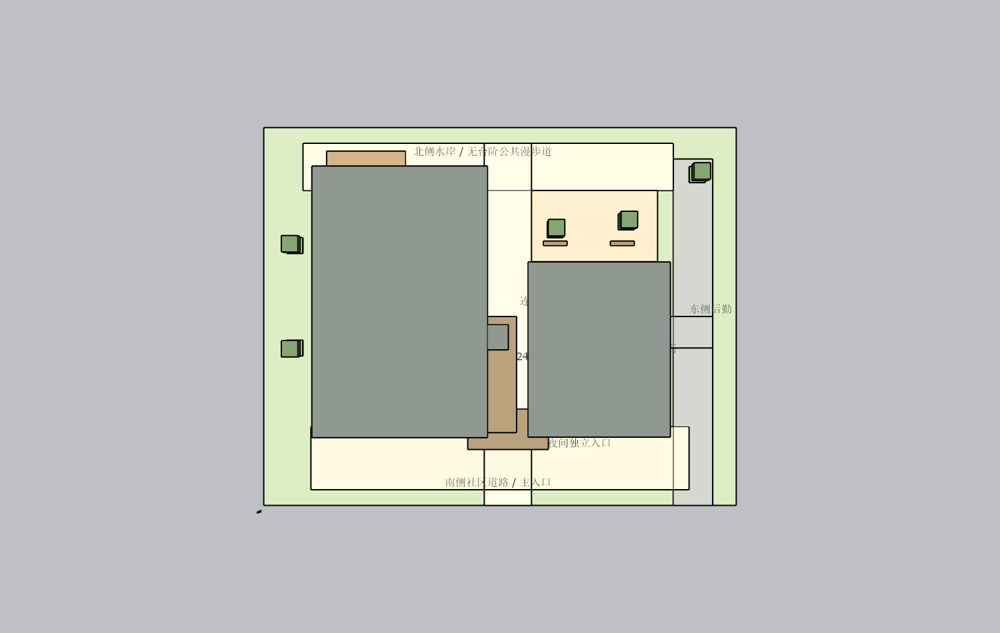

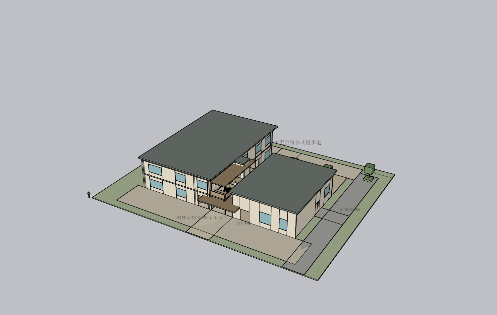

### Acceptance and verification

1. Provider-independent Architecture Skill / Ruby / Kongxing tool surface — **PASS**.
2. Replaceable provider boundary with optional LiteLLM Qwen adapter — **PASS**; a live Qwen call was not applicable because no credential was available. The optional package install was blocked by a Windows file lock in the existing virtual environment; mock adapter tests ran, and no unrelated Python process was stopped.
3. Astra Low still runs as an explicit one-turn Premium reference — **PASS**.
4. GPT-6 Luna was run against the identical real SketchUp benchmark — **PASS for execution; FAIL for useful final architecture output**.
5. Provider / model / timing / tool / screenshot results persist — **PARTIAL** because the native runtime does not provide token totals, region, or price.
6. Matched-view quality findings are recorded — **PASS**; screenshot review exposed Luna's missing massing and Astra's roof-obscured plan. No automated architectural score is claimed.
7. Economy / Premium selection and the one-turn visible rescue policy — **PASS**; no Astra rescue was used in these benchmark runs.
8. Existing connector reused; no private thesis asset or original model touched — **PASS**.
9. Test suite and real disposable SketchUp benchmark — **PASS for execution**; architectural quality limitations above remain explicit.
10. Commit and `origin/main` verification — **PASS** after the completed change is pushed and the remote SHA is verified.

### Checks

- `scripts/check.ps1`: **41 passed**, with one existing Starlette/httpx deprecation warning.
- `node --check app/static/studio.js`: **passed**.
- `python -m py_compile` for the changed runtime, router, and benchmark modules: **passed**.
- `git diff --check`: **passed**; Git printed only the repository's existing LF-to-CRLF working-copy notices.
- Benchmark outputs and provider/API credentials remain outside Git; only the sanitized input, curated viewport screenshots, implementation, and documentation are candidates for commit.

---

## Latest task — Quality Lift v1: Astra Low + Architecture Skill + Ruby

### Delivered

- Kept the current native model `gpt-6-astra` and changed the normal reasoning effort from high to **low**. `ARCH_STUDIO_CODEX_REASONING_EFFORT` remains an explicit local experiment override (`low`, `medium`, `high`, `xhigh`, or `max`); no higher effort was used to improve this benchmark. The API/local session status records both active settings.
- Selectively vendored the MIT-licensed `Mentat-Uran/sketchup-architect-skill` at commit `8be9ec80359cd90a7cfc5d9b03d2b0cf86188772`, retaining its `LICENSE` and attribution in `app/vendor/sketchup_architect/UPSTREAM.md`. The agent receives a bounded selection of workflow sections (under 12,500 characters) on modeling turns, not a repository dump.
- Added a project-local Ruby execution helper that exposes one task-specific script tool through the already configured Kongxing connector's `sketchup_eval_project_file`. It checks the active model path, fresh SketchUp GUID, and edit context; refreshes that GUID after existing MCP tools edit the model during the same turn; stores source/reports only under ignored project runtime; scopes revision geometry to an owned root; returns readback and an image; and keeps the raw connector eval tool hidden. No MCP server or connector was rebuilt.
- Reasserted the host-owned project-root identity after agent source runs, preventing script metadata from changing the root's project identity. Added source checks for file/process access, Ruby reflection/dispatch, model escape paths, and whole-document erase/save operations. **These checks are static guardrails, not an isolated Ruby sandbox**; this milestone does not claim hostile Ruby can be securely contained inside SketchUp.
- Added focused tests for low/default configuration, the override, prompt context selection, Ruby path/source/model guards, the active-model gate, same-root revision and screenshot lifecycle, camera up-vector handling, and benchmark persistence.

### Controlled real SketchUp A/B benchmark

- Both variants used the exact same active disposable SketchUp document, model `gpt-6-astra`, reasoning effort **low**, and sanitized synthetic input hash `58603e178062c85398a4ff0208c06c377c5673f6235feb52e1d30762f4b84c60` (60 × 48 m waterfront community learning center). Only B received the selected architecture skill and the project Ruby tool. SketchUp version: `24.0.484`.
- A used the existing MCP tools without skill injection or project Ruby. Its view shows a simpler pair of roof-heavy masses, site road, and a limited visible courtyard/connection. B produced a two-level program with separated learning/workshop and independently entered hall volumes, real façade openings, a south public path and entry, east service access, and a north waterfront terrace. In the matched exterior view B has visibly richer openings and façade rhythm. The plan view remains roof-obscured, so it does **not** establish that the internal layout is legible from above.
- B's Ruby transaction readback covered 277 groups, 3,252 edges, 1,626 faces, and 12 text entities inside the owned project root. The vendored upstream read-only audit completed its traversal, but reported 34 duplicate semantic-ID categories (repeated wall pieces, furniture, columns, and shading members). This is a QA defect; `complete: true` means the walk finished, not that the geometry passed. No code or claim treats it as a clean audit.
- After the first B screenshot, the agent called undo, added a replacement mass, and reset the camera; this is recorded as one agent-initiated correction. A same-thread natural-language follow-up extended the south entry canopy on the same SketchUp document and captured a second pair of views. After identifying and fixing the helper reload boundary, a second real Kongxing → SketchUp project-script revision committed as revision 2 even though the audit module was already loaded; the root stayed bound to `fast-assembly-synthetic-pavilion`. An audit-verified disposable checkpoint remains only under ignored `runtime/`. No `.skp`, runtime Ruby, private thesis asset, API key, or machine path is included below.

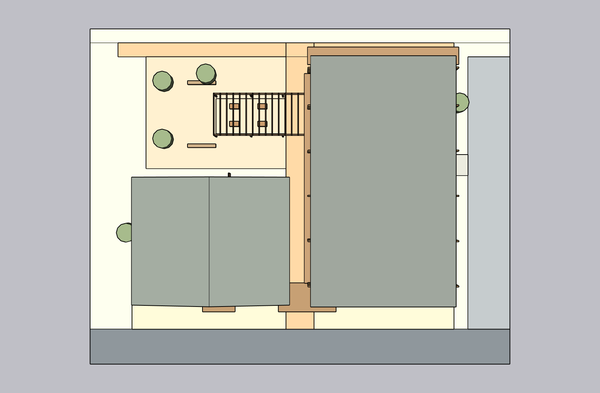

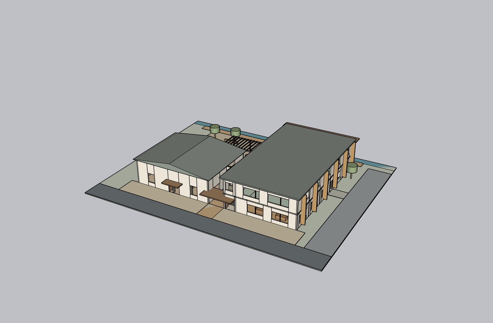

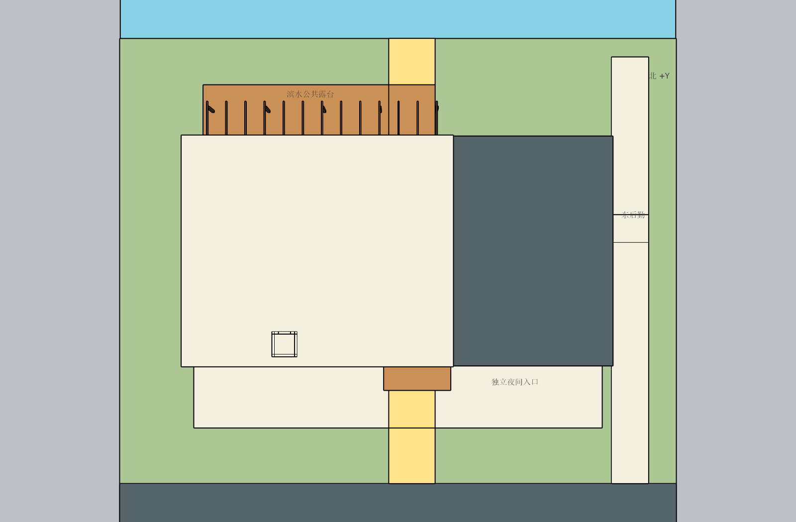

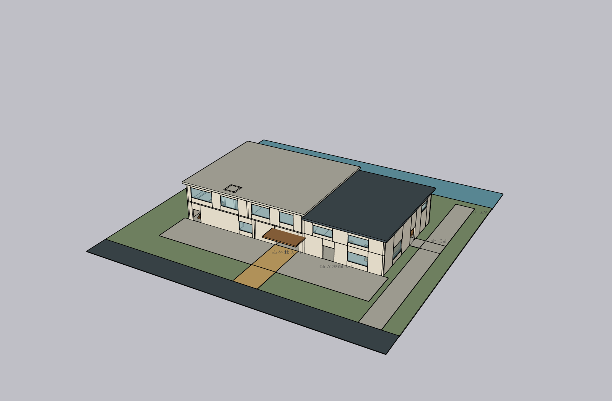


### Acceptance criteria

1. Native product defaults to the current Astra model at low effort — **PASS**.
2. Active model and effort appear in local status/session state — **PASS**.
3. MIT SketchUp Architect Skill is reused with attribution — **PASS**.
4. The agent receives selected bounded workflow context — **PASS**.
5. Project Ruby path/model/revision guardrails work through the existing connector — **PARTIAL** (static source restrictions are not a secure Ruby sandbox).
6. No new MCP/SketchUp bridge was built — **PASS**.
7. A/B used the same model, low effort, and input; only skill/tool availability changed — **PASS**.
8. B is visibly more detailed than A in matched screenshots — **PASS**, with roof-obscured plan and repeated semantic IDs recorded as remaining QA gaps.
9. B inspected its output and made an agent-initiated correction — **PASS**.
10. Natural-language follow-up changed the same SketchUp document — **PASS**.
11. Existing workspace/session/model safety behavior remains covered — **PASS** (`scripts/check.ps1`).
12. Private source models/assets, credentials, runtime scripts, and local model files are not included — **PASS**.
13. Handoff includes settings, A/B method, screenshots, license, and gaps — **PASS**.
14. Implementation is committed and pushed to `origin/main` — **PASS** (see the current handoff commit in Git history).

### Checks and local verification

- `scripts/check.ps1`: **35 passed**, one existing Starlette/httpx deprecation warning.
- `git diff --check`: passed.
- Existing Kongxing connection reached SketchUp 2024; active path remained the project-local `blank-disposable-20260927-104818.skp`. The upstream model audit ran against its owned root and the audit-verified checkpoint was saved locally under ignored `runtime/`.
- Screenshot files above were inspected. The model audit deliberately remains a recorded failure category, not an acceptance pass.
- `.gitignore` continues to exclude `runtime/`, local `.skp`/`.dwg` files, scripts, and generated state; only sanitized synthetic viewport PNGs were curated into this handoff.

---

## Latest task — Fast Assembly v1: Astra-native Architecture Agent

### Delivered

- Made the local Chinese workspace conversation the primary modeling path. It starts with design discussion, then opens a project-specific copy of SketchUp's Simple template and continues on that same editable model. The fixed DesignIR/BuildPlan flow remains under a collapsed legacy section for compatibility; it is no longer the product's main geometry path.
- Added `CodexAppServerRuntime` behind a replaceable local-agent boundary. It runs the signed-in local Codex App Server with the current prototype model `gpt-6-astra`. Project context and the latest message go directly to the agent; it may make a sequence of SketchUp tool calls, inspect returned model data/images, and refine the model before responding.
- Reused the user's already-configured `kongxing_sketchup` MCP and its existing 19 tool schemas. The installed server uses its existing custom Content-Length framing, which the App Server's native stdio MCP client did not accept in the initial compatibility probe. To preserve the working connector without implementing a new MCP server or protocol, the local App Server turn exposes only the existing Kongxing tool schemas as dynamic tools and dispatches each call to the existing connector client. No other configured MCP server is loaded into the isolated agent home.
- Kept Codex credentials local. The runtime creates its own Codex home under `%LOCALAPPDATA%\AI Architecture Studio\CodexHome`, reuses only the existing Codex sign-in cache, and writes a minimal isolated configuration. It does not modify the user's global Codex configuration or use an API key. Agent shell access is read-only; SketchUp actions go through the existing MCP tool allowlist.
- Added an active-model path gate: modeling tools are enabled only after the active SketchUp document resolves to that project's `blank-disposable-*.skp` under ignored `runtime/`. Session reconnect opens the same disposable copy. No thesis source model is opened or written.
- Added transcript filtering for absolute local paths returned by connector tools so machine paths do not appear in the user-facing reply/history.

### Run Fast Assembly v1 locally (Windows)

```powershell
.\scripts\setup.ps1
.\scripts\dev.ps1
```

Open `http://127.0.0.1:8787`, load or create a project, and enter the design context. Click **打开空白副本并连接 Agent** when ready to model; the app creates/reconnects to that project's disposable SketchUp copy. Continue with natural-language requests in the same conversation. Run checks with `.\scripts\check.ps1`.

### Synthetic real-SketchUp benchmark

- Used project `fast-assembly-synthetic-pavilion` with a synthetic 60 × 48 m waterfront site brief. No private thesis files, site CAD, or source SketchUp files were used.
- On the blank disposable SketchUp model, Astra selected and sequenced 11 distinct existing MCP tools in one turn: model context, masses, road/site, gable roofs, stair, cylinders, facade grid, group transform, camera, viewport export, and grouping. The result has three distinct building wings, pitched roofs, a two-level reading pavilion with terrace and stair, a covered courtyard connection, public platform/steps, paths, facade divisions, and trees. The agent inspected its screenshot and adjusted the canopy/roof connection, facade/window placement, landscape objects, and stair protection before replying.
- A second natural-language request asked to extend the covered courtyard canopy 4 m south while preserving the buildings and roofs. The same persistent Astra thread and same active model (`blank-disposable-20260927-104818`) continued; the agent read model context, added the extension and supports, checked the updated screenshot, and saved a new project checkpoint. Model readback moved from 7 to 8 top-level entities. The local checkpoint, session identifier, and runtime screenshots remain ignored.
- The following curated screenshots are from that synthetic disposable model; the `.skp` and runtime data are not committed.

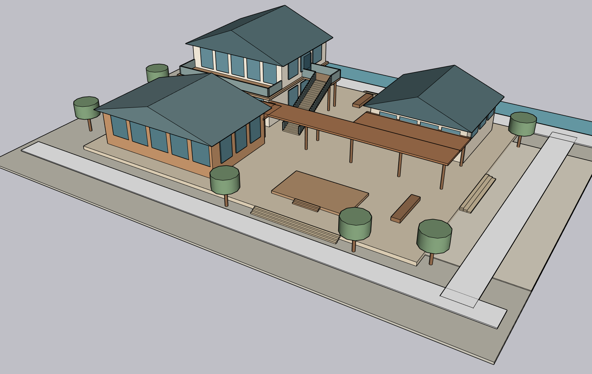

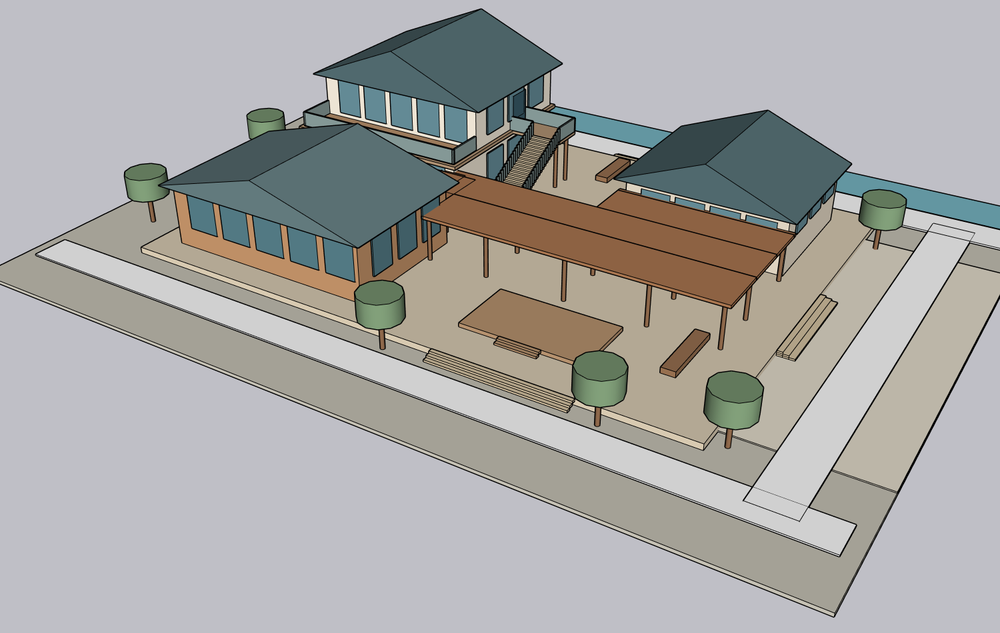

### Acceptance criteria

1. Normal workspace uses the native agent conversation as its primary modeling route — **PASS**.
2. The native agent can access the configured SketchUp tools through the existing Kongxing connector; no replacement MCP server was built — **PASS**.
3. One user request can trigger multiple agent-selected operations — **PASS** (11 distinct tool types in the first real model turn; 6 in the follow-up).
4. The agent can inspect model state/screenshots and correct the same model — **PASS** (first-turn visual corrections and follow-up visual check).
5. Real benchmark geometry is materially richer than the old three-box sample — **PASS** (three roofed wings, two-level pavilion, terrace, stair, canopy/bridge, public-space platform and landscape).
6. Non-trivial form, vertical relationship, and site/public connection are demonstrated — **PASS**.
7. A follow-up natural-language instruction modifies the same model rather than rebuilding — **PASS** (same thread and active model path; entity readback 7 → 8).
8. Chinese workspace, project persistence, and conversation are retained — **PASS** (`scripts/check.ps1`, API/UI tests).
9. Private thesis assets, credentials, raw SKP/DWG files, and machine paths are absent from the commit — **PASS** (runtime/model paths ignored; only synthetic viewport PNGs curated here).
10. Open-source reuse follows compatible licensing — **PASS** (no external source code copied; reused the already-installed local Kongxing MCP without redistributing it).
11. HANDOFF records reuse, implementation boundary, and real benchmark evidence — **PASS**.
12. Completed implementation is committed and pushed to `origin/main` — **PASS** (`6702a46edcd7f950b3ae8318b3b15108b2f2d4f6` is present on the verified remote branch).

### Checks

- `scripts/check.ps1`: **25 passed**; one upstream Starlette `TestClient`/httpx deprecation warning.
- Real follow-up call through the local web API and Codex App Server: HTTP 200; Astra thread resumed; same active SketchUp model validated; six distinct MCP tool types recorded; updated model checkpoint and viewport artifact persisted.
- Final read-only call through the configured Kongxing connector confirmed that the active SketchUp document is still the project's disposable copy and reads 8 top-level entities. The environment-derived generated-script directory resolves under Windows `PROGRAMDATA` on this machine.
- Both synthetic SketchUp viewport images were visually inspected before being curated into this document.
- `git diff --check`: passed. Runtime outputs, local Codex home, `.skp`, and `.dwg` remain excluded by `.gitignore`.

---

## Previous task — Thesis Modeling Showcase v0.1

### What changed

- Added a responsive Chinese project case study at `/showcase`, with an entry link from the Product Alpha workspace. It explains the reference-to-site translation, model iterations, long-side entrance and garage interface, SketchUp-to-CAD correspondence, GPT-6 Astra/Codex role, and remaining design checks.
- Added a GitHub-readable companion at `docs/THESIS_MODELING_CASE_STUDY.md` with the same evidence and image captions.
- Curated nine web-optimized WebP previews from the user's own SketchUp viewport and CAD export. The page includes an accessible image lightbox, reduced-motion handling, responsive layouts, and honest scheme-stage limitations.
- The official ECADI article is linked for reference attribution. No source images from that article, source SKP/DWG, taskbook, raw design graph, or private machine paths were included. The app has no configured deployment service; this task adds the route and source, not a hosted endpoint.

### Evidence and review boundaries

- Latest model evidence snapshot: v12, nine units, 42 floor plates, approximately 20,900 m² above-grade scheme area, maximum height 23.6 m. The local QA record reports visually reviewed geometry and CAD/SU outline agreement.
- CAD snapshot: A-01 site plan at 1:500 plus A-02 through A-08 floor plans at 1:200; 13,511 ordinary CAD entities. The seventh-floor preview contains one small upper mass, approximately 198 m².
- Page and companion document disclose unresolved land-area/FAR/underground-area conflicts, schematic CAD-only interiors, non-native Tianzheng entities, pending plot-output review, and the absence of structural, fire, egress, and accessibility approval.
- `scripts/check.ps1`: **19 passed**, with one pre-existing Starlette `TestClient`/httpx deprecation warning.
- `node --check app/static/showcase/showcase.js` and `node --check app/static/studio.js`: passed.
- `git diff --check`: passed.
- Local `GET /showcase`: HTTP 200; the page contains the case title and gallery. Curated image HEAD request returns HTTP 200 with `image/webp`.
- The Codex browser panel request is queued and the CUA browser inventory could not attach in this session. The route and static assets were checked over localhost and through TestClient; no browser screenshot is claimed.
- The local app is running at `http://127.0.0.1:8787`; open `/showcase` to view the case page. There is no automatic public hosting configured.

## Previous milestone — Product Alpha v0.2

Product Alpha v0.2 was implemented, tested, and exercised against the local Codex CLI and the existing SketchUp MCP before this case-study task began.

## Product Alpha v0.2 implementation

### What changed

- The workspace copy, statuses, labels, help text, and error fallbacks use Simplified Chinese. The page title and in-app version now identify Product Alpha 0.2.
- One persistent conversation area records user and Codex messages. Before a SketchUp build, Codex receives the existing DesignIR and conversation and regenerates the structured design. After a build, the same box sends one validated edit to the existing live model.
- Public HTTP/HTTPS references are checked before connection. Requests resolve DNS once, reject every non-public address, connect to that validated IP while retaining the original Host/TLS name, disable environment proxies, use an 8-second connection/read timeout, cap the response at 1 MB, and follow at most three revalidated redirects. The reader extracts HTML title and visible text (or plain text) and stores a 4,000-character excerpt and timestamp in ProjectContext. JavaScript-only or otherwise unreadable pages remain marked unreadable with a Chinese screenshot/image fallback. Uploaded reference images still go to Codex.
- Edit plans now allow one bounded mass width or depth change, or one route width change, in addition to the existing height/floors/origin operations. Width/depth changes target rectangular building masses. Route width changes target straight horizontal or vertical circulation. Values are checked against fixed limits and the site boundary before the connector is called.
- `SketchUpAdapter` and the existing Kongxing MCP remain in use. Connector transform bounds are retained in model-state readback. The DXF, viewport, project persistence, and A3 presentation pipeline remains intact.

### Files changed

- `app/references.py` — public-page URL validation, pinned-address HTTP/HTTPS fetch, response limits, and visible text extraction.
- `app/models.py`, `app/brain.py`, `app/main.py` — reference metadata, conversation persistence, pre-build refinement, post-build edits, and deterministic width/depth/route-width validation.
- `app/static/index.html`, `app/static/studio.js`, `app/static/studio.css` — Chinese conversation and reference status UI; optional edit examples retained.
- `tests/conftest.py`, `tests/test_demo.py` — reference safety/extraction/size, conversation, dimension, readback, UI-copy, and v0.1 regression checks.
- `scripts/check.ps1`, `README.md`, `docs/HANDOFF.md` — current check label, run instructions, and evidence.

### Local run instructions (Windows)

```powershell
.\scripts\setup.ps1
.\scripts\open_blank_sketchup.ps1
.\scripts\dev.ps1
```

Open `http://127.0.0.1:8787`. Add inputs, use **讨论与修改** to refine the design, confirm the active SketchUp document is blank/disposable, then build. Continue in the same conversation to edit the current SketchUp model. Run automated checks with `.\scripts\check.ps1`.

### Tests and local UI verification

- `scripts/check.ps1`: **18 passed**, with one existing Starlette `TestClient`/httpx deprecation warning.
- `node --check app/static/studio.js`: passed.
- `GET http://127.0.0.1:8787/`: HTTP 200; response contains `lang="zh-CN"`, the Chinese conversation controls, and `ALPHA 0.2`.
- `GET /api/status`: app ready, Codex CLI available, and existing `kongxing_sketchup` MCP configured.
- Live reference fetch of `https://example.com/`: readable; title `Example Domain`; 127 visible-text characters stored. Safety tests also reject localhost, private DNS results, and redirects to localhost.
- The local browser automation surface could not attach to an app/browser in this session. The workspace response and JavaScript syntax were checked over localhost; the real SketchUp viewport was captured and reviewed.

### Real Codex → existing SketchUp MCP smoke test

- Created disposable test project `alpha-v0-2-real-smoke` with synthetic brief/site data. No graduation-design files were used.
- Pre-build message: “公共街道加宽到 8 米，两个主要体块之间更开放，保持三座低层体块和原有功能关系。” Codex returned DesignIR/BuildPlan, retained three building masses, and set `circulation_public_street.width` to 8 m. The public reference excerpt was present in the project context and Codex input.
- Built five named objects into the active copied SketchUp Simple template `blank-disposable-20260926-224251`. Connector readback reported six entities (five created objects plus the template person). The active test file is under ignored `runtime/`; the generated project copy is `runtime/projects/alpha-v0-2-real-smoke/outputs/model/alpha-v0-2-real-smoke.skp`.
- Post-build message: “把公共街道通道加宽到 10 米，其他体块尺寸与位置保持不变。” Codex targeted `circulation_public_street` with `{ "route_width": 10 }`. ModelState reports width 10 m, connector entity ID `4746`, the same active model name, and six entities after the edit. The saved project copy was updated without rebuilding geometry.
- Local viewport captures: `runtime/projects/alpha-v0-2-real-smoke/outputs/renders/model-initial.png` and `runtime/projects/alpha-v0-2-real-smoke/outputs/renders/edit-72a86848.png`. The post-edit capture shows the three mass groups and widened public route.
- No original model or SKP/DWG source was modified. Runtime files, model copies, captures, jobs, and uploads remain ignored.

### Current limits

- Reference reading supports public HTML/XHTML/plain-text pages; JavaScript-rendered pages need screenshot/image input. The reader does not crawl linked pages.
- New width/depth edits cover rectangular building masses; route width edits cover straight axis-aligned public routes. Other SketchUp geometry operations remain out of scope.
- The renderer remains the real SketchUp viewport fallback. The brain remains the local Codex CLI/Job Mode adapter; no model API key or production provider was added.

---

## Historical record: Demo v0.1

The following records the completed baseline and remains for reference.

## Architecture chosen

- FastAPI backend, local static HTML/CSS/JavaScript workspace, and a runtime project store under ignored `runtime/`.
- `CodexBrainAdapter` invokes the local Codex CLI for schema-constrained `DesignIR`, `BuildPlan`, and edit plans. If Codex is unavailable, the app writes a recoverable Codex Job Mode package.
- The backend compiles geometry operations and validation IDs from the accepted DesignIR before execution, so connector calls only target stable IDs present in that design.
- `SketchUpAdapter` is a thin stdio client for the user's configured `kongxing_sketchup` MCP. It reads the existing `~/.codex/config.toml` entry and starts the configured server for each operation. The installed Kongxing extension/Bridge remains the SketchUp integration; this repository adds no replacement bridge.
- `open_blank_sketchup.ps1` makes a copy of SketchUp's Simple template in ignored runtime storage. Its `-RubyStartup` helper starts the already-installed extension in the active disposable document.
- Deterministic DXF/SVG generation and an A3 landscape HTML presentation use the shared design state. SketchUp viewport capture supplies the render fallback.

## Open-source reuse

- Reused the existing locally configured Kongxing SketchUp MCP and extension; wrapped their existing tools. Their installed source/configuration was not copied into this repository.
- No source was vendored from SAIE, VBO SkAgent, ArchFlow Studio, or other surveyed repositories. The DXF generator is a small project-local implementation.
- Runtime packages are declared in `requirements.txt`, installed in the local virtual environment, and not vendored: FastAPI (MIT), Uvicorn (BSD-3-Clause), Pydantic (MIT), ezdxf (MIT), python-multipart (Apache-2.0), pypdf (BSD-3-Clause), python-docx (MIT), httpx (BSD-3-Clause), and pytest (MIT). Their upstream license files remain with the installed distributions.

## Completed

- Project context, DesignIR, BuildPlan, ModelState, and OutputManifest schemas and local persistence.
- Brief/site/reference uploads, text extraction for supported brief formats, DXF boundary import, and project/job APIs.
- Codex CLI brain boundary, strict JSON-schema output, deterministic validation, correction retry, and Job Mode fallback.
- Design, Model, Drawing, Render, and Present views in the local workspace.
- Editable site base, three named masses, circulation geometry, model-wide readback, safe copy-save, and two sequential edits against one SketchUp model.
- Basic DXF and SVG, viewport screenshots, and an A3 HTML presentation preview.
- Resume support for a partial build after a save failure without recreating completed geometry.

## Important files

- `app/main.py` — app/API workflow, validation, build/edit/resume, artifacts.
- `app/brain.py` — Codex BrainAdapter and safe operation compilation.
- `app/sketchup_mcp.py` — thin client/adapter for the existing configured MCP.
- `app/models.py`, `app/store.py`, `app/generators.py` — schemas, persistence, drawings and presentation.
- `app/static/` — local workspace UI.
- `scripts/` — setup, launch, SketchUp disposable-copy startup, demo, and check scripts.
- `examples/demo_project/project_context.json` — synthetic seed project.
- `tests/` — schema, upload/store, generator, connector adapter, job, build/edit and resume checks.
- `README.md`, `.gitignore`, `requirements.txt`, `docs/HANDOFF.md`.

## Run instructions (Windows)

From the repository root:

```powershell
.\scripts\setup.ps1
.\scripts\open_blank_sketchup.ps1
.\scripts\dev.ps1
```

Then open `http://127.0.0.1:8787`. Use the seeded Tidal Commons project, prepare the design, confirm that the active document is the disposable blank model, build, and apply the two edits. To restart a stopped extension Bridge manually, use SketchUp's **Extensions → Kongxing AI → Start Local Bridge** menu item.

Run checks with:

```powershell
.\scripts\check.ps1
```

## Tests / checks

- `scripts/check.ps1` — **10 passed**. One upstream Starlette deprecation warning remains for using `httpx` with `starlette.testclient`.
- Local API status reported the app ready, Codex CLI available, and the existing SketchUp MCP configured.
- The real API flow generated 6 DesignIR objects, a 7-operation compiled BuildPlan, two drawing artifacts, and one presentation artifact.
- Generated DXF reopened through ezdxf and contained 7 `LWPOLYLINE` entities.
- Brief upload test verified both the file and its path in `ProjectContext`.

## Acceptance criteria

1. Local web app launches — **PASS** (`127.0.0.1:8787`, FastAPI health endpoint and workspace served).
2. Synthetic project can be created/loaded — **PASS**.
3. Inputs are stored into ProjectContext — **PASS** (upload persistence check).
4. Codex produces structured DesignIR and BuildPlan for the seeded demo — **PASS** (live Codex CLI; safe operation IDs are compiled from DesignIR).
5. Existing SketchUp connection is reused — **PASS** (configured Kongxing MCP and installed extension; no replacement server built).
6. Live SketchUp creates 3 editable named masses plus circulation — **PASS** (3 masses, site base, route; 5 mapped objects and 6 model entities including SketchUp's template person).
7. Two sequential edits operate on the same model — **PASS** (reading mass raised from 2 to 3 floors; workshop moved +3 m in X; connector IDs and model name remained stable).
8. Model state/readback is persisted — **PASS** (same-model readback, five stable-ID mappings, edit patches and copy-save path persisted).
9. Real basic DXF is generated — **PASS** (site, mass footprints and route; DXF reopened and parsed).
10. Render/viewport artifact is produced — **PASS** (initial and after each edit).
11. A3 presentation preview is generated — **PASS** (HTML preview includes drawing and viewport image).
12. Private assets/secrets are not committed — **PASS** (runtime, artifacts, `.skp`, and `.dwg` ignored; only synthetic project is tracked).
13. Open-source licenses/notices are respected — **PASS** (no external source code vendored; dependency licenses remain with their upstream distributions).
14. HANDOFF has exact run instructions and honest evidence — **PASS**.

## Live SketchUp evidence

- Used a copied SketchUp Simple template named `blank-disposable-20260926-220355.skp` in ignored runtime storage. Its SHA-256 matched the installed Simple template after both edits; it remained a disposable blank source model. The generated project model is saved separately at `runtime/projects/demo-cultural-center/outputs/model/demo-cultural-center.skp` through SketchUp's `Model#save_copy` API.
- The existing MCP reported model `blank-disposable-20260926-220355`, units `inch`, and 6 entities throughout the build and both edits. Five generated objects had stable IDs: `site-base`, `reading-mass`, `workshop-mass`, `gallery-mass`, and `public-route`.
- After edit 1, `reading-mass` was 3 floors / 10.8 m. After edit 2, `workshop-mass` origin was `[39, 30, 0]` m. No geometry was regenerated for either edit.
- Viewport evidence is local and ignored: `outputs/renders/model-initial.png`, `outputs/renders/edit-058faf37.png`, and `outputs/renders/edit-d605ce4f.png`.
- One initial save attempt found that the installed extension did not provide the called `Model#save_as` method. The adapter now calls `Model#save_copy`, which is the SketchUp model API for saving a copy without changing the active model path. The partial-build resume path completed the live save without duplicate geometry.

## Known issues / limits

- Render output is the SketchUp viewport, not a photorealistic AI render.
- Connector readback is model-level (model name, units, entity count and bounds); per-object values are maintained by the app's stable-ID/entity-ID map.
- The demo uses schematic rectangular massing and a synthetic site. It is not a BIM authoring system.
- Automated checks emit one Starlette `TestClient`/httpx deprecation warning; all 10 checks pass.

## Blockers

None for Demo v0.1.

## Recommended next step

Stop at Demo v0.1 as requested. Any later milestone should be explicitly started by the user.

## Competitor installation reinspection (2026-10-02)

Read-only review of installed SketchUp Skill, quality references, bridge source, agent rules, configuration key names and dependency manifest. Findings and reuse boundaries added to COMPETITOR_DESKTOP_ARCHITECTURE_OBSERVATION.md. No proprietary source/credentials/private history adopted, no model inference, no product code changes or modeling. Previous engineering changes remain local while modeling is paused. Documentation-only check: git diff --check.
## Sellable beta research (2026-10-02)

User requested current competitor search and commercial next-step advice. Added SELLABLE_BETA_NEXT_STEPS_2026-10-02.md as non-binding research, not CURRENT_TASK. Verified MakeIt4Me bridge/Skill/BYOK offer, official Veras 5.2 editable agentic modeling Beta, current Maket pricing (30 free credits, correcting earlier50) and SketchUp distribution channel. No paid competitor trial, revenue estimate, model inference or product implementation. Recommendation: independently reproduce the developed Sol result through a production API boundary, validate clean-machine installation, then five-person/ten-case assisted beta with separately reported developer intervention. Suggested pricing/acceptance targets are hypotheses, not achieved outcomes. Documentation-only whitespace check completed.

