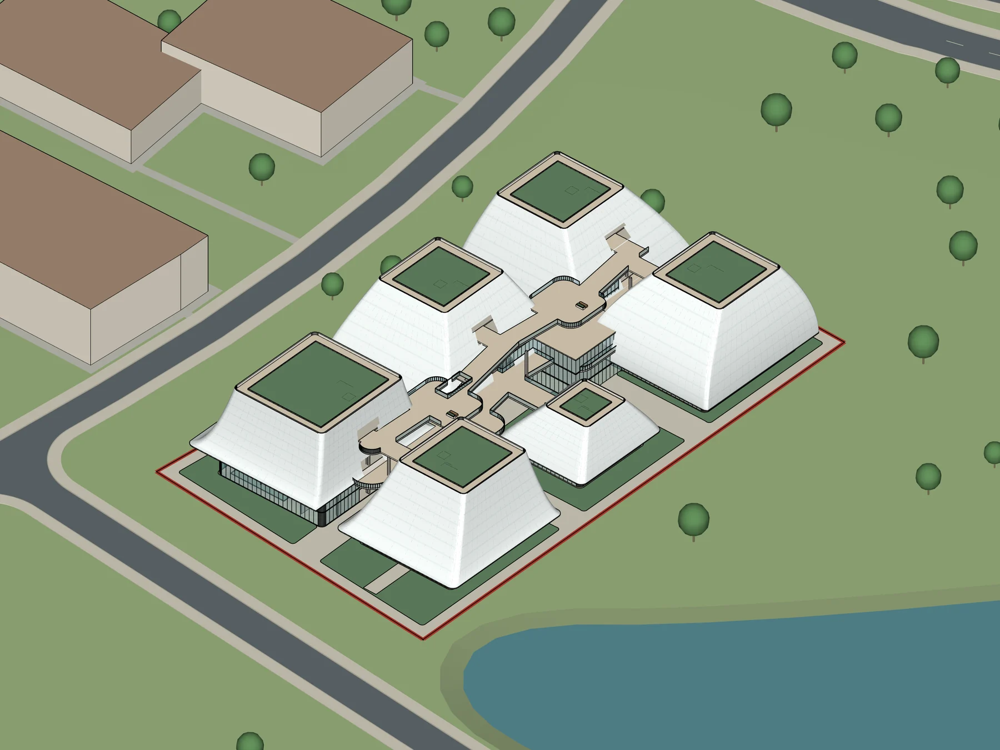
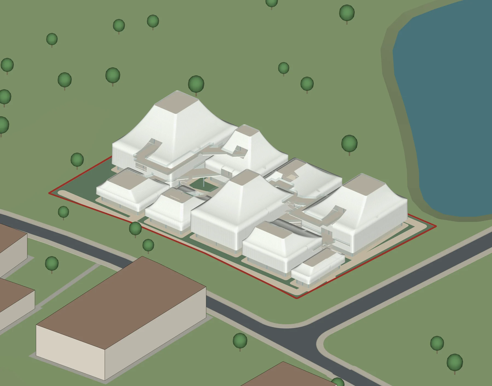
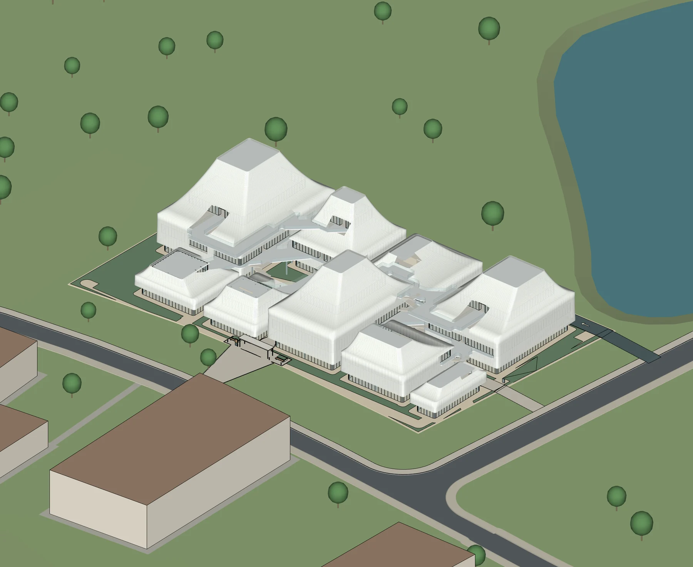
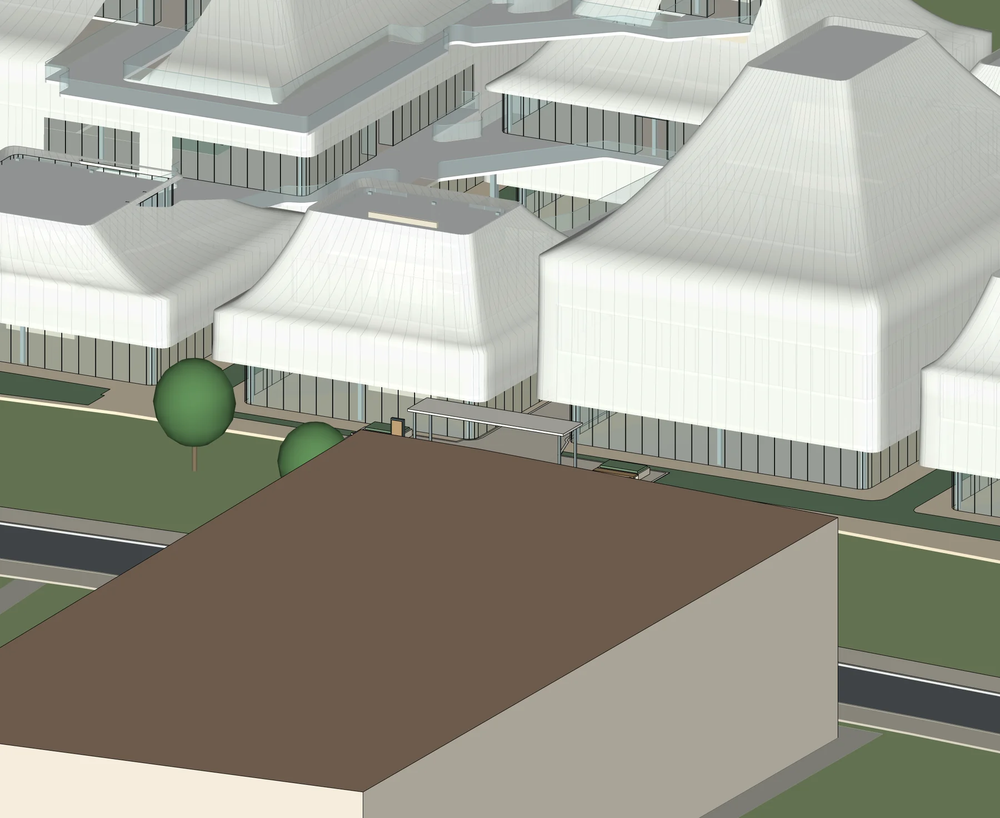
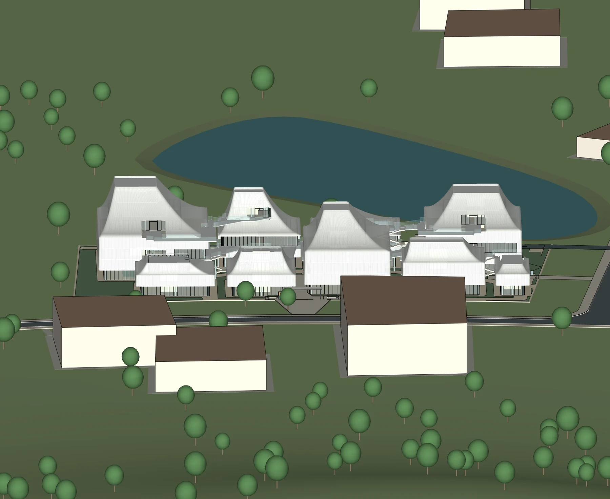
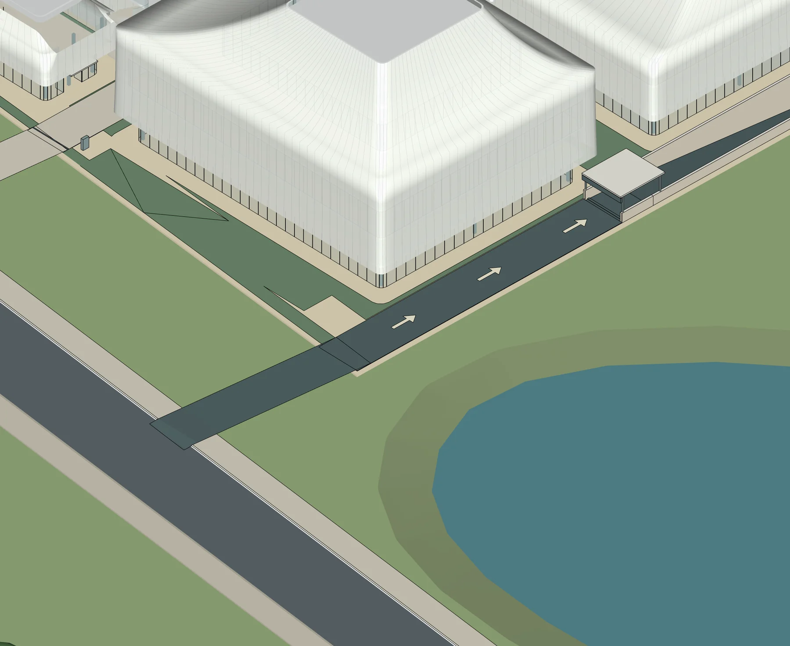
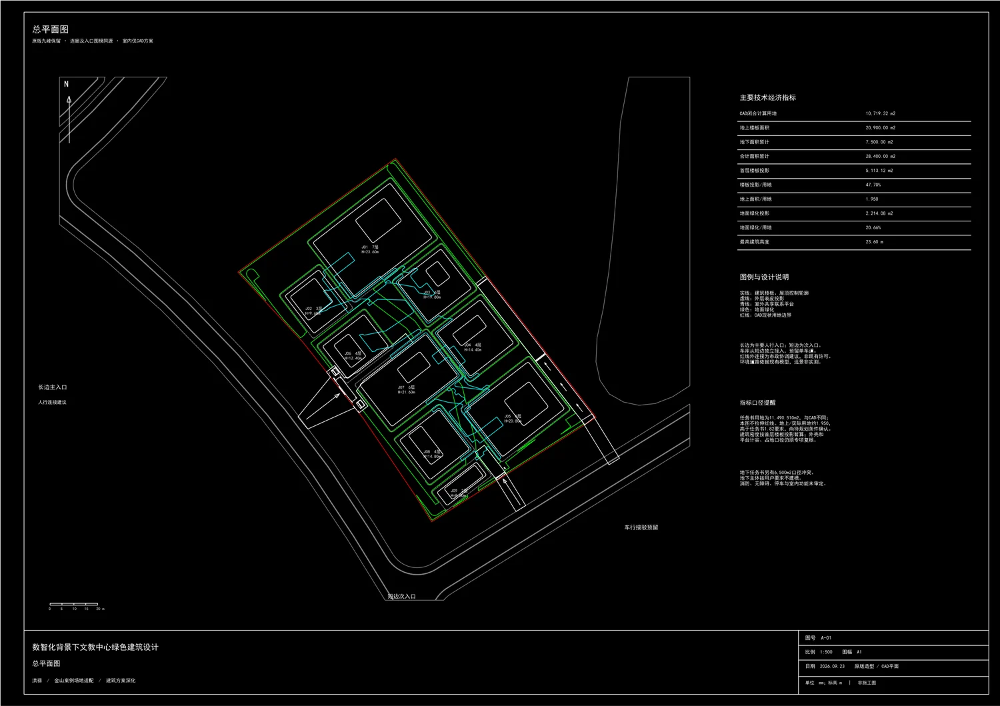
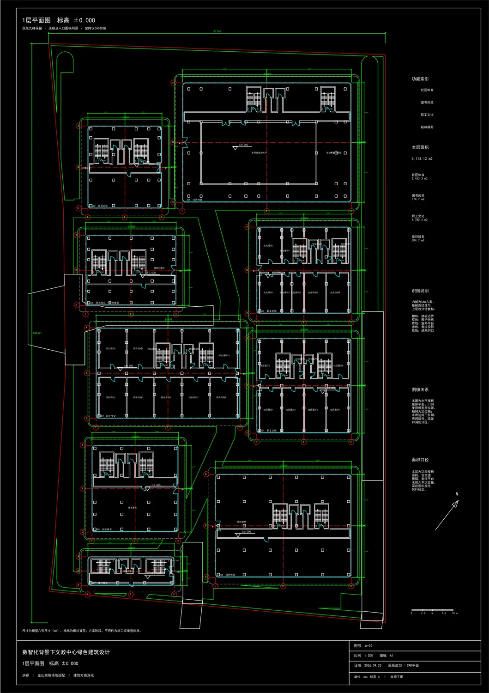
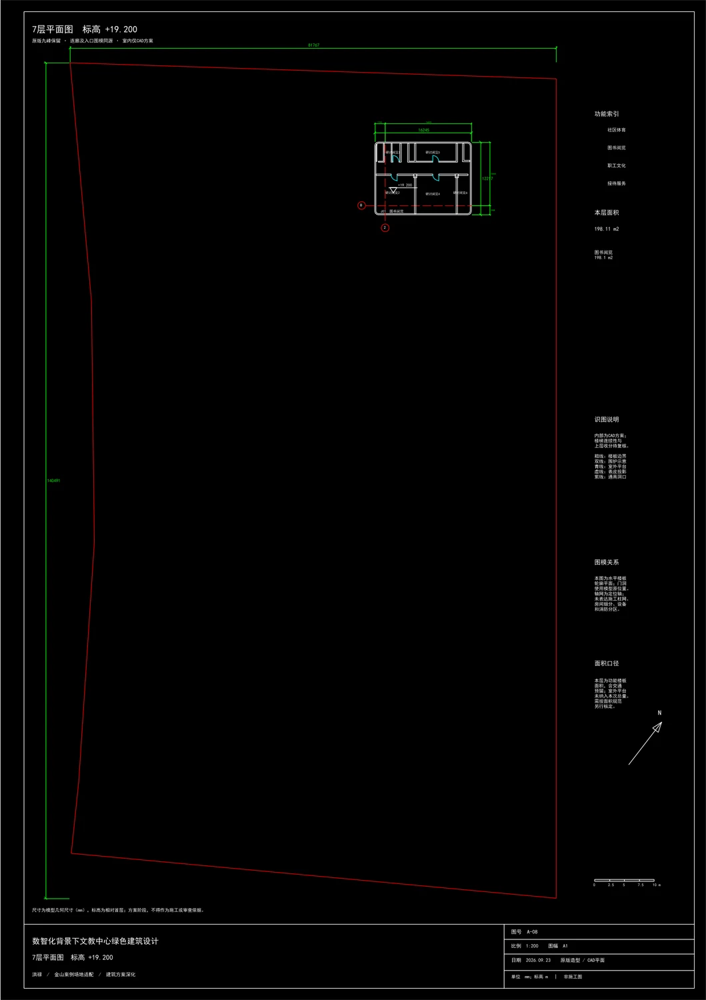

# 山形入场：文教中心场地适配与 GPT-6 Astra 协作建模记录

> 项目展示基于用户委托公开的模型视口与 CAD 预览。原始 SKP/DWG、任务书源文件、场地源文件和参考案例原图没有放入本仓库。

## 项目目标

将金山邻里中心的空间气质转译到实际场地与文教中心任务书中：保留错落的山形轮廓、半透外表皮、首层玻璃界面、共享平台和短桥，同时重新组织项目自己的功能、入口和道路关系。目标是形成可继续讨论和修改的方案模型，不是按参考项目描摹一份施工图。

任务书功能按方案口径为社区体育约 8,000 m²、文化约 8,000 m²、图书约 4,000 m²、接待约 900 m²，地上合计约 20,900 m²。金山邻里中心只作为形体与公共空间研究的来源；其公开报道介绍了山水意象、层叠体量、朦胧表皮与云桥平台等设计线索。此项目未使用该报道中的项目图片。[华东建筑设计研究院官方报道](https://www.ecadi.com/index.php?m=index&a=news&id=175)

## 从参考线索到建筑规则

### 1. 把体量拆成组团

早期体量较大、相似度高。根据用户反馈逐轮拉开单体尺度与高度，形成 J01–J09 九个建筑单体；外轮廓采用上收、起伏的曲面关系，最高点约 23.6 m。场地、道路和周边环境作为模型背景保留，没有用参考案例图片替代实际场地。

### 2. 把室外连接当成建筑空间

平台从环绕建筑的一整圈收敛为局部可停留的平台与短连接。模型围绕主入口、次入口、公共步行联系和车库道路预留继续推敲，并检查连廊、屋顶和入口雨棚是否遮挡道路或产生突兀交接。

### 3. 分开处理表皮与首层

模型将浅色半透外皮、内侧玻璃界面、楼板、核心筒预留和室外平台分层管理。收到“表皮偏黄、首层应更通透、门窗实体不要破坏外观”的反馈后，恢复偏白的外皮表达，并保持首层玻璃基座清晰。CAD 需要读图的门、窗与交通符号按方案线稿表达，不把它们全部变成 SketchUp 立面上的显眼实体。

## 迭代片段

### 第一轮：确认面积与总体布局

保留真实红线与周边道路，先放入任务书主要功能，并建立体量、楼板、外皮与平台之间的分层关系。首轮方案已可进行三维查看，但体量数量与大小仍显得规整。

### 第二轮：拆分体量、调整表皮与平台

按“高低错落、大小有别”的意见重新组织组团；平台连接收敛为几处短桥和停留面，并将外表皮与首层玻璃关系重新拉开。

### 当前记录：检查入口与道路关系

模型记录显示九个单体、42 个楼层板及约 20,900 m² 地上方案面积。模型保存后进行视口复核；末轮 QA 还检查了两处平台变化与屋面切口，并记录 CAD/SU 平面轮廓误差为 0 mm、面积误差接近浮点计算精度。

## SketchUp 与 CAD 的对应

当前 CAD 预览快照包括 A-01 总平和 A-02 至 A-08 七张楼层平面：总平按 1:500 编排，楼层平面按 1:200 编排。QA 记录计有 13,511 个普通 CAD 基础图元，包括线、多段线、弧、圆和文字。楼层轮廓、标高、洞口与功能区用于对照 SketchUp 的同源数据。

### A-01 总平 · 1:500

### A-02 一层平面 · 1:200

### A-08 七层平面 · 1:200

七层因上部体量退台，仅保留一个约 198 m² 的小单体。这是模型和图纸当前显示的实际结果，也是后续继续检查功能、竖向交通与方案合理性的重点。

## AI 与工具各自做什么

- **Codex / GPT-6 Astra**：整理用户任务书、场地说明与案例线索，把自然语言反馈转成下一轮的体量、表皮、入口和图纸修改任务。
- **SketchUp 与现有本地连接器**：保存可编辑的场地、曲面体量、楼板、玻璃界面、平台和道路接驳几何；模型视口用于检查设计结果。
- **CAD 工作流**：由同源的边界、楼层轮廓、标高和开口数据整理方案图纸，表达总平、楼层平面和读图所需的门窗、交通核、功能与尺寸信息。

GPT 并没有直接把建筑“画成一张图”。真实几何、图元和文件读回都由连接的本地建模软件完成；对话负责解释意图、迭代决定和工具编排。

## 当前方案的边界

下面数值来自不同的任务书与 CAD 记录，尚未统一：

| 检查项 | 当前记录 | 状态 |
|---|---:|---|
| CAD 场地边界 | 约 10,719.32 m² | 与任务书面积不一致 |
| 任务书用地 | 约 11,490.51 m² | 需回到原始红线核定 |
| 地上方案面积 | 约 20,900 m² | 方案测算值 |
| 按 CAD 场地面积计算 FAR | 约 1.95 | 高于任务书 1.82 |
| 地下功能面积 | 6,500 / 7,500 m² | 两处资料口径冲突 |

CAD 室内区域仍属于可修改的方案线稿；模型不构成结构计算、消防审查、疏散或无障碍校核。楼梯、电梯、车库的尺寸与流线需要按适用规范由专业人员复核。CAD 输出为普通 CAD 图元，不代表所有对象都是天正原生构件；QA 记录中打印输出的最终视觉复核仍待完成。因此这些画面是设计过程与模型能力展示，不是可施工或已审查图纸。

## 发布内容说明

本仓库只包含经缩放、重新编码的模型视口和 CAD 预览。未包含私人 SKP/DWG 原文件、任务书、红线源数据、原始参考图片、原始设计图元数据库或机器路径。参考案例只保留官方来源链接，不复制来源图片。
