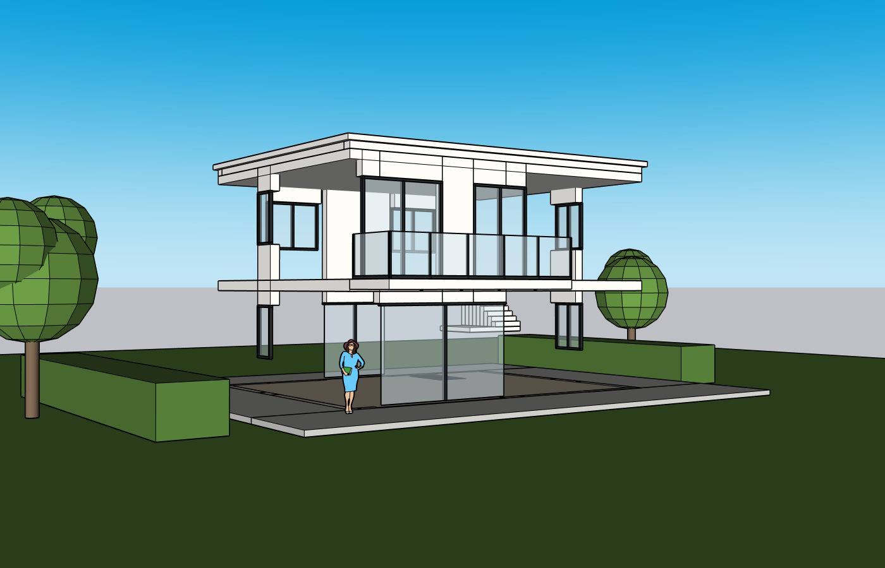
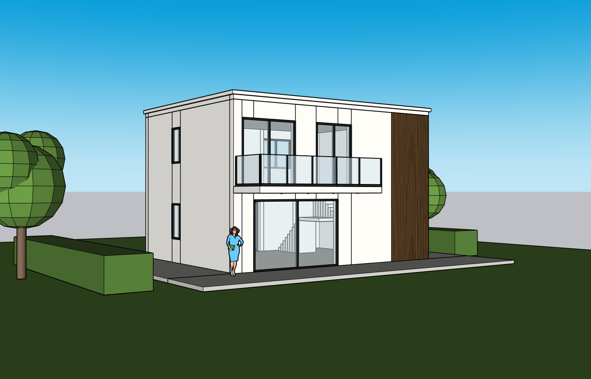
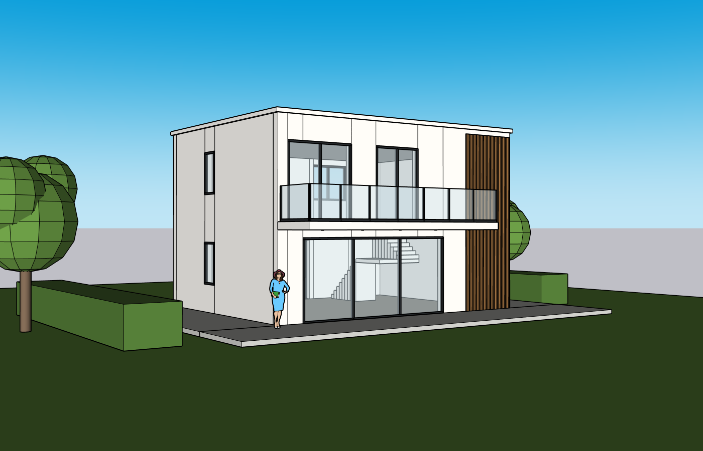
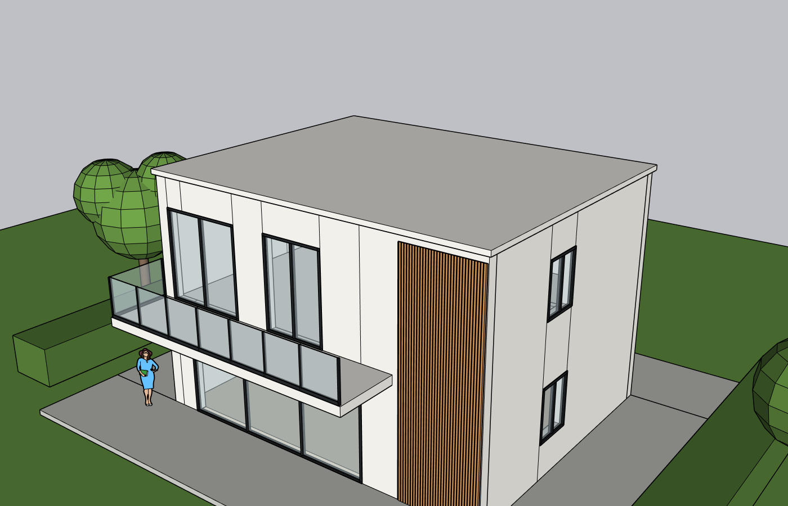
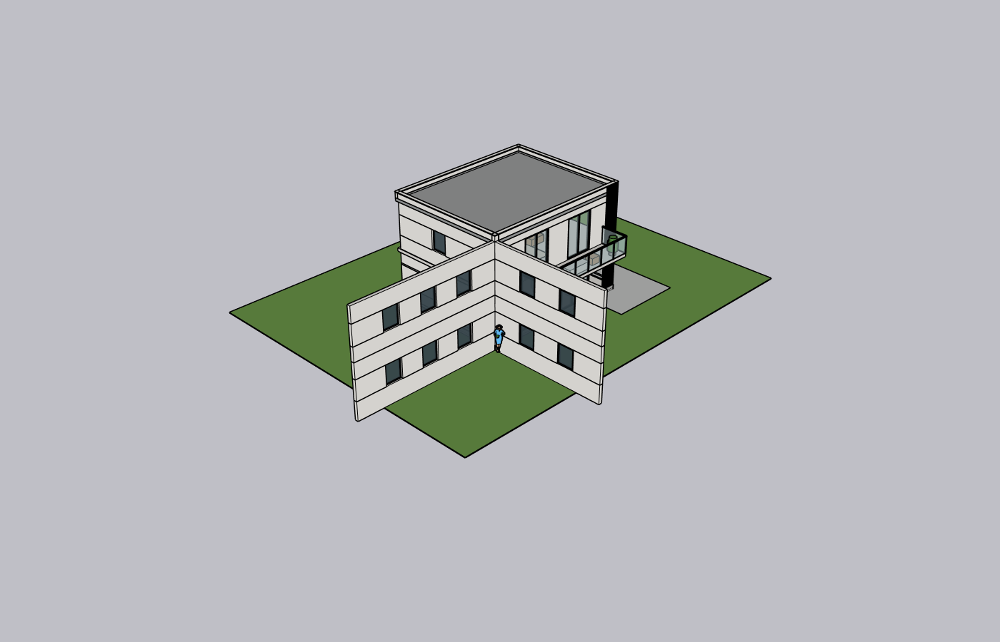
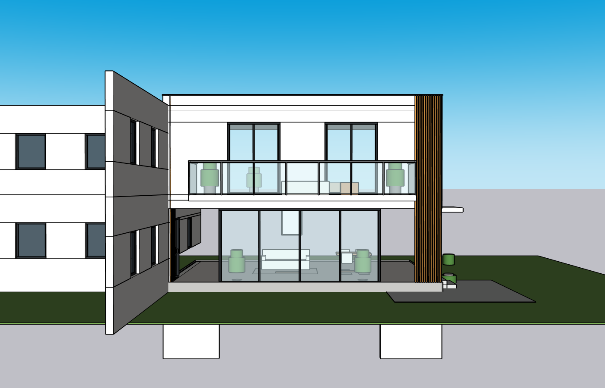

# Windows / SketchUp actual reconstruction test — 2026-10-05

## Acceptance status

**Not a product-quality pass.** Real DeepSeek inference, SketchUp geometry, same-project revision and a downloadable/reopened editable single-view SKP were exercised. Single-view reconstruction is partial; six-view reconstruction failed visual acceptance despite the Agent reporting completion. The screenshots below are the authoritative result, not its QA prose.

Inputs came from main `665d465`: [single image](../../../test-assets/cloud-villa/villa-single-view.png), [whole six-view sheet](../../../test-assets/cloud-villa/villa-six-view-sheet.png), [provenance/checksums](../../../test-assets/cloud-villa/README.md). The sheet stayed one PNG throughout upload and inference. These independently generated inputs are not a controlled, geometrically identical A/B benchmark.

## Environment and isolation

- Windows 11 build 22000; Python 3.12.2; SketchUp 2024 `24.0.484.191`.
- Existing Kongxing plugin and loopback MCP bridge reused; no connector replacement or proprietary source copying.
- FastAPI 0.141.1, Uvicorn 0.53.0, LiteLLM 1.102.1, OpenAI SDK 2.54.0, pytest 8.4.2, Pillow 12.3.0.
- Root `Start K Studio.cmd` installed/reused dependencies and launched the actual workbench. A subsequent source reload used the same starter on port 8787. This was an existing Windows installation, **not** a clean virtual-machine installation test.
- Separate dedicated blank disposable models for single and sheet sessions. Original user models were not modified. Geometry stayed inside each project-owned root. Existing unrelated startup-plugin warnings needed manual dismissal.
- User entered API Key locally. Actual responses were `deepseek-flash`, via `deepseek/deepseek-flash`, provider-default reasoning. No stronger-model substitution. The old memory-only implementation lost the Key on restart; the user explicitly requested a persistence fix during this run.

## Actual browser workflow

1. Uploaded the original public PNG with the webpage file picker. Refresh retained project input/draft. Sent a natural-language request for editable reconstruction.
2. Agent clarified dimensions, scope and inference; supplied common width 10 m, depth 8 m, two floors, 3.2 m floor height, developed exterior and visible schematic interior/small site.
3. Generated parameter card; used conversation to revise balcony to 7.6 m wide / 1.8 m projection / 1.1 m railing, lower glazing to 5.8 m, upper doors full-height. Sheet correction explicitly set rear to three windows/floor and opposite side to one/floor.
4. Clicked approval. With SketchUp unavailable, check-connection displayed an actionable bridge error without closing/crashing the dialog. Automatic connection launched existing SketchUp/plugin, created a dedicated blank and resumed execution without a second approval. Sheet run reused the live bridge and created its own blank.
5. Actual Ruby submissions, screenshot readback and Agent repairs ran. User-style feedback requested same-model revisions without restarting clarification.
6. Clicked the single-session SKP download, opened the downloaded SKP in SketchUp and read back seven unlocked editable named child groups. This verifies saved hierarchy, not source fidelity.

## Single-view result: partial

The first geometry attempt had missing walls and incorrect extrusion. Agent repaired part of it. The recognizable result contains two floors, glazing, balcony, individual timber members and interior/site placeholders, but wall seams remain and the rooftop cap still hides the parapet interior. A revision widened the balcony and lower door; the Agent's final claimed fixes exceed what the screenshots show.

The earlier local revision used `replace`, rebuilding all owned geometry. Unrelated child persistent IDs changed. Therefore it did **not** pass the local-edit preservation criterion, even though it stayed within the same document/root. Reopening the downloaded SKP retained seven unlocked child groups (walls, slabs, balcony, openings, timber, interior and site); this is an editability inspection, not a post-reopen modeling-edit acceptance.

## Whole six-view result: failed

The execution took about 13 min 43 s, with 43 tool calls and two recorded failures. DeepSeek saw screenshots and corrected negative extrusions but missed gross lateral wall displacement. The response still claimed all views matched. Its last requests exceeded 217,000 input tokens; this is evidence of growing history, not a monetary cost estimate.

Concrete source defect: wall origins used `Geom::Point3d.new(10,8,0)` / `(10,0,0)` / `(0,8,0)` as if those values were meters. SketchUp treats them as inches while offsets were converted with `.m`; rear/side walls consequently moved outside the intended building. The Agent also retained two windows/floor on the opposite side despite the requested one. Multi-view evidence alone did not prevent coding or QA errors.

## Fixes and checks

- Close the parameter-plan disclosure when execution starts and keep progress collapsed so conversation has usable space. Actual execution was observed with the plan overlay closed.
- Added a thin scoped removal helper to the existing trusted Ruby transport: remove exactly one unlocked direct-child named group/component from the owned root. Missing, duplicate and locked targets are rejected; arbitrary erase/clear and whole-document mutation remain blocked. This restores local replacement without designing a new geometry engine.
- Actual SketchUp helper smoke: owned root PID 40386; existing child IDs 47073/47075/47077/47079/47081/47083 remained unchanged. Added two disposable QA groups, removed only A, verified B survived, removed B and verified original IDs/counts unchanged. Root and missing-target deletion probes were rejected and rolled back. This was an engineering smoke, **not** an architectural quality success or a DeepSeek local-repair demonstration.
- Skill guidance now explicitly covers metric origins, opening construction, unchanged-object readback, avoiding repeat micro-confirmations, screenshot truthfulness, parapet-cap errors and actual output paths. Compressed redundant guidance to preserve the 10,000-character context budget and safety tail.
- Added pytest discovery configuration so ignored runtime/third-party copies are not collected as application tests.
- Windows credentials now use current-user DPAPI, restoring provider/model/base/effort after restart. No plaintext fallback, no browser/localStorage Key, no credential returned by API. Added remove-saved-Key action and a corrupt-store recovery message. Real Windows DPAPI tests use a fake Key, verify encrypted bytes and fresh application restoration/removal; these do not imply a real provider authentication test after restart. [Configuration UI](windows-encrypted-settings.jpg).
- Automated result after all fixes: **192 passed, 1 skipped**, two dependency warnings. Python compile, JavaScript syntax and diff-whitespace checks passed.

## Human intervention and evidence restrictions

Human/engineering intervention: supplied shared dimensions and explicit window/balcony corrections; dismissed unrelated SU plugin warnings; restarted server for source fixes; clicked download/reopened the dedicated test output; ran separate scoped-helper smoke. The active blank was manually saved for reopen verification; the host's downloadable checkpoint is a separate file. Agent-invented `qa/...` filenames were not accepted as evidence.

Only viewport images produced from the public synthetic benchmark are published. Raw conversations, runtime logs, private project history, local paths, API credentials and SKP files are excluded. GitHub contains sufficient public visual evidence to see the defects; omitted runtime data must not be described as remotely accessible proof.

## Reproduction / remaining gates

Use `Start K Studio.cmd`, configure DeepSeek locally, upload the two linked assets into separate sessions, supply the common dimensions and revisions above, approve, connect existing Kongxing to dedicated blanks, inspect front/rear/side/roof screenshots and download/reopen the outputs. Do not accept the Agent's prose instead of inspecting geometry.

Pending: post-fix DeepSeek same-model repair and unchanged-ID validation; six-view download/reopen; post-reopen actual edit; failure-checkpoint restore; actual clipboard image upload and full stale-plan/recovery browser regression on this Windows run. Existing automated coverage is not substituted for these missing desktop gates. Clean installation remains `pending_external`. Product release/marketing acceptance is not granted.
