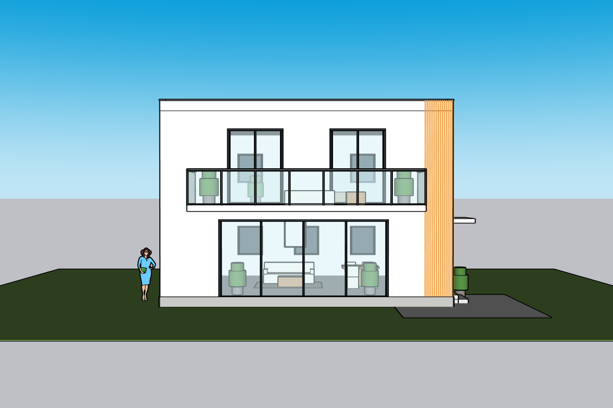
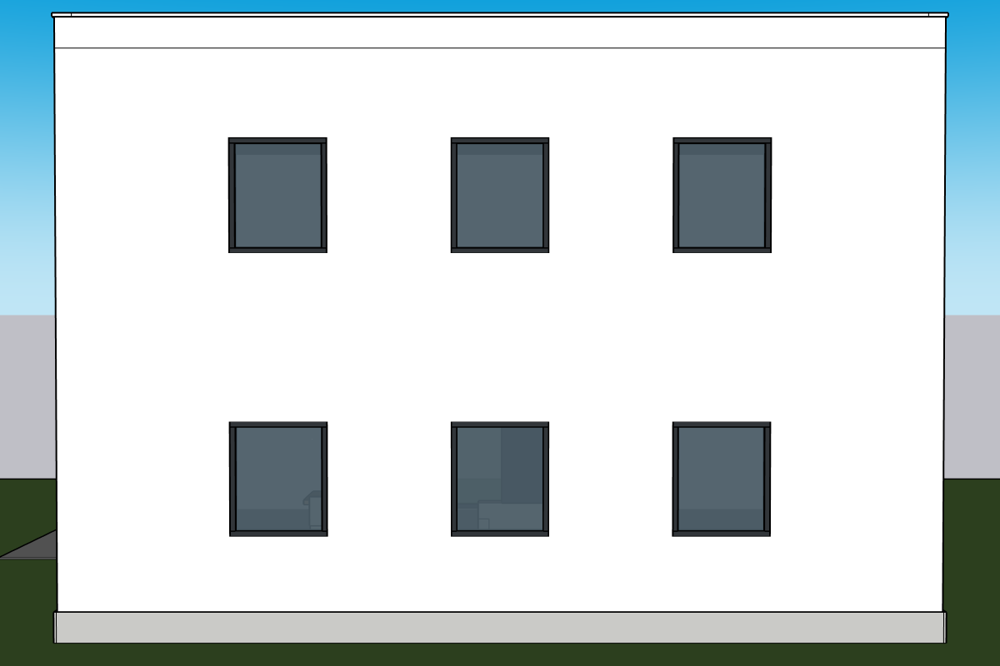
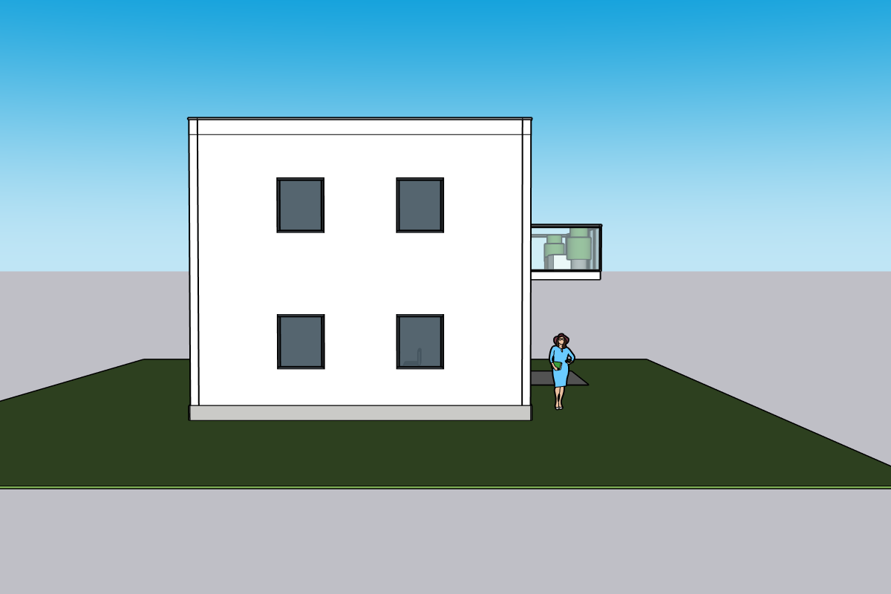
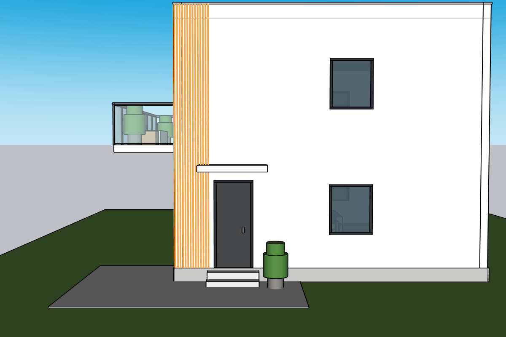
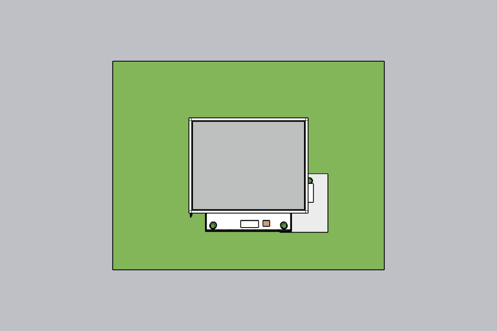
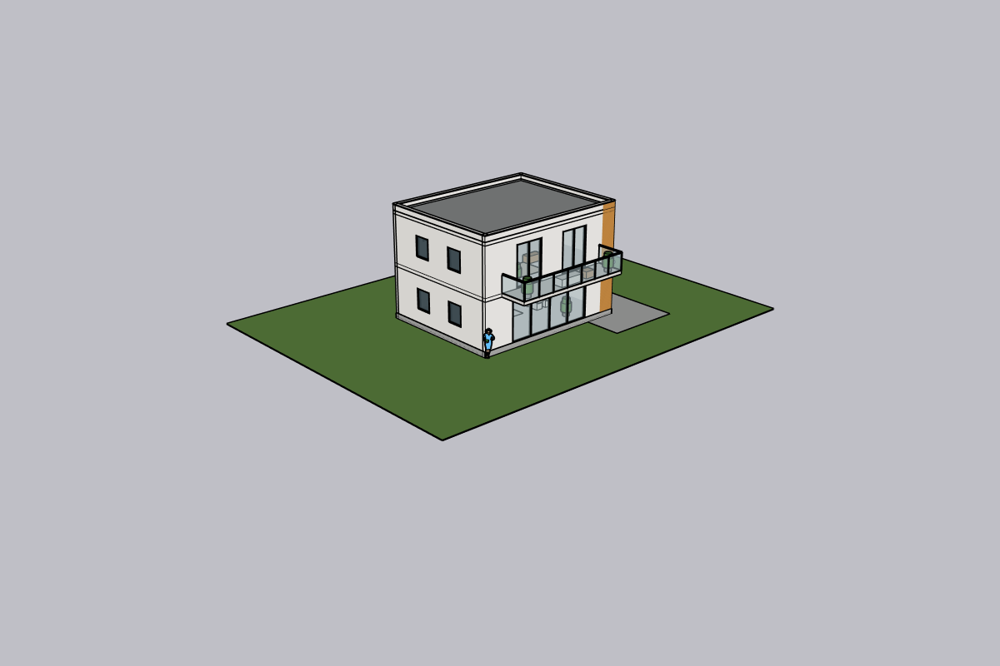

# Windows 六视图修复、对象保持与 SKP 重开编辑 — 2026-10-06

## 结论

本机从干净工作树拉取 `0589895`，继续现有专用六视图项目。**同一 DeepSeek 网页 Agent 已真实修复严重错位/朝下挤出，完成新的六个方向截图、单构件修改、SKP 下载→原生重开→实际编辑→保存→再次重开。** 本轮不是本机 Codex 代建整栋，也没有换更强模型。

建筑现在可辨认、有门窗/阳台/女儿墙/逐根格栅及分组，但**源图还原验收仍为 partial，不能标 release PASS**。左侧窗数误读、开口比例、材质及屋顶细节仍需纠正。Agent 自评的“一致 ✓”不作为质量证据。

单图本轮未重建，沿用 [10 月 5 日单图 partial](../2026-10-05/README.md)。剪贴板、旧计划失效、失败检查点恢复和干净新电脑安装仍未完成新的 Windows 全流程验收。

## 环境与流程

- Windows 11；Python 3.12.2；SketchUp 2024 `24.0.484.191`；既有 Kongxing 本机 bridge/MCP。
- K Studio 本机网页端口 8787，复用 `windows-six-view` 专用模型；操作前核对模型路径与 root ID 40386。用户原始模型未编辑。
- DeepSeek `deepseek/deepseek-flash`，provider-default effort，界面名 DeepSeek V4.1 Flash。真实 Key 启动时已恢复；本轮服务重启后无需重填，继续付费推理成功。密钥未读取、输出或提交。
- 保留 [原六视图整图](../../../test-assets/cloud-villa/villa-six-view-sheet.png)，不拆格、不替换。使用已有批准尺度和参数卡。
- 重建并安装最新桌面包，保留 data/旧安装版本，更新快捷方式；不把源码拉取当作 EXE 更新。

步骤：读取现有持久 Ruby/参数卡/对象 → 网页输入修复要求 → 因意图误判先发生一轮只读诊断 → 网页明确“直接执行” → Agent 修复单位/法线/沉降 → 独立看截图提出墙缝/格栅反馈 → Agent 再修 → 六方向导出 → 下载 SKP 并原生重开编辑 → 服务重启加载意图修复 → 网页单构件修改并完整回读 → 最新 SKP 再下载/重开/编辑/保存/重开。

## 修复及工程干预

1. **执行意图 bug**：已批准模型的修复指令包含“检查是否”，原 `discussion_only` 将整个请求判成 clarify，导致该轮没有几何执行工具。修改 `resolve_reconstruction_action`：building 状态下明确“请直接执行/修复/修改”不因嵌入检查子句而降级；问号、暂停/否定仍保守处理。新增 5 个回归案例，未移除首次计划批准门槛。
2. 网页 Agent 自己编写并执行 `patch_fix_units.rb`、`patch_fix_down.rb`、`patch_fix_sunk.rb`：统一米→内部英寸转换，纠正基面法线，修复沉入地坪的构件。SHELL/OPENINGS/LOUVER 为修复而替换，不称其 ID 保持。
3. 网页 Agent 执行 `patch_fix_seams.rb`：隐藏分段墙产生的非洞口横边、楼板/屋面板内缩约 10 mm、隐藏格栅边线。Agent 报告隐藏 466 边/保留 108 洞边；该计数为 Agent 记录，截图及对象回读另行验收。正交墙面明显改善，斜视/原生视口仍可见楼层/构件轮廓线，不能称全部墙缝消失。
4. 人工干预：本机 Codex 操作网页、独立检查图片、输入诊断/纠正要求；关闭无关第三方扩展启动错误；编写**只读**对象/毫米回读探针。整栋修复 Ruby 都由产品 Agent 生成。下载文件的单桌子 +100 mm 编辑是人工 MCP 可编辑性探针，明确与产品 Agent 修复分开。原生打开、保存、再打开使用 Windows 鼠标/快捷键。
5. 复测安装器发现 Windows PowerShell 5.1 会破坏内嵌 `python -c` 的引号，包检查误将 `package` 当文件名。已改为忽略目录中的校验脚本，PowerShell 7 与 Windows PowerShell 5.1 的实际保留 data 安装均通过；不是绕过包检查。
6. 重启后的网页实测请求：“请直接执行一次局部修改…只将 BAL_TABLE 52717 沿 X 正向移动 50 mm…检查其他对象 ID 和边界是否保持”。不重复批准/讨论，实际执行 7 次工具调用、0 失败，完成保存/截图。独立探针证明只变 1 件。

[实际执行的公制/法线及单件位移 Ruby 片段、Agent QA 纠正](agent-patch-excerpts.md)。片段不是未经实机验证的新通用几何模块。

## 实际调用与耗时

| 轮次 | 耗时 | 工具调用 / 失败 | 结果 |
| --- | --- | --- | --- |
| 初次诊断 | 约 48 秒 | 3 / 0 | 意图被误判为 clarify，只读、未建模 |
| 单位/法线/沉降修复 | 262.719 秒 | 21 / 1 | rev9→12，错误后继续修复 |
| 墙缝/格栅、六方向图 | 194.875 秒 | 19 / 2 | rev13，失败后修改脚本继续 |
| 重启后网页单桌子修改 | 49.515 秒 | 7 / 0 | rev14 移动/临时诊断，rev15 删除诊断组 |

会话记录报告后 3 轮输入/输出 token 分别为 5,920,304/49,923、6,514,546/26,973、2,777,355/7,172。**这是运行时/provider 返回的累计计数，未与账单核对，不能当作实际收费金额。** 重复大图/长历史的成本仍应独立核查，不能据此宣传低成本。本轮未登录账单平台或计算未经核实的费用。

## 统一坐标、参数与逐立面表（公开摘要）

root 局部坐标：正面 y=0，背面 y=8000 mm，左右 x=0/10000 mm，Z 向上。总宽 10000、进深 8000、两层/层高 3200 mm 是先前批准锚点；其余推断/估算不冒充实测图纸。

| 立面 / 参考 panel | 批准/当前构件 | 真实输出与独立判断 |
| --- | --- | --- |
| 正面 / 下中，另参上中 | 一层 5800×2700、4 扇玻璃；二层两处 1900×2600 落地门；阳台 7600×1800、栏高 1100 | 主构成存在，门窗/墙垛比例与参考仍有差别；阳台比图中观感深，保留批准值 |
| 后面 / 右上 | 每层 3 小窗，1100×1300，窗台 900/4100 | 3×2 实际存在，已回到后墙；视觉内凹与窗比例需加强 |
| 入户侧 / 左下的侧面部分、上中侧面 | 每层 1 小窗，另有入户门/雨棚/两级台阶 | 构成存在，入户门离转角偏远；小窗估算沿用批准卡 |
| 左侧 / 左上侧面 | 旧参数卡默认 2 窗/层，低置信 | **源 panel 可见 1 窄窗/层，当前 2 窗/层不符**。没有将 Agent 的“2 窗一致”通过；需重新修订卡/批准这一实质参数变更 |
| 屋顶 / 右下 | 板顶 6400、女儿墙 6750、压顶至 6790；内沿可见 | 有独立屋面/女儿墙，不是封闭实心屋顶盒；缺原图屋面分缝/细构造 |
| 格栅 / 正面右端及转角 | 40 mm 宽 +25 mm 缝，前15/转角14根，估算 | 29根可见，暖木色恢复；偏橙、无木纹，密度仍为估算 |

参数卡旧文本还含“各格无矛盾”“左上2窗”等过度断言，**不能原样当真值训练或验收**。本表是独立复核摘要。原图为合成渲染，有视角不一致可能，不声称精确测绘。

## 新的真实截图

以下六张均来自网页 Agent 的 **rev13**（同一完成修复的几何版本），不是沿用失败版截图。rev15 仅将桌子 +50 mm，建筑未再改。PNG 原样复制，校验值见 [SHA-256](screenshot-sha256.json)。

| 正面 | 背面 |
| --- | --- |
|  |  |
| 左侧 | 入户右侧 |
|  |  |
| 屋顶俯视 | 斜视 |
|  |  |

[网页单桌子修改后正面 rev15](six-r15-web-single-edit-front.png)；[最新 SKP 重开/编辑/再次重开后视口](six-r15-downloaded-reopened-edit.png)。后者为实际 SketchUp 视口导出，不是桌面标题截图；桌面完整截图含私人历史/文件名而未公开。

## 对象 ID / 毫米回读

root **40386** 一直保留。全部回读未截断，完整 child 名称/ID 在 JSON 中，非只列六个顶层组。

| 顶层组 | 修复前 rev8 | rev13/15 | rev13 XYZ 范围 mm |
| --- | --- | --- | --- |
| SITE | 47073 | 47073 | [-8000,-6000,-340] … [18000,14000,820] |
| SHELL | 47075 | **62503，替换** | [-30,-30,-300] … [10030,8030,6790] |
| OPENINGS | 47077 | **62505，替换** | [20,30,0] … [10900,7980,5800] |
| BALCONY | 47079 | 47079 | [1200,-1830,3000] … [8800,30,4350] |
| LOUVER | 47081 | **56613，替换** | [9025,-30,50] … [10030,885,6750] |
| INTERIOR | 47083 | 47083 | [2250,730,-12] … [7800,7800,4208] |

之前 SHELL x/y 最低约 −9746/−7596.8，z −2700；OPENINGS z 最低 −2240。单位/法线修复消除了这些严重错误。SITE/INTERIOR 保留顶层 ID，但组内沉降件也被平移，**不能声称几何完全未动**。

- [修复前](objects-before.json)
- [单位修复后 rev12](objects-units-repaired.json)
- [rev13](objects-final-r13.json)：与 rev12 对比，六个组 ID、全部 child 名称/ID 保持；这不等于所有几何未改。
- [最终 rev15](objects-final-r15.json)
- [网页单构件修改完整前后数据](web-single-child-edit-readback.json)：249 个 child ID 保持；仅 52717 的 X 从 6300…6900 到 6350…6950 mm，另外 248 件边界逐项相同。临时诊断组已删除。

边界/ID 检查不证明所有网格面或 hidden 状态逐面相同，截图需另行审查。

## SKP 交付文件重开编辑

网页模型 tab 的实际下载文件为 `outputs/model/fast-assembly-agent.skp`。Agent 回复中的专用 blank 文件名不是网页下载路径；验收使用实际下载链接。下载原始字节 SHA-256 与该 export 相同，随后才编辑下载副本。

分别对 rev13 和最新 rev15 完成：网页点击下载 → Windows SketchUp Ctrl+O 打开 → 验证路径/root/目标 ID → 仅把 BAL_TABLE **52717** 沿 X 正向移动 **100 mm** → Ctrl+S 保存 → Ctrl+O 再开同文件 → 比较全部 249 个子构件 ID/边界。

最新 rev15 桌子 X 6350…6950 → **6450…7050 mm**；其他 248 件边界保持。六个顶层组未锁定，二次重开读值与保存后的全部数据一致。该人工可编辑性探针只改变下载测试副本，不改变网页项目文件；网页 +50 mm 修改是另一个独立已通过的产品测试。

- [rev13 重开/编辑证据](skp-reopen-edit-readback.json)
- [rev15 重开/编辑证据](skp-r15-reopen-edit-readback.json)

不提交私人 SKP、下载路径、账号或密钥。公开参考生成模型的截图与毫米/ID 数据足够云端审查这些结论；完整 SKP 二进制及本机原生操作录像不在仓库，不声称云端可直接重开该二进制。

## 验证与下一执行任务

自动测试：**214 passed / 2 skipped / 2 dependency warnings**；意图测试 31 passed。两 skip 为可选系统 Ruby 缺失、Linux-only 平台边界；自动测试不替代建模质量。Python compile / JavaScript syntax / git diff whitespace 检查通过。桌面包构建/安装通过，真实已保存 Key 服务重启 + 再调用通过。

下一轮按当前里程碑继续：

1. 先审查本报告六张真图和源 panel；纠正参数卡左侧窗误读、Agent 自评假通过与下载文件名误报。实质参数修改经网页修订/批准，不把问答门槛全部移除。
2. 用同一 DeepSeek 改窗数/深度与屋面细节，独立比图；保持同模型 IDs，必要替换明确记录。检查斜视/原生显示的轮廓线及屋面板的真实构造。
3. 整合 Agent 生成的单位/法线补丁到持久基线后实测重跑：当前 `build_villa.rb` 旧基线仍有历史错误，不能只重跑它丢弃补丁。补丁均在忽略的 per-project workspace；本轮没有把模型专用脚本升级成新几何引擎。
4. 继续单图屋顶/墙缝修复；完成 Windows 剪贴板上传、旧计划失效、失败检查点恢复及干净安装验收。当前已有环境不能替代新电脑测试。
5. 核查 provider 实际账单及大图/历史上下文耗用；降低重复上下文，不以报表 token 推测费用。

**剩余验收未完，不将本轮局部通过宣称完整可售产品通过。** 本轮结果/代码/公开证据通过 GitHub main 交接，云端直接读取。
