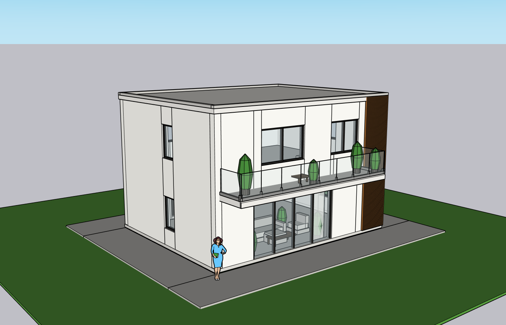
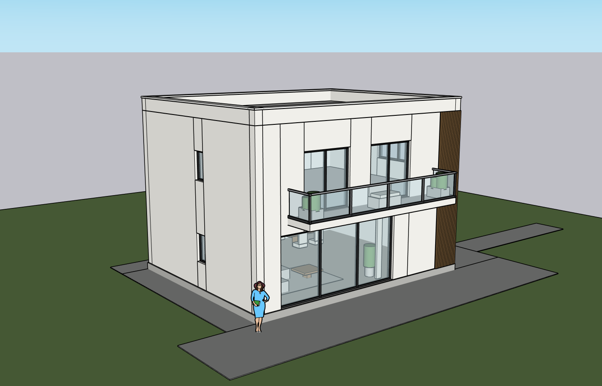

# Windows Modeling Quality Loop v1 — 2026-10-08

**Overall: PARTIAL. The buildings are recognizable and editable; neither reconstruction passes source-matched visual acceptance.** This report overrides optimistic Agent completion language. Started from clean `2a80973` after `git pull --ff-only`. No private original model was edited.

## Environment and input

Windows 11 build 22000; SketchUp 2024; existing Kongxing bridge; Python 3.12.2; PyInstaller 6.22.3; Node 24.19.0. Started through `Start K Studio.cmd`, then controlled source-service restarts on localhost:8787 to load fixes. DeepSeek `deepseek/deepseek-flash`, provider-default reasoning throughout. Saved DPAPI credentials restored across restarts; actual paid requests worked without retyping or reading the Key. No stronger model substitution.

Inputs were [single image](../../../test-assets/cloud-villa/villa-single-view.png) and [whole six-view sheet](../../../test-assets/cloud-villa/villa-six-view-sheet.png), with [source hashes](../../../test-assets/cloud-villa/README.md). The sheet was uploaded intact, never cropped or split. Both ordinary user requests specified editable geometry, two storeys, 10×8 m footprint, 3.2 m levels, estimated remaining dimensions, approved unseen inference, building/roof/balcony/windows/louvers/materials, visible furnishings and small site context.

Paid reconstruction used the source web product. Desktop package rebuilt/installed after fixes while preserving data/Key/shortcut. Complete paid frozen-EXE and clean-PC installation remain `pending_external`; this is not their certification.

## Actual webpage sequence

1. Fresh independent single and six-view conversations; upload the matching public image, ordinary Chinese request, clarify/plan, inspect plan.
2. Single plan initially expanded landscaping: user removed trees/hedges and accepted other estimates. Six-view plan misread openings: user corrected left 1 window per floor, rear 3 per floor, entrance lower door/canopy and upper one wide window. Record these as human interpretation assistance, not autonomous success.
3. One approval action, then automatic connection reused Kongxing and opened each dedicated blank document. Execution continued without requesting approval between writes.
4. Each run made **five full-root writes**, exceeding the intended primary-plus-two-corrections policy. All five deterministic receipts passed. This exposed a prompt-only limit failure; fixes below were made afterward.
5. Independently captured/read all six CURRENT final r5 views. Engineering camera/readback did not change geometry. Agent-generated QA was incomplete/stale and overconfident; independent QA below takes precedence.
6. Replayed the integrated six-view baseline into a third fresh blank document using the same guarded workspace executor. This was an **engineering replay, not a new AI reconstruction**. All 171 direct named object bounds matched the six-view r5 model by name. New-model IDs were expected to differ.
7. Two guarded engineering table edits (+100/−100 mm X) preserved all 170 other objects and restored the baseline. A further Ruby write, including a new script ID, was rejected before execution; readback and captures remained available.
8. Web SKP download → native SketchUp open → native Ruby-console guarded manual table 43167 +100 mm → Ctrl+S → native reopen → all 171 IDs and high-precision bounds matched the saved edit; other 170 stayed unchanged. This proves native editable objects, **not mouse Move-tool usability**. [Native evidence](replay/native-final.json), [window screenshot](replay/native-edited-saved.png).

### Replay save intervention and reconnect defect

The engineering replay harness initially omitted the product's final save step: its first download was the blank on-disk template. A native save prompt saved the generated disposable document, and a second web download had the same SHA-256 as that saved file. That second download was used for the successful native edit/reopen test. Do not count the first attempt as PASS.

Inspection also found a product defect: its end-of-turn checkpoint saved `fast-assembly-agent.skp` for download but left `session.model_path` on disk at the initial blank. Reconnection can reopen that stale blank after SketchUp closes. The host now saves both the guarded bound document and the download artifact, including interrupted-but-committed turns. SketchUp 2024 rejected the first fix's `save_copy` to the active filename; corrected to native `save` for that filename, `save_copy` for other artifacts. Regression assertions cover both paths and branches. The subsequent real product probe below succeeded after this repair.

### Subsequent real product revision/save probe

Ordinary webpage Chinese requested the living-room coffee table +100 mm X, everything else unchanged. DeepSeek r4 moved the table top and its separate leg together; full two-page readback independently proves all171 IDs retained and other169 objects unchanged. Initial host save failed with the native `save_copy` restriction above. The UI additionally mistook a Ruby backtrace's line401 for HTTP401 and displayed an invalid-Key warning, although the Key still worked. Fixed 401/402/429 matching to require HTTP/status context and added an actual Node function regression.

After restart with the save fix (saved Key automatically restored), ordinary Chinese requested save retry without another move. DeepSeek made a no-geometry-change Ruby transaction r5; host save completed without error. Native reopening of both the bound document and the freshly web-downloaded artifact matched all171 objects at r5. Files differ in byte hash; each respective download matches its artifact, and geometric equality is proved by IDs/mm readback rather than assuming binary equality.

[Product r5 full readback / bound reopen](product-revision/product-after-save.json), [web download / native reopen](product-revision/native-product-download.json), [native window](product-revision/native-product-reopened.png), [r4/r5 receipts](product-revision/write-verifications.json), [current six r5 views](product-revision/views.json), [independent final visual review](product-revision/independent-visual-qa.md), [integrated moved baseline](product-revision/baseline.rb), [provider metrics and reply excerpts](product-revision/turns.json).

After reopening the download externally, the webpage's automatic reconnect returned to the same bound r5 document, preserving all171 objects. [Final connected native window](product-revision/native-final-connected.png). The source service remains at the current test project for continued inspection; latest installed package/shortcut was updated after final code changes.

The initial edit spent 41 tools/15 failures (705,921 input, 20,327 output, 150,203 ms), repeatedly guessing the wrong script ID from copied baseline comments. Tool errors now list the available persisted script IDs/revisions to aid recovery. This hint has a live read-only check, not another paid wrong-ID retest. Retry used 10 tools/0 failures (344,267 input, 4,656 output, 68,328 ms). These editable-object/save probes do not fix source fidelity, and the Agent's "无需返工" refers to this small edit, not building acceptance.

## Single-image result

Current [front](single/front.png), [rear](single/rear.png), [left](single/left.png), [right](single/right.png), [roof](single/roof.png), [oblique](single/oblique.png), [capture revision ledger](single/views.json).

Root 37843, script `villa1008`, r5; 7 top groups and complete depth-1 paging of 156 named objects (including those groups). [Objects](single/objects.json), [five receipts](single/write-verifications.json), [transactions](single/transactions.json), [integrated baseline](single/baseline.rb), [parameter card](single/reconstruction_card.md), [Agent audit with independent review](single/agent-visual-qa.md).

- Primary write extruded louvers below ground; [r1](single/observed-r1.png), r2 did not fix it, r3 corrected direction; r4/r5 refined materials and seams. All used replace and regenerated child IDs.
- Final visible building is developed, not white boxes. Wall construction seams, glazing proportions and schematic furnishing/plant/rail details remain substantial differences. Rear/right/roof are inferred from a single image, not verified source facts.
- Agent reused an r4 front view after r5 and did not automatically review all six final views. Engineering r5 captures fill the evidence gap but do not turn the Agent loop into a PASS.

## Whole-six-view result

Current [front](six/front.png), [rear](six/rear.png), [left](six/left.png), [right](six/right.png), [roof](six/roof.png), [oblique](six/oblique.png), [capture revision ledger](six/views.json).

Root 37843 in this separate document, script `villa_qv1_1008`, r5, 171 direct named objects/two complete pages. [Objects](six/objects.json), [five receipts](six/write-verifications.json), [transactions](six/transactions.json), [integrated baseline](six/baseline.rb), [parameter card](six/reconstruction_card.md), [Agent audit with independent review](six/agent-visual-qa.md).

- r1 wall seams/intersections; r2/r3 generated zero-thickness walls and obscured rear openings; [r2](six/observed-r2.png), [r3](six/observed-r3.png). r4 box-with-hole method cut only one hole; r5 returned to segmented solid walls. Receipts still passed because actual generated geometry matched the transaction snapshot. They do **not** prove correct topology or source fidelity.
- Final opening counts reflect supervised clarification, but vertical wall seams, bulky parapet/capping and missing roof divisions visibly fail the source. Some window shapes/positions, glazing/furnishings/plants/rail details differ; site is oversized.
- Agent QA named nonexistent `qa/v31/v32` captures and reviewed only a subset of actual frames. The tool had put metadata outside the provider's text content. Fixed by including actual path/revision in `contentItems` and persisting it next to the PNG. The paid reconstructions occurred before that final fix; fresh engineering captures and tests validate the metadata transport, not a new autonomous paid visual PASS.

## Fixes and checks

| Finding | Change | Evidence / limit |
|---|---|---|
| Expanded Skill clipped scope/safety and OSS excerpts at 10k | Compressed duplicate prose; retained source fidelity, lifecycle safety and adopted guidance | Initial full suite 3 failures; final suite passes; no weakened assertions |
| Expected count/bounds could be silently absent in readback | Missing expected fields now fail verification | Missing-field regression |
| Capture failure could hide a valid write receipt | Persist immutable receipt + state before capture | Interrupted-capture regression |
| QA lacked actual path and model revision | Persist `.evidence.json`; include path/revision as provider input text | Metadata regression and real current captures |
| Agent ignored two-correction prompt, repeatedly replaced everything | Shared per-turn project/workspace-Ruby write budget: initial 3, existing 2; committed writes consume it even if capture fails; new IDs cannot bypass | Real replay probes and regression. Not a universal budget for connector transforms/SAIE tools; not a separate read-only critic runtime |
| Repeated minor plan confirmations | PLAN only lists unanswered high-impact items; accepted defaults mean no new questionnaire | Prompt regression; final prompt change not freshly paid-plan retested |
| Bound file stayed empty despite current download model | Host saves bound disposable file and download checkpoint | Success/interrupted regression; real product probe below |
| `save_copy` rejects current filename in SU2024 | Native `save` for bound filename; `save_copy` for artifact | Actual failed probe repaired; paid retry and native both-file reopen succeeded |
| Ruby line401 falsely reported invalid Key | Only HTTP/status codes, not arbitrary numbers, trigger provider warnings | Actual Node regression; saved Key and paid retry worked |
| Repeated guessed script IDs in replay's product edit | Inspection failure lists existing script IDs/revisions | Read-only hint check; provider retest still pending |

Latest automated checks: full repository suite through `scripts/check.ps1` **249 passed / 2 skipped / 2 dependency warnings**; mandated six quality suites **51 passed**; Python compilation passes; actual Node error-classifier regression plus Node syntax checks for `studio.js`/`showcase.js` and diff check pass. Initial standalone full pytest runs also completed (247/248 before final regressions). No clean-PC/production claim.

Writer receipts count actual transaction root/revision, named-object total and mm bounds. They are generated expected-vs-actual checks, not a semantic facade schedule validator. Critic contract remains prompt-guided; the parser helper is not a separately invoked read-only critic. These are remaining architecture gaps, not hidden successes.

## Replay and usage evidence

[Replay verdict and write receipts](replay/replay-verdict.json), [baseline objects](replay/replay-baseline-readback.json), [targeted edit](replay/replay-targeted-edit-readback.json), [restored objects](replay/replay-final-readback.json), [views](replay/views.json), [baseline script](replay/baseline.rb), [native before](replay/native-before.json), [native edited](replay/native-edited.json), [native saved/reopened](replay/native-final.json).

[Single provider metrics](single/usage.json): 32 tools / 3 failures, reported input 4,084,595 and output 145,112 tokens, 768,235 ms. [Six provider metrics](six/usage.json): 40 tools / 4 failures, input 4,920,976 and output 145,083 tokens, 920,078 ms. These are runtime-reported turn aggregates, **not verified supplier billing**. Context/latency is excessive; no monetary cost invented.

Manual interventions: ordinary plan corrections described above, closing unrelated pre-existing SU plugin error dialogs, engineering current-view capture/readback, replay/budget probes, native save prompt, guarded native-console edit. No original user model changed. SKP files, raw provider histories, Key/account/request IDs and personal machine paths are omitted. Public source-derived PNGs, generated Ruby/cards, receipts and object measurements are included; cloud reviewers can inspect them directly.

## Next executable work (same milestone)

1. Review actual seams/roof/opening defects in this folder. Use the adopted helper or verified continuous surface/hole method on **only affected walls/roof**, preserving KEEP objects. Do not blindly replace the whole baseline.
2. Run a new paid DeepSeek reconstruction with final metadata/budget/save fixes; enforce current six-view evidence and semantic facade schedule comparison. Stop partial if two directed corrections cannot fix high-impact defects.
3. Wire the existing critic parser to a real read-only review phase and validate current-image coverage rather than trusting free-form QA prose. Do not substitute a stronger model or add unrelated infrastructure.
4. Develop source-visible furniture/material detail, lower context/latency, then repeat source matched QA and native edit/reopen. Clean-PC/frozen-app and remaining clipboard/plan-invalidation/recovery UX gates remain pending.
