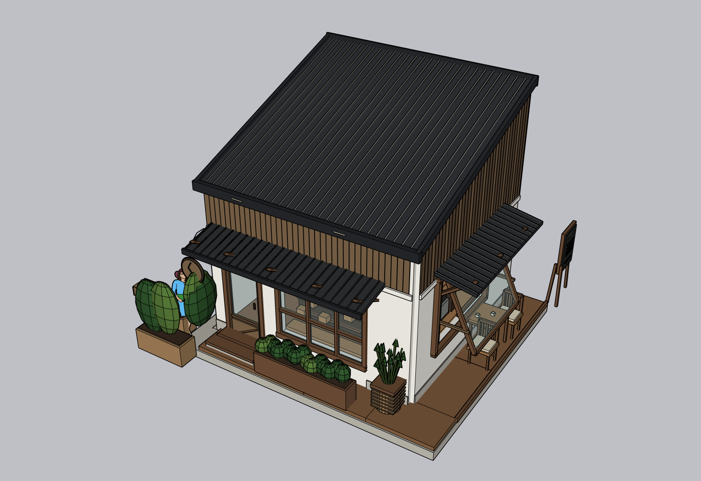
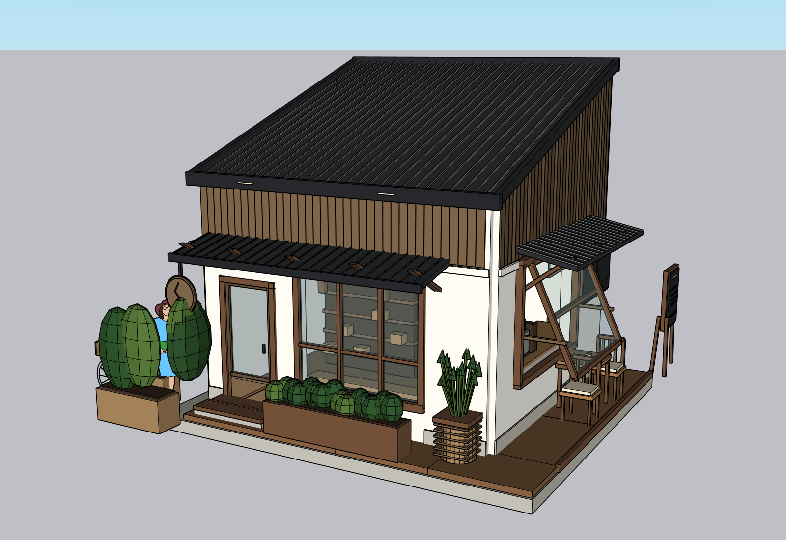
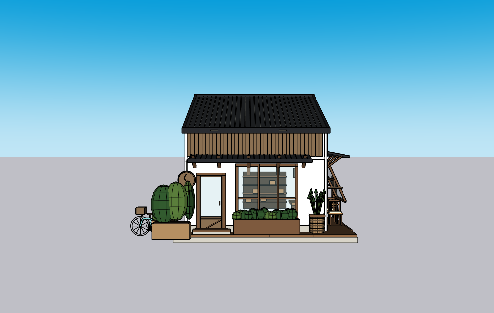
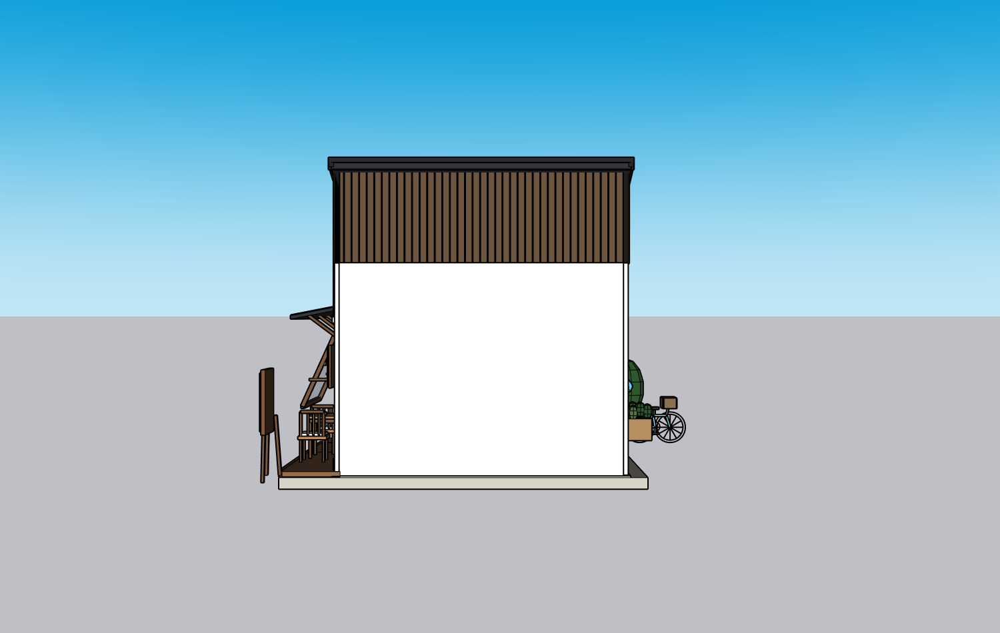
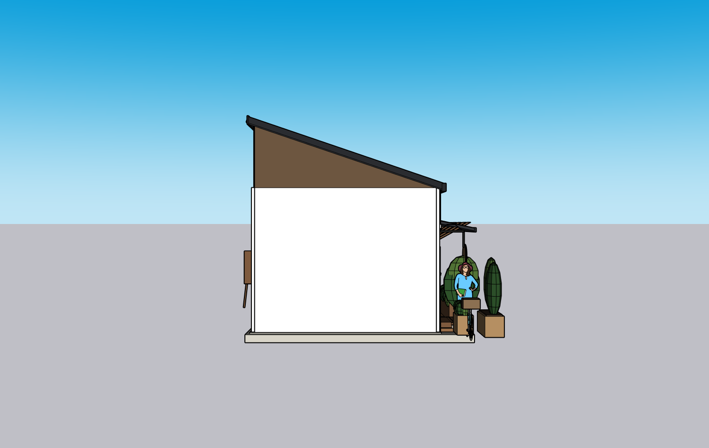
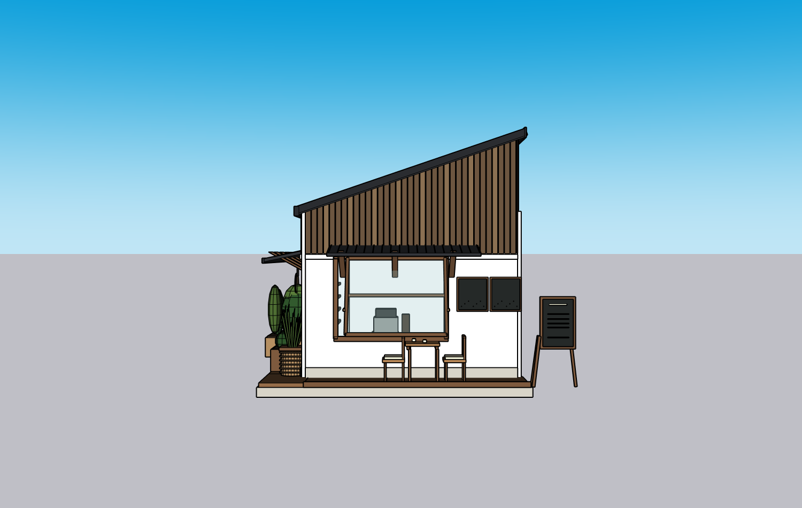
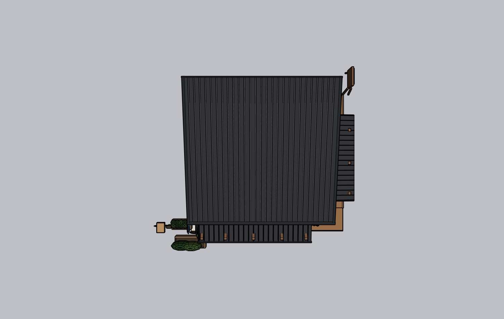
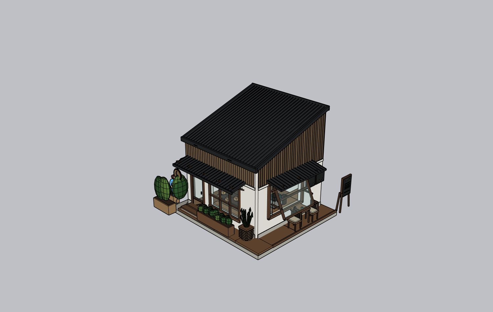

# 双视角单层咖啡店 / Luna Max / SU2024 — PARTIAL

2026-10-09，基线 `bdc90f8` 加本轮有效修复。用户明确改用新发的两张咖啡店完整 PNG，本轮没有继续用白色别墅代替。两图高/低斜视均在网站实际上传，没有拆图。原图未获公开授权，只有输入文件 hash/规划中的来源引用；公开库不能复验原图像素，禁止把缺失原图说成完整云端保真验收。

## 结论

| 项目 | 实际状态 |
|---|---|
| 实际模型 | `gpt-6-luna` / `max`，Codex native，K Studio 网站；无模型回退 |
| 环境 | Windows 11 Home build22000 / Python3.12.2 / SU2024 24.0.484 / Kongxing AI0.1.0 单写者 |
| 规划 | 两张来源约束 + 单层 + 估算尺寸 + 允许后侧补全；三份 JSON 严格校验通过 |
| 几何写入 | 初建 + 两次局部修正，r3 / root PID `51007` / 31 个顶层命名组，三笔 write_verification通过 |
| 真实洞口与构造 | SAIE墙+开洞、单坡带肋屋面、双雨棚、木饰板、门窗与外开扇、室内柜台/展示架、台阶平台、招牌和简化配景 |
| ADAI | 官方0.5.39 verified helper可用，本咖啡店实际选用了SAIE，没有调用ADAI；ADAI原生smoke在[同日单独工程证据](../2026-10-09-kai-integrated-v1/adai-smoke/results.json) |
| KEEP | 两次真实 correction有保护；恢复会话第一写的破坏屋顶负例提交前abort / PID、bounds、revision不变 |
| 六方向截图 | 六张同为r3 canonical真实相机，另有高/低两张source-angle模型PNG |
| 审查 | `agent_supplied` Builder自审，`NEEDS_FIX: YES`；独立Critic **NOT_RUN** |
| 下载 / 原生编辑 | **PASS**，实际浏览器下载 → SU Ctrl+O → 鼠标Move命名菜单立牌 → Ctrl+S → Ctrl+O再读回，仅一个对象移动549.3mm，其他30组PID/bounds不变 |
| 全新空白重放 | 第一次 **FAIL**：基脚端点错60mm；持久脚本修正后另一个新空白 **PASS**，31组名称/边界与最终模型一致 |
| 自动检查 | **314 passed / 2 skipped / 2 warnings，30.93s**，workspace/case-study检查通过 |
| 整体还原质量 | **PARTIAL**，不是可销售质量通过 |

## 真实结果截图

来源角度模型截图（原参考图不公开）：

| 正面 | 后面 | 左侧 |
|---|---|---|
|  |  |  |

| 右侧 | 屋顶 | 斜视 |
|---|---|---|
|  |  |  |

[初建错误屋面斜视](before/agent-view-oblique-a526568618.png)与最终斜视可直接比较；初建真实图片保留，不删FAIL。新空白重放截图在[replay-views](model/replay-views/oblique.png)，没有模板人物，但仍保留 Builder错误添加的植物屏，不能把无人物等同还原质量PASS。

## 视觉问题与修正

1. 初建大块竖向深色屋顶侧板、门框/平台下垂构件明显错误，第一轮针对修复；错误事务没有假作提交成功。
2. 第二轮为遮挡根外默认人物而加大植物屏，结果挡住自行车/圆吊牌，**不是有效的来源保真修正**。本轮两次已用完，不新增第三轮掩盖失败。
3. 主执行者复看两张原图和六图发现：参考图右后侧较低白墙/屋面体量未准确还原，主体上部木饰面/坡度比例仍有差异；源图桌椅扶手/椅背、铁艺、纹理细节比模型丰富，不能只看主门窗可辨就称一致。详见[复核](review/review.md)。

这些失败导致下一轮需要更可靠的体量/来源 inventory 和独立审查，不能靠更强模型或装了ADAI就宣称解决。

## 已改的产品/流程

- Native commandExecution/fileChange也计入进度/失败，规划不再一直显示零工具；保留命令内容隐私。
- 规划source_refs实际输入相对路径与ADAI正确profile契约，Native明文自审fallback解释，默认timeout900s不变、显式测试1800s。
- 修复 resumed turn 第一写跳过已有review/KEEP的问题；本轮工程重放负例实际通过，revision不推进。
- Launcher新空白优先SU2024无人物AEC模板、Simple备用，避免根外人物污染；不删现有模型的根外对象。
- Workspace v11补充QA优先检查全部可见主/附体量和低屋顶，禁止为遮模板人物而增加遮挡配景。**这条说明在本轮几何完成后修改，未来质量改善尚未复测**。
- 持久完整脚本基脚端点同步遗漏已修复并重放验证；这是操作者工程脚本维护1次，不是当前模型手工美化。

## 运行数据、人工干预、限制

网站流程：新会话/2整图上传 → 一次澄清（50.968s）→ 规划（340.797s）→ 操作者代批准 → 独立SU2024 → 连续Builder与两次局部修正（1371.125s）→ 保存/实际下载 → native编辑保存再打开 → 新空白重放与KEEP负例。

原生回合工具共 **130**（规划18，Builder112），失败 **7**，总回合推理时间 **1762.890s**。Native contextCompaction事件实际出现；input/output/critic tokens全部null，本集成未得到可靠Token，不声称相对4.92M input baseline降低成本。主模型初建/修正人工几何0、人工额外提示0；下载副本编辑验证1次、工程重放基线源码维护1次，分开记录。

公开证据：[run](run.json)、[metrics](metrics.json)、[错误](errors.json)、[planning](planning/validation.json)、[writer receipts](model/write-verifications.json)、[readback/PID](model/geometry-readback.json)、[KEEP正向](model/keep-results.json)、[resumed first-write真机负例](model/resumed-keep-negative.json)、[下载/重开/编辑](model/native-reopen.json)、[首次重放失败](model/baseline-replay-first-failure.json)、[修复后重放](model/baseline-replay.json)、[真实自审](review/critique.json)、[生成Ruby](scripts/luna_cafe_reconstruction.rb)、[SHA256文件清单](artifacts.json)。

原图、个人路径、API Key、私人SKP不提交。原生证明提供模型截图/对象位移/hash；没有公开二进制SKP，云端不能独立重开本机文件。其他SU版本NOT_RUN。公共PNG仅为真实本轮SU视口，没有生成渲染冒充。
