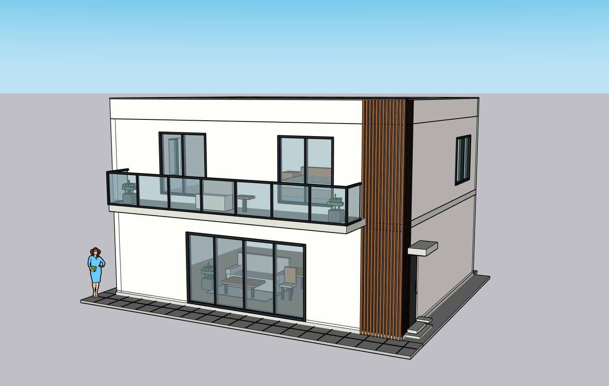
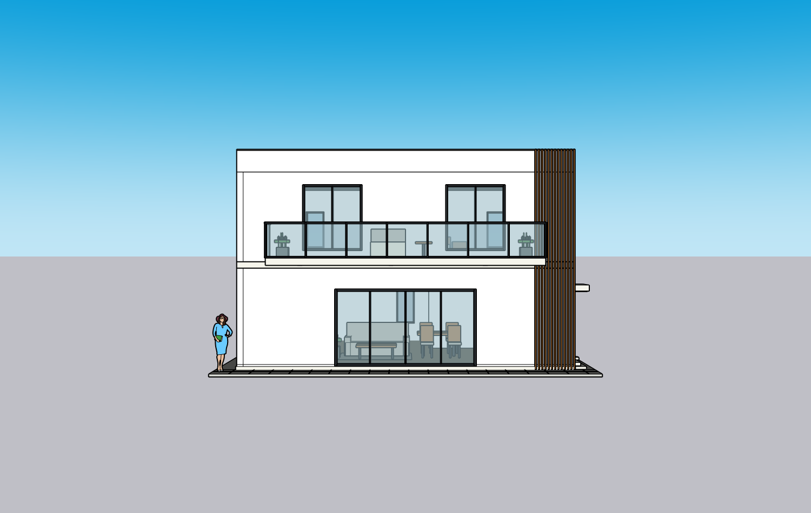
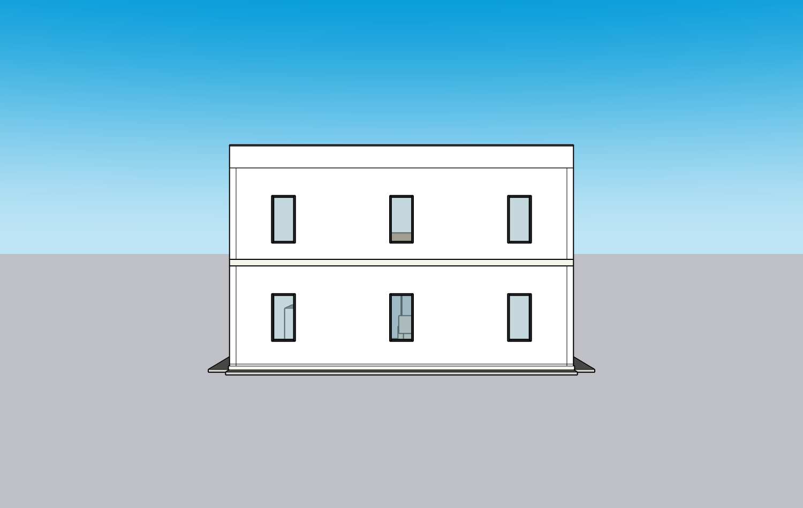
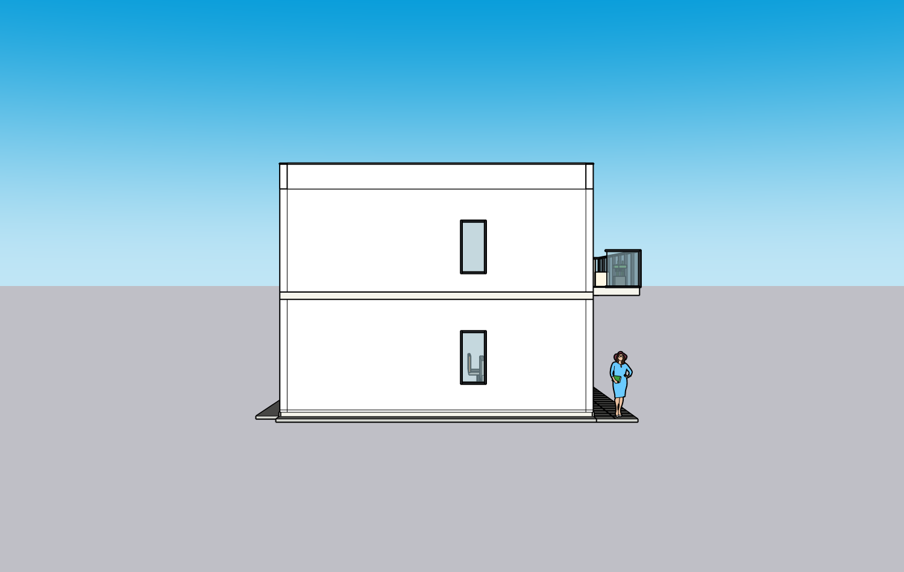
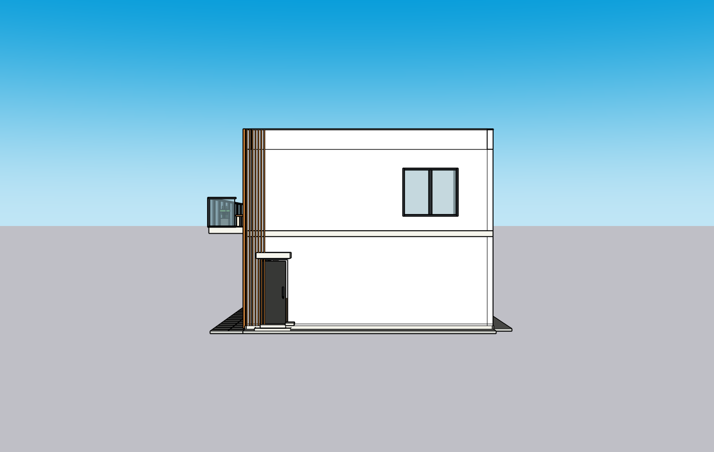
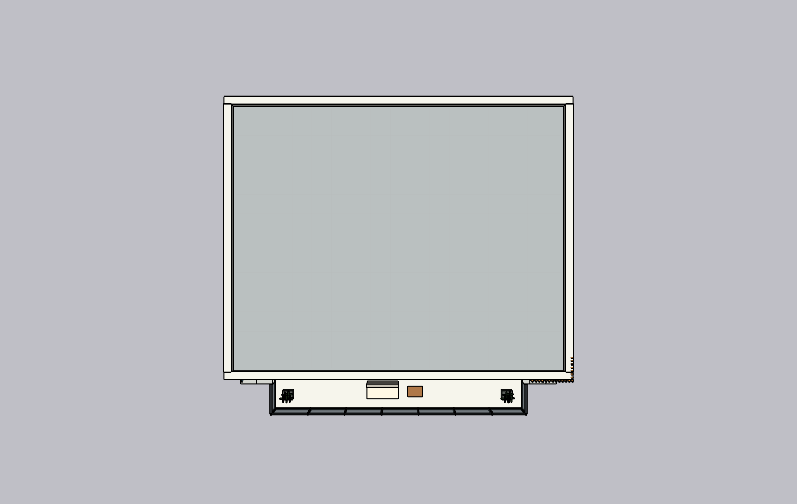
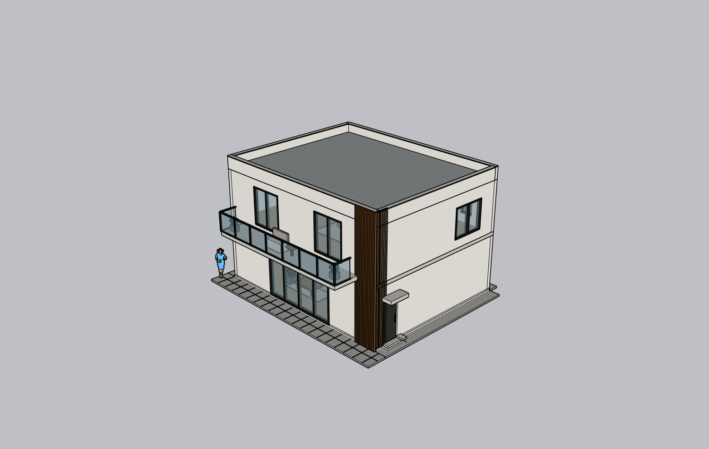

# Luna Max × ADAI × SU2024 六视图实测 — PARTIAL

2026-10-09，测试基线 `bdc90f8`；这是本轮真实新建白色别墅结果，随后用户明确改为两张新咖啡店图片。本目录保留已发生的别墅测试，不冒充咖啡店结果。

## 实际结果

- **模型**：主机 catalog 与已接受 Native turn 配置为 `gpt-6-luna` / `max`，K Studio 网站驱动，未回退 DeepSeek/Sol。Builder 自身无法读取模型身份，身份依据来自宿主记录。
- **环境**：Windows 11 Home build 22000、Python 3.12.2、SketchUp 2024 24.0.484、Kongxing AI 0.1.0 单写者；ADAI 0.5.39 官方固定分发包验 hash，helper 显式启用，独立 Managed MCP 未启动。其他 SU 版本 NOT_RUN。
- **建模**：一个全新 root（persistent ID `37885`），r1 初建、r2/r3 两次局部修改；最终 277 个命名对象，真实墙洞、阳台/回转玻璃栏杆、木格栅、门窗与屋顶、简化家具。没有人工替 Builder 写或改几何。
- **技术 PASS**：三次 committed write 均有真实 write_verification；六个 canonical 方向同为 revision 3；r3 24 条 KEEP precommit 校验；网站下载 SKP hash 与输出相同；下载副本原生 Ctrl+O 后读回 277 个对象。
- **视觉 PARTIAL**：右侧多余窗组被修正，屋顶粗网格减弱；仍存在墙面水平分缝/层带、家具植物简化、材料及比例差异。Builder `NEEDS_FIX: NO` 只是 `agent_supplied` 自审，不能作为独立 Critic PASS。
- **NOT_RUN**：独立 Native Critic；下载副本鼠标编辑/保存/再次重开、新空白 baseline replay。在这几项完成前用户要求立即改测新咖啡店；未把其他轮次证明移植成这一轮 PASS。

## 原图与实际截图

输入为[仓库公开完整六视图整图](../../../test-assets/cloud-villa/villa-six-view-sheet.png)，没有拆成六张输入。

| 正面 | 后面 | 左侧 |
|---|---|---|
|  |  |  |

| 右侧 | 屋顶 | 斜视 |
|---|---|---|
|  |  |  |

修正前真实 r1：[右侧](before/right-r1.png)、[屋顶](before/roof-r1.png)、[斜视](before/oblique-r1.png)。对照本轮 r3 的六图，不使用上一轮截图。

## 过程、故障及修复

通过网站新建 → 整图上传 → 明确范围/估算/推断 → 澄清 → 参数计划 → 操作者代批准 → 独立 SU2024 模型 → Native Builder → canonical/source-angle → 自审 → 两次同模型 correction → 网站下载 → 下载副本原生重开。

人工提示干预两次：修复规划 source_refs 格式；在初建超时后指出右墙窗数/屋顶网格并提示 Native 自审格式。真实建模三次 writer 均由网站 Native 执行。

1. PowerShell 5.1 读取无 BOM 的中文正则导致启动失败：改 ASCII Unicode escape，实际 SU2024 启动成功。
2. ADAI 官方 raw 下载超时：官方 GitHub contents API 取得同一固定版本，SHA 验证后使用原安装器隔离安装；没有提交上游源码或私有安装包。
3. Native 规划 source_refs 写成 ID：契约明确要求已上传相对文件路径，实际规划修复后严格校验。新增 helper 签名说明，避免模型猜参数。
4. 初建在 900s Native 超时，r1 已提交：保留实际 checkpoint，在同 root 继续；显式测试 timeout 1800s，不改变默认 900s。
5. Native coding/file-change 以前显示 0 工具调用：现在计入工具/失败并提供安全进度事件；不记录命令内容/凭证。
6. 自审 JSON 被工具拒绝：说明 Native fallback 为明文 NEEDS_FIX/assessment/issue/KEEP，保留 agent_supplied 标记。
7. **r2 的第一笔 resumed-turn correction 未触发旧 KEEP**：已修复宿主在存在已提交 review 时也必须挂 guard；回归覆盖 fresh/resumed 场景。r3 实際 24 KEEP 正向通过；不回填 r2 为 PASS。新代码 resumed 真机负例本目录未跑。
8. 最后 inspect_owned 的 GUID freshness 错误未取消安全检查：宿主保存成功；另开 fresh context 完整读回所有 277 对象。

完整自动检查 **313 passed / 2 skipped / 2 warnings（33.75s）**，workspace/case-study checks 全通过。两项警告来自依赖。

## 数据入口与复验限制

[run](run.json) · [metrics](metrics.json) · [真实错误](errors.json) · [规划/schema](planning/validation.json) · [writer](model/write-verifications.json) · [完整分页读回/对象 ID](model/geometry-readback.json) · [KEEP](model/keep-results.json) · [下载及原生重开](model/native-reopen.json) · [真实自审](review/critique.json) · [人工图像复核](review/review.md) · [ADAI工程 smoke](adai-smoke/results.json) · [SHA清单](artifacts.json)。

规划+初建+修正推理耗时共 3,527,923ms，Builder instrumented 两次回合 127 次工具调用、27 次失败；早期 planner native coding 未计入，因此总工具数不完整。Tokens 均为 null，不能声称相对以前 4.92M input baseline 降本。六视图不代表独立视觉通过。

ADAI工程 smoke 新空白内实际连续墙两洞和非平屋面成功，KEEP 故意移动屋顶在 commit 前 abort，PID/bounds/revision不变，工程模型原生重开。只证明 helper/保护，不证明建筑像原图。

私人 SKP、账号、本机路径不提交。公开生成 Ruby 只属于本轮脚本，ADAI 官方 helper 与 LICENSE/NOTICE 留在本机隔离安装。云端可看全部 PNG/对象/receipt，无法从公开二进制重复原生 SKP 操作，限制如实记录。
