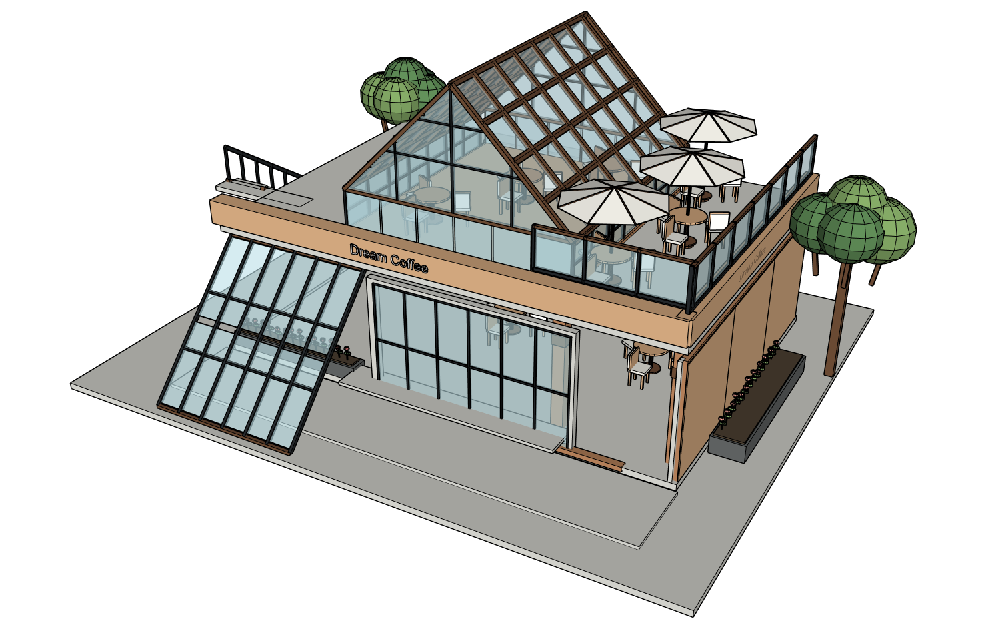

# Dream Coffee 新建筑：真实 OSS 产品使用验收（2026-10-10）

## 结论：PARTIAL，不能作为还原质量通过

使用本次新上传的完整五面板 Dream Coffee 图（四外观＋室内），未拆图、未替换旧案例。网站实际调用 **gpt-6-luna / max**，SketchUp2024，Kongxing 单 writer；ADAI0.5.39 仅 opt-in helper，无第二个 MCP writer。原图未获公开许可，保留私密；摘要/hash 见 [run.json](run.json)。公开截图为本轮实际生成模型，不是参考图，也不是白盒烟测。

## 实际流程与人工介入

1. 网站上传整图、一次范围/估算/推断声明 → 澄清 → 计划，三份严格 schema 验证通过。13系统记录 method_id/选择理由；见 [planning](planning/reconstruction_card.md)。网站批准并自动连接专用空白 SU。
2. 初始建模失败：MCP无返回、prepared回执、空孤儿根 PID19，无有效 geometry commit。后来脚本在真实 SU 编译 PASS，无法证明初始原因就是语法错。操作者重开同专用空白清除未保存空根；未动用户原模型。修复事务对 SyntaxError 等非 StandardError 的回滚。
3. Native Builder 重试：向量转换/3D文字实参错误被拒绝后改脚本，r1成功。r1独立 Critic 提出开放柱廊与侧墙问题；同根定向修正r2；第二次 Critic 提出首层斜玻璃太窄、入口玻璃和屋架问题，修正r3。两轮额度用完，未做第三轮。
4. Builder 903172ms 超时，r3已提交/保存，但最终 QA 未完成。操作者补采当前六方向及来源角度，再通过同 Native host 的独立 readOnly Critic 恢复终审；明确不是 Builder 自评。期间一次只读审查被交互中断，Token不可得为null。
5. 网站下载 SKP，SHA验证和原生重开 r3/PID35529/110对象通过。只在下载副本用 SU Move工具/鼠标移动 PLANTERS 组，保存再开：该组改变，其余109对象PID/bounds不变，保存读回一致；见 [原生编辑](model/native-reopen.json) 和 [截图](model/native-native-reopened-readback.png)。首次键盘尝试没有变化，失败也记录。
6. 全新空白 baseline replay首次两玻璃组尺寸不一致 FAIL。同步持久脚本横杆/边框尺寸后，第二个新空白重放110对象名称/bounds全部相同 PASS；见 [首次](model/baseline-replay.json)、[第二次](model/baseline-replay-sync.json)。这是脚本同步工程修复，没有手改正式模型，也不是第三次视觉修正。

## 开源方法真实执行了什么

| 方法 | 实际产品几何 | 结论 |
|---|---|---|
| saie.wall_with_openings | r1入口墙/推断后墙，r2/r3入口墙洞重做 | 主模型调用＋提交后root账本读回，非安装/烟测代替 |
| saie.wall | r1右侧墙 | 实际调用1次 |
| adai.profile | r1/r3九条恒截面纵向屋面檩条 | 真正执行9次；生成9个独立可编辑命名实体 |
| custom_owned_ruby | 斜玻璃薄片、楼梯、露台、家具/伞/栏杆等 | 计划记录具体拓扑/能力适用原因，不把这些归功 ADAI |

[r3主模型账本](model/oss-method-ledger.json)、[方法采纳判定](model/oss-method-adoption.json)、[r1账本](before-r1/ruby-state.json) 含方法、PID、源SHA、revision、耗时。r1 SAIE合计3＋ADAI9；r3最近事务 SAIE墙洞1＋ADAI9，不能把不同 revision 简单累加当最终对象数。`any_oss_product_use=true`，但 `effect_verified=false` 保留：真实执行并不证明还原达标。ADAI loft/shell未选择，来源是平面板/恒截面梁，不应为凑调用引入曲面方法。SAIE MIT、ADAI CPAL-1.0 固定版本许可/NOTICE保持既有集成边界；没有搬运完整上游代码。

另有 [工程烟测](smoke/results.json)：ADAI带两洞profile＋非矩形profile、SAIE墙洞，KEEP破坏提交前拒绝。零调用事务的 adoption=false见 [零调用负例](smoke/zero-call.json)。它们仅说明路径/保护，不算主产品质量。受控 SyntaxError 生成真实 aborted 回执且revision未变，事务回滚通过；MCP仍返回 no tool response，异常传输恢复未修复，不能宣称该响应问题通过。SyntaxError回滚见 [负例](model/syntax-error-rollback.json) 及第二重放工程回执。

## 视觉观察

首层斜玻璃扩大、上层三角玻璃厅、两层层级、露台/伞、外楼梯已可辨认。但仍与来源差异显著：**上层伸出平雨棚及支架漏建；侧墙仅纯色而非木材深化；柱廊开敞与入口玻璃相对关系、屋架/坡面比例和细节不准；配景/家具很粗糙。** 原图后面未显示，后墙是授权推断，不能验收成精确还原。独立Critic最后明确 NEEDS_FIX:YES，列平雨棚及木材面；操作者额外观察不替换其真实结论。六方向方向凭据一致r3，构图仍留白偏多，是本轮已发现的体验缺点。室内最后没有新匹配角度，r2室内证据不能冒充r3验收。

六方向：[正](views/front.png) · [后](views/rear.png) · [左](views/left.png) · [右](views/right.png) · [顶](views/roof.png) · [斜](views/oblique.png)，各有相机/revision sidecar；[修正前r1](before-r1)；[真实终审](review/critique.json)。

## 成本与故障

[metrics.json](metrics.json)：Builder/规划各次本轮增量输入 **10,504,446**、输出150,476；实际160工具调用/26失败。已完成独立Critic输入105,591/输出20,541，另一个中断审查usage=null，故所有Critic合计为null。规划442016ms、失败首建575391ms、重试超时903172ms、终审54312ms。用户中断使整体walltime不可靠，elapsed_ms=null。不同建筑、失败重试，无法受控证明与历史4.92M基线优劣；本轮没有降本通过，成本/结束阶段循环仍需修。

[真实错误](errors.json) 包含MCP/参数/超时/分页/原生UI操作/扩展启动警告；不隐藏人工恢复。完整自动检查324 passed/2 skipped/2 warnings，见 [checks.txt](checks.txt)。API无需重填，本轮Native不读取/提交Key。

## 已改与下一轮

仓库代码修复 model_session.rb 的非 StandardError 事务回滚、结构回归检查；真实受控 SyntaxError 在重放副本被拒绝，revision不变。生成baseline尺寸同步及新空白重放通过。源文件/脚本、修正回执、KEEP和真实模型数据公开脱敏；私密原图、SKP、密钥和机器路径不提交。公开证据可复核实际结果，但不能拿到私密原图做第三方像素对照；这是明确限制。

下一轮只继续同产品：补雨棚/开敞柱廊与木饰面，先纠正体量/遮挡；缩短规划与结束阶段上下文/工具循环；改善canonical构图与当前室内匹配证据。保持独立Critic、两轮预算、真实方法账本，不能继续增加不执行的工具。验收标准不降。
